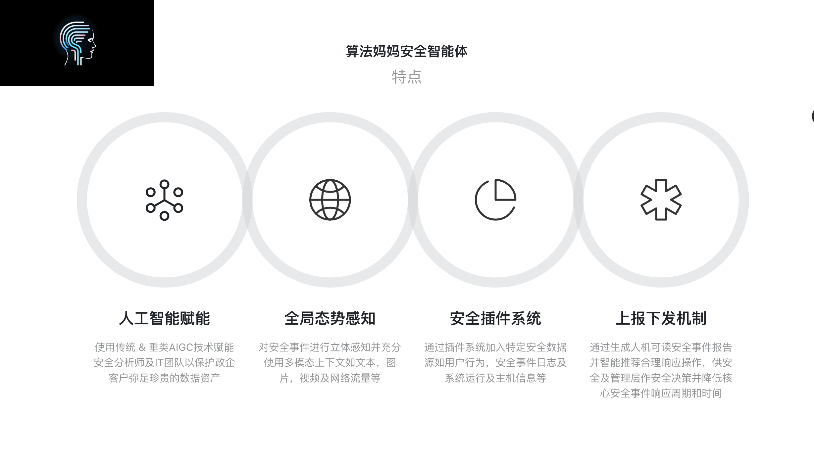

# 公司简介

## 使命
* 算法妈妈的使命是使用人工智能技术赋能千行百业。

## 简介
* 算法妈妈成立于2020年，总部设在广州，是一家业界领先的人工智能公司，专注于赋能时尚与教培行业。公司的主要业务包括垂类大模型的训练与部署，以及相关上下游应用。算法妈妈致力于提供高质量的人工智能行业解决方案，帮助客户在各个领域实现业务的智能化升级。作为一家技术驱动的公司，算法妈妈拥有一支专业的AI时尚买手团队及一支业界领先的AI时尚科技研发团队，不断进行技术创新和产品优化，以满足客户的需求。

## 注册商标

* Keep yourself in Zen mode

## 核心业务

* Algmon AI（妈妈智能）
* Algmon Education（妈妈教培）
* Algmon Fashion（妈妈时尚）

## 新业务披露！

* Algmon Information Security（妈妈信息安全）
* 算法妈妈团队在2024年Q2正式布局信息安全行业，主推产品为算法妈妈下一代安全智能体。