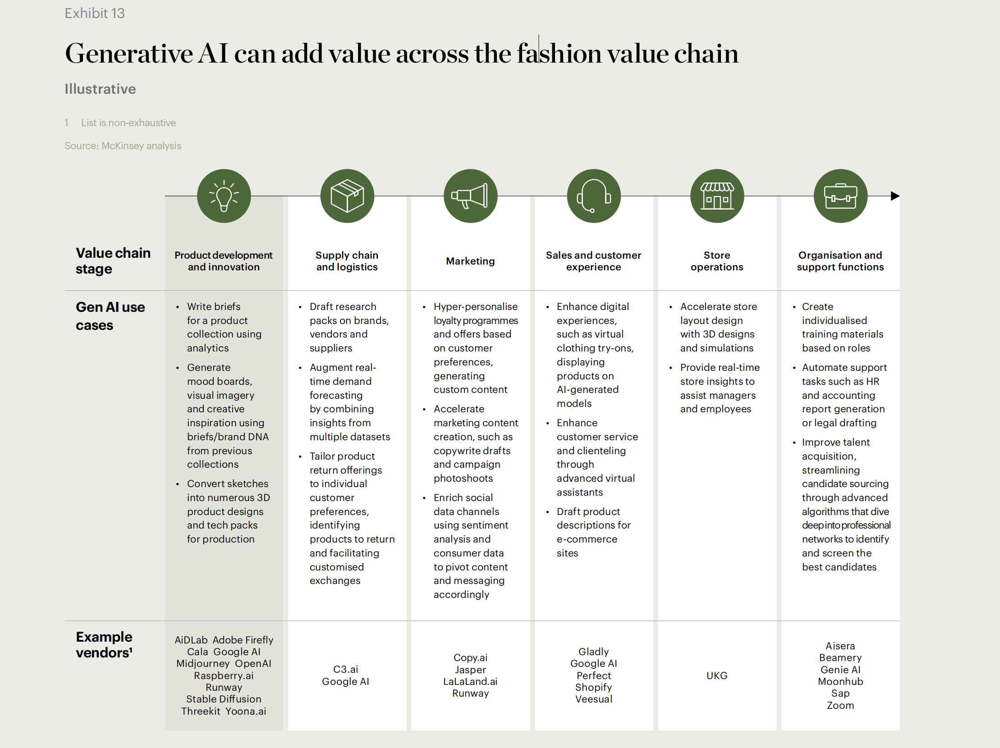
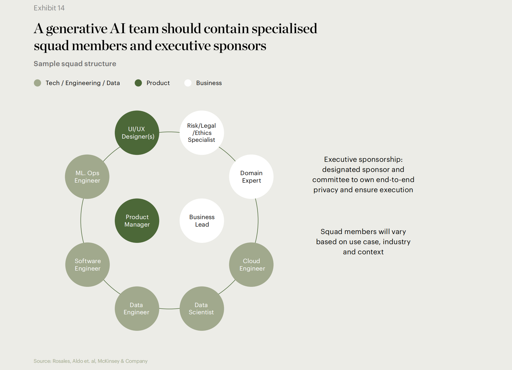

# 时尚行业发展趋势

## 第一部分：发展趋势
### 2024
#### Segment 1: Global Economy
##### 1. Fragmented Future
* In 2024, the global economic outlook will likely continue to be unsettled. As new and ongoing financial, geopolitical and other challenges weigh heavily on consumer confidence, fashion markets in the US, Europe and China are facing differing headwinds, requiring suppliers, brands and retailers to bolster contingency planning, among other measures.
* Data Support: Consumers’ net intent to spend on apparel is −16% across the US, Europe and China in Q4 2023

##### 2. Climate Urgency
* The frequency and intensity of extreme weather-related events in 2023 mean the climate crisis has become even more visible, leaving the fashion value chain especially vulnerable. With climate risks worsening across continents, the fashion industry can’t hold off any longer on building resilience into its supply chains and helping to abate emissions.
* Data Support: More than $65 billion of apparel exports are at risk of being wiped out by climate events such as flooding and extreme heat

#### Segment 2: Consumer Shifts
##### 1. Vacation Mode
* Consumers are gearing up for the biggest year of travel since before the pandemic. But a shift in values means travellers have a different set of expectations, even as shopping remains high on the agenda. Brands and retailers should consider refreshing distribution and category strategies to meet travellers wherever they are.
* Data Support: In 2024, global travel volumes are projected to reach 110% of 2019 levels, the first year to exceed pre-pandemic levels

##### 2. The New Face of Influence
* It’s time for brand marketers to update their influencer playbooks. A new guard of creative personalities is gaining brands’ attention, winning trust and fandom among key audiences. Working with these personalities in 2024 will require a different type of partnership, an emphasis on video and a willingness to relinquish a degree of creative control.
* Data Support: More than 40% of consumers prefer fashion influencers who are relatable and authentic

##### 3. Outdoor Reinvented
* Technical outdoor wear has been propelled by consumers’ postpandemic embrace of healthier lifestyles as well as “gorpcore,” and is likely to accelerate even further in 2024. More outdoor brands will likely launch lifestyle collections while lifestyle brands embed technical elements into collections, further blurring the lines between functionality and style.
* Data Support: Trade activity on resale platform StockX for Salomon, Arc’teryx and The North Face grew on average 800% in 2023 vs 2022

#### Segment 3: Fashion System
##### 1. Gen AI's Creative Crossroad
* After generative AI’s breakout year in 2023, use cases are emerging across creative industries, including fashion. Capturing the value of this transformative technology in 2024 will require fashion players to look beyond automation and explore its potential to augment the work of human creatives.
* Data Support: 73% of fashion executives think gen AI is a 2024 priority for their companies, but only 5% believe they have the capabilities to fully leverage it

##### 2. Fast Fashion's Power Plays
* Fast-fashion competition will likely become even fiercer in the year ahead. Challengers, led by Shein and Temu, are changing tactics around price, customer experience and speed. Success for disruptors and incumbents will likely hinge on their ability to adapt to evolving consumer preferences, while navigating regulations that may impact the industry.
* Data Support: 40% of US consumers have shopped at Shein or Temu in the last 12 months

##### 3. All Eyes on Brand
* Brand marketing will likely be back in the limelight in the year ahead as the fashion industry confronts a shifting landscape in which performance marketing no longer reigns. Consumers’ emotional connections to brands will likely be critical as fashion marketers reorientate their playbooks to emphasise long-term brandbuilding strategies.
* Data Support: 71% of fashion executives plan to increase brand marketing spend in 2024

##### 4. Sustainability Rules
* The era of the fashion industry self-regulating sustainability is drawing to a close around the world. Across jurisdictions, new rules could have a widespread impact on both consumers and fashion players. Brands and manufacturers need to revamp business models to align with the changes ahead.
* Data Support: 87% of fashion executives think sustainability regulations will impact their businesses in 2024

##### 5. Bullwhip Snaps Back
* Changes in consumer demand have resulted in the “bullwhip effect,” where cuts to orders increase in magnitude at different parts of a supply chain, putting pressure on fashion’s suppliers. Now, if supply is to keep pace with anticipated renewed demand, brands and retailers should consider focusing on transparency and bolstering strategic partnerships.
* Data Support: 73% of chief procurement officers cited demand volatility as a dynamic that may impact supplier relationships in the next five years

### 2023
#### Segment 1: Global Economy
1. Global Fragility
2. Regional Realities

#### Segment 2: Consumer Shifts
1. Two-Track Spending
2. Fluid Fashion
3. Formalwear Reinvented

#### Segment 3: Fashion System
1. DTC Reckoning
2. Tackling Greenwashing
3. Future-Proofing Manufacturing
4. Digital Marketing Reloaded
5. Organisation Overhaul

### 2022
#### Segment 1: Global Economy
1. Uneven Recovery
2. Logistics Gridlock

#### Segment 2: Consumer Shifts
1. Domestic Luxuries
2. Wardrobe Reboot
3. Metaverse Mindset

#### Segment 3: Fashion System
1. Social Shopping
2. Circular Textiles
3. Product Passports
4. Cyber Resilience
5. Talent Crunch

### 2021
#### Segment 1: Global Economy
1. Living with the Virus
2. Diminished Demand

#### Segment 2: Consumer Shifts
1. Digital Sprint
2. Seeking Justice
3. Travel Interrupted

#### Segment 3: Fashion System
1. Less is More
2. Opportunistic Investment
3. Deeper Partnerships
4. Retail ROI
5. Work Revolution

### 2020
#### Segment 1: Global Economy
1. On High Alert
2. Beyond China

#### Segment 2: Consumer Shifts
1. Next Gen Social
2. In the Neighbourhood
3. Sustainability First

#### Segment 3: Fashion System
1. Materials Revolution
2. Inclusive Culture
3. Cross-Border Challengers
4. Unconventional Conventions
5. Digital Recalibration

### 2019
#### Segment 1: Global Economy
1. Caution Ahead
2. Indian Ascent
3. Trade 2.0

#### Segment 2: Consumer Shifts
1. End of Ownership
2. Getting Woke

#### Segment 3: Fashion System
1. Now or Never
2. Radical Transparency
3. Self-Disrupt
4. Digital Landgrab
5. On Demand

### 2018
#### Segment 1: Global Economy
1. Predictably Unpredictable
2. Globalisation Reboot
3. Asian Trailblazers

#### Segment 2: Consumer Shifts
1. Getting Personal
2. Platforms first
3. Mobile Obsessed

#### Segment 3: Fashion System
1. AI gets real
2. Sustainability Credibility
3. Off-price deception
4. Startup thinking

### 2017
#### Segment 1: Global Economy
1. Age of Uncertainty
2. China Interrupted

#### Segment 2: Consumer Shifts
1. Discount Culture
2. Consumer Kinship
3. Digital Upgrade

#### Segment 3: Fashion System
1. System Breakdown
2. Cost Cutting
3. Instant Gratification
4. A Creativity Crisis
5. Responsible Innovation