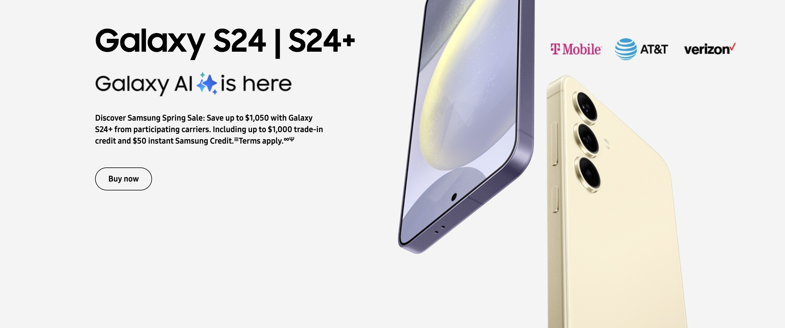
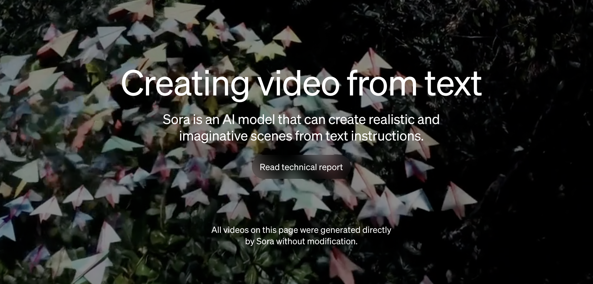
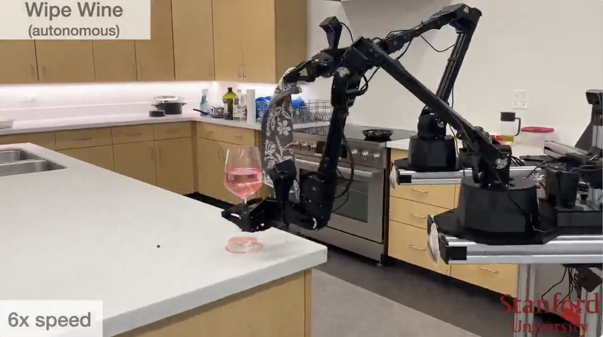

# 人工智能行业发展趋势

## 第一部分：发展趋势
### 趋势1：小模型与大模型

* 端云结合

### 趋势2：逼真视频生成

* [Intro: Video generation models as world simulators](https://openai.com/research/video-generation-models-as-world-simulators)
* [Sora Samples](https://www.youtube.com/watch?v=HK6y8DAPN_0)

### 趋势3：有灵魂具身机器人

* [Learning Bimanual Mobile Manipulation with Low-Cost Whole-Body Teleoperation](https://mobile-aloha.github.io/)

### 趋势4：多模态

* multimodal
* Case 1: [Claude 3 family](https://www.anthropic.com/news/claude-3-family)

### 趋势5：RAG

* [OpenAI Dev Day: A Survey of Techniques for Maximizing LLM Performance](https://www.youtube.com/watch?v=ahnGLM-RC1Y)
* [RAG 技术解读](https://www.algmon.com/docs/research/2023-12-19-research-post)

### 趋势6：多端与平台

* Edge & Platform
* 平台例子：[LinkAI平台 技术解读](https://docs.link-ai.tech/platform)
* 微信端例子：[算法妈妈通用智能助手Rita 产品介绍](https://www.algmon.com/docs/chatbot/intro)

### 趋势7：AIGC赋能传统行业

* Education & Fashion Industry
* 信息安全行业: [360安全大模型简介](https://ai.360.com/)
* 教培与时尚行业: [算法妈妈公司简介](https://www.algmon.com/docs/about/)

### 趋势8：闭源与开源共发展

* Close & Open Source
* decoder only is popular
* Close Source Example: [技术解读 Gemini](https://www.algmon.com/docs/research/2023-12-07-research-post)
* Open Source Example: [技术解读 MoE](https://www.algmon.com/docs/research/2023-12-10-research-post)

## 第二部分：赋能教培行业应用

* 算法妈妈：人工智能自习室

## 第三部分：赋能时尚行业应用

* 算法妈妈：AI原优舍买手店

## 第四部分：赋能其他行业应用
* （算法妈妈与各行业合作伙伴一道，为客户提供优质产品和服务）

## 第五部分：总结
* 我们和AI做好朋友；
* 我们会用好AI工具；
* 深入AIGC工具的原理总令人兴奋；
* AI，实体经济与2024年，共同勾勒现代创业新范式；

## 第六部分：附：部分核心技术详解

* 我们在此感谢Jeff。

* Key Observations:
* In recent years, ML has completely changed our expectations of what is possible with computers.
* Increasing scale (compute, data, model size) delivers better results.
* The kinds of computations we want to run and the hardware on which we run them is changing dramatically.

* to text

* from text

* Image Classification

* Speech Recognition

* More computational power improves models significantly
* Deep learning is transforming how we design computers

* ML Optimized Hardware is Much More Efficient
* Major improvements from generation to generation
* Enables larger-scale models with lower economic and energy costs

* It is OK to reduce precision

* TPU Chip family

* TPU Pods

* TPU v5 generation

* fifteen years of language model advances

* Simple techniques over large amounts of data are very effective

* Distributed representations are powerful

* Use a neural encoder over an input sequence to generate state, use that to initialize state of a neural decoder
* Scale up LSTMs and this works

* Possible to have effective multi-turn interactions using a neural language model

* Attention is all you need

* Meena

* Chatbots & LLMs

* Gemini

* Multimodal from the start

* Ultra, Pro and Nano

* Training Infra: Pathways

* Training at Scale

* Training Data

* Advances not just on training, but also on how to ask questions of a model
* Ask models to "Show Their Work" improves accuracy and interpretability

* Chain of Thought Example

* Chain of Thought Reasoning

* Vison Understanding & Logic Reasoning

* Evaluation is a critical aspect for LLMs

* Text Benchmarks

* Image Understanding Benchmarks 1

* Image Understanding Benchmarks 2

* Audio & Multilingual Benchmarks

* Large Transformer-Based Language Models Can Generate Surprisingly Coherent Conversations

* AI Assistant for code writing

* AI Assistant for answering facts

* Further refinement of general models can make amazing domain-specific models

* Med-PaLM 2

* Generative models can produce realistic images, videos, and audio

* Image Generation

* Prompt: A stream train passes through a grand library. Oil painting in the style of rembrandt.

* Prompt: A giant cobra snake made from X. X in {"corn", "pancakes", "sushi", "salad"}

* Prompt: A photo of a living room with a white couch and a fireplace. An abstract painting is on the wall and bright light comes through windows.

* 1

* 2

* ML is becoming more personally and communally beneficial

* Computational Photography

* Magic Eraser

* Growing Impact in Engineering, Science, Health, and Sustainability

* Materials Science

* Medical Imaging

* Automated solution for screening for detecting diabetic retinopathy

* Deeper and broader understanding of ML

* Our focus: Avoid creating or reinforcing unfair bias.

* Conclusions
  * AI is making major progress in the ability for computers to understand, perceive, and reason about the world around them.
  * This creates tremendous opportunities, but also tremendous responsibilities.