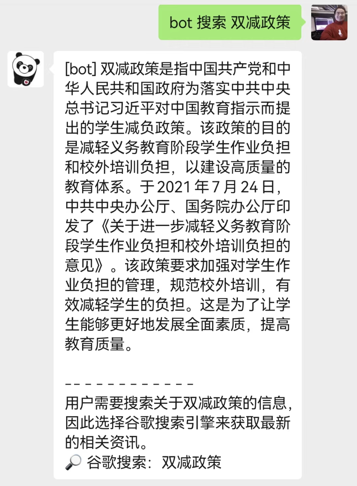
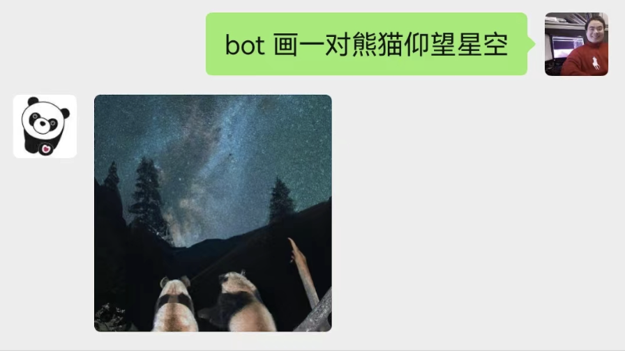
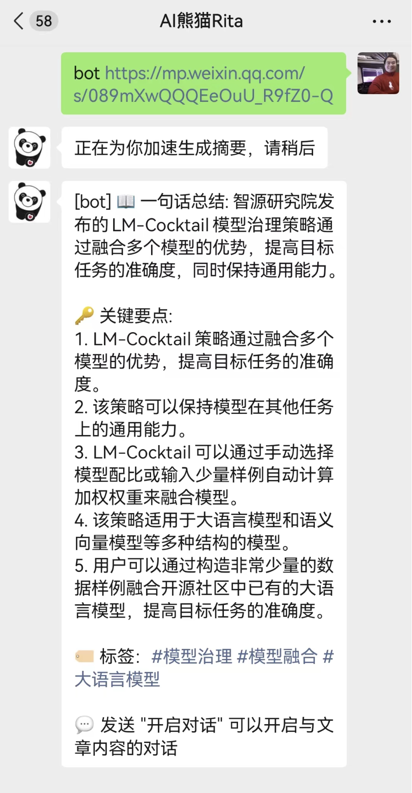
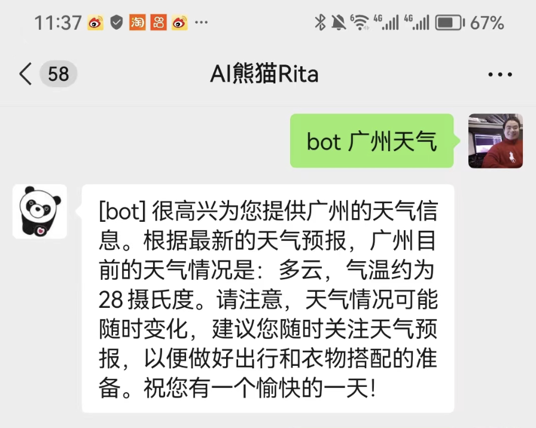
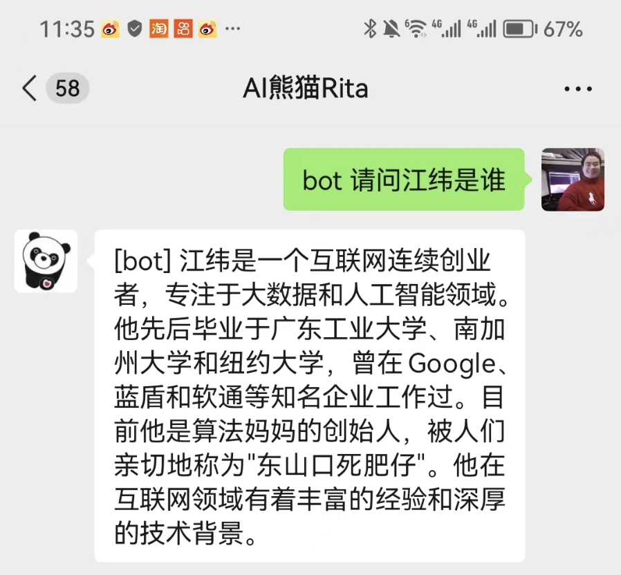

# 马上体验
## 第一步 扫码
扫描下方二维码即体验我们的智能聊天机器人AI熊猫Rita，Rita是一个教培助手，她能友好地和同学聊天，明晰其知识点疏漏并为之提供相应教育建议和答疑。

## 第二步 畅聊与体验
* 群聊模式：直接@熊猫触发机器人聊天
* 私聊模式：在聊天时加前缀bot触发机器人聊天

### 核心功能1：Google搜索与信息整合

1. "bot 搜索 双减政策"

### 核心功能2：基于文字描述的画图

2. "bot 画 一对熊猫 仰望星空"

### 核心功能3：链接总结

3. "bot https://mp.weixin.qq.com/s/089mXwQQQEeOuU_R9fZ0-Q"

### 核心功能4：使用插件询问实时天气状况等

4. "bot 广州天气"

### 核心功能5：通用行业助手
#### 垂直行业1：程序员

5. "bot 请帮我写一个Hello World程序"

#### 垂直行业2：英语培优老师

6. "bot 有些家长问到什么是pet 什么是ket考试"

### 核心功能6：垂类知识库定制

7. "bot 请问江纬是谁"（注：江纬这个实体信息存在于垂类知识库中，在基模型中不存在）