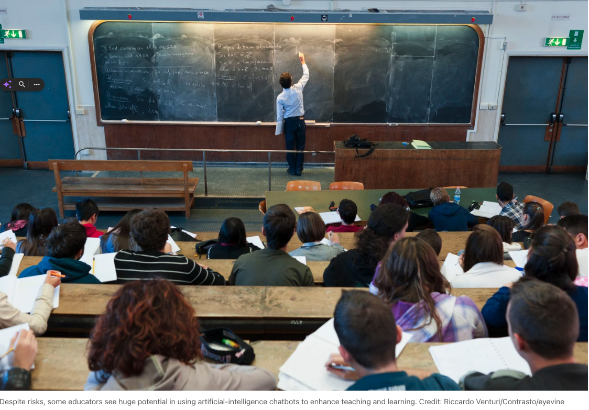
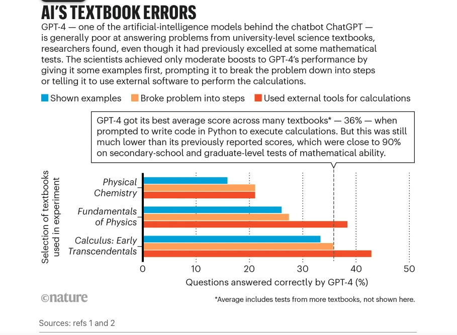
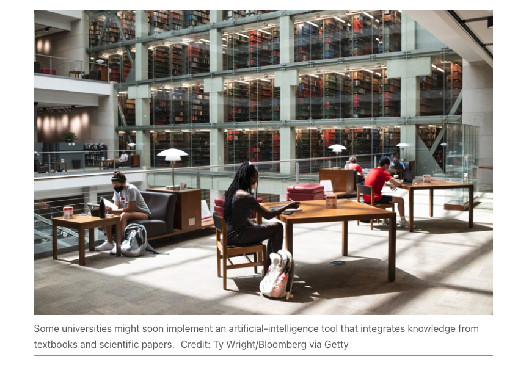

# AI赋能教育
## 关键洞察
1. AI自习室是落地AI技术的有效形式；
2. 线上可推出一系列直击教育痛点的AI工具，供学员使用。如[算法妈妈科学教培助手](https://chat.openai.com/g/g-aPshFOQqv-suan-fa-ma-ma-ke-xue-jiao-pei-zhu-shou)；
3. Researchers, educators and companies are experimenting with ways to turn flawed but famous large language models into trustworthy, accurate ‘thought partners’ for learning.（研究人员、教育工作者和公司正在尝试将存在缺陷但著名的大型语言模型转变为可信赖、准确的“思维伙伴”来进行学习。）

## ChatGPT has entered the classroom: how LLMs could transform education

Key Idea: Researchers, educators and companies are experimenting with ways to turn flawed but famous large language models into trustworthy, accurate ‘thought partners’ for learning.

Originally by [Andy Extance](https://twitter.com/andyextance?lang=en) and edited by [algmon](https://twitter.com/algmon2024)

Last month, educational psychologist Ronald Beghetto asked a group of graduate students and teaching professionals to discuss their work in an unusual way. As well as talking to each other, they conversed with a collection of creativity-focused chatbots that Beghetto had designed and that will soon be hosted on a platform run by his institute, Arizona State University (ASU).

The bots are based on the same artificial-intelligence (AI) technology that powers the famous and conversationally fluent ChatGPT. Beghetto prompts the bots to take on various personas to encourage creativity — for example, by deliberately challenging someone’s assumptions. One student discussed various dissertation topics with the chatbots. Lecturers talked about how to design classes.

The feedback was overwhelmingly positive.（反馈结果非常积极。） One participant said that they had previously tried to use ChatGPT to support learning but had not found it useful — unlike Beghetto’s chatbots. Another asked: “When are these things going to be available?” The bots helped participants to generate more possibilities than they would have considered otherwise.

Many educators fear that the rise of ChatGPT will make it easier for students to cheat on assignments. Yet Beghetto, who is based in Tempe, and others are exploring the potential of large language models (LLMs), such as ChatGPT, as tools to enhance education.

Using LLMs to read and summarize large stretches of text could save students and teachers time and help them to instead focus on discussion and learning. ChatGPT’s ability to lucidly discuss nearly any topic raises the prospect of using LLMs to create a personalized, conversational educational experience. Some educators see them as potential ‘thought partners’ that might cost less than a human tutor and — unlike people — are always available.

“One-on-one tutoring is the single most effective intervention for teaching, but it’s very expensive and not scalable,” says Theodore Gray, co-founder of Wolfram Research, a technology company in Champaign, Illinois. “People have tried software, and it generally doesn’t work very well. There’s now a real possibility that one could make educational software that works.” Gray told Nature that Wolfram Research is currently working on an LLM-based tutor but gave few details.

Such AI partners could be used to lead students through a problem step by step, stimulate critical thinking or — as in the case of Beghetto’s experiment — enhance users’ creativity and broaden the possibilities being considered. Jules White, director of the Initiative on the Future of Learning and Generative AI at Vanderbilt University in Nashville, Tennessee, calls ChatGPT “an exoskeleton for the mind”.

### The risks are real
Since California firm OpenAI launched ChatGPT in November 2022, much of the attention regarding its use in education has been negative. LLMs work by learning how words and phrases relate to each other from training data containing billions of examples. In response to user prompts, they then produce sentences, including the answer to an assignment question, and even whole essays.

Unlike previous AI systems, ChatGPT’s answers are often well written and seemingly well researched. This raises concerns that students will simply be able to get ChatGPT to do their homework for them, or at least that they might become reliant on a chatbot to get quick answers, without understanding the rationale.（这引发了人们的担忧，担心学生们只是简单地让ChatGPT帮他们完成作业，或者至少他们可能会依赖聊天机器人来获取快速答案，而不理解其原理。）

ChatGPT could also lead students astray. Despite excelling in a host of business, legal and academic exams[1], the bot is notoriously brittle, getting things wrong if a question is phrased slightly differently, and it even makes things up, an issue known as hallucination.

Wei Wang, a computer scientist at the University of California, Los Angeles, found that GPT-3.5 — which powers the free version of ChatGPT — and its successor, GPT-4, got a lot wrong when tested on questions in physics, chemistry, computer science and mathematics taken from university-level textbooks and exams[2]. Wang and her colleagues experimented with different ways to query the two GPT bots. They found that the best method used GPT-4, and that its bot could answer around one-third of the textbook questions correctly that way (see ‘AI’s textbook errors’), although it scored 80% in one exam.

Privacy is another hurdle: students might be put off working regularly with LLMs once they realize that everything they type into them is being stored by OpenAI and might be used to train the models.

### Embracing LLMs
But despite the challenges, some researchers, educators and companies see huge potential in ChatGPT and its underlying LLM technology. Like Beghetto and Wolfram Research, they are now experimenting with how best to use LLMs in education. Some use alternatives to ChatGPT, some find ways to minimize inaccuracies and hallucinations, and some improve the LLMs’ subject-specific knowledge.

“Are there positive uses?” asks Collin Lynch, a computer scientist at North Carolina State University in Raleigh who specializes in educational systems. “Absolutely. Are there risks? There are huge risks and concerns. But I think there are ways to mitigate those.”

Society needs to help students to understand LLMs’ strengths and risks, rather than just forbidding them to use the technology, says Sobhi Tawil, director of the future of learning and innovation at UNESCO, the United Nations’ agency for education, in Paris. In September, UNESCO published a report entitled Guidance for Generative AI in Education and Research. One of its key recommendations is that educational institutions validate tools such as ChatGPT before using them to support learning[3].

Companies are marketing commercial assistants, such as MagicSchool and Eduaide, that are based on OpenAI’s LLM technology and help schoolteachers to plan lesson activities and assess students’ work. Academics have produced other tools, such as PyrEval[4], created by computer scientist Rebecca Passonneau’s team at Pennsylvania State University in State College, to read essays and extract the key ideas.

With help from educational psychologist Sadhana Puntambekar at the University of Wisconsin–Madison, PyrEval has scored physics essays[5] written during science classes by around 2,000 middle-school students a year for the past three years. The essays are not given conventional grades, but PyrEval enables teachers to quickly check whether assignments include key themes and to provide feedback during the class itself, something that would otherwise be impossible, says Puntambekar.

PyrEval’s scores also help students to reflect on their work: if the AI doesn’t detect a theme that the student thought they had included, it could indicate that the idea needs to be explained more clearly or that they made small conceptual or grammatical errors, she says. The team is now asking ChatGPT and other LLMs to do the same task and is comparing the results.

### Introducing the AI tutor
Other organizations use AI to help students directly. That’s the approach of what is perhaps the most widely used LLM-based education tool other than ChatGPT itself; the AI tutor and teaching assistant Khanmigo. The tool is the result of a partnership between OpenAI and education non-profit organization Khan Academy in Mountain View, California. Using GPT-4, Khanmigo offers students tips as they work through an exercise, saving teachers time.

Khanmigo works differently from ChatGPT. It appears as a pop-up chatbot on a student’s computer screen. Students can discuss the problem that they are working on with it. The tool automatically adds a prompt before it sends the student’s query to GPT-4, instructing the bot not to give away answers and instead to ask lots of questions.（学生可以与ChatGPT讨论他们正在解决的问题。该工具会在将学生的查询发送给GPT-4之前自动添加一个提示，指示机器人不要直接给出答案，而是要提出大量问题。）

Kristen DiCerbo, the academy’s chief learning officer, calls this process a “productive struggle”. But she acknowledges that Khanmigo is still in a pilot phase and that there is a fine line between a question that aids learning and one that’s so difficult that it makes students give up. “The trick is to figure out where that line is,” she says.

Khanmigo was first introduced in March, and more than 28,000 US teachers and 11–18-year-old students are piloting the AI assistant this school year, according to Khan Academy. Users include private subscribers as well as more than 30 school districts. Individuals pay US$99 a year to cover the computing costs of LLMs, and school districts pay $60 a year per student for access. To protect student privacy, OpenAI has agreed not to use Khanmigo data for training.

But whether Khanmigo can truly revolutionize education is still unclear.（但是，Khanmigo是否能真正革新教育仍然不清楚。） LLMs are trained to include only the next most likely word in a sentence, not to check facts. They therefore sometimes get things wrong. To improve its accuracy, the prompt that Khanmigo sends to GPT-4 now includes the right answers for guidance, says DiCerbo.（DiCerbo表示，为了提高准确性，Khanmigo现在将正确答案包含在发送给GPT-4的提示中，以提供指导。） It still makes mistakes, however, and Khan Academy asks users to let the organization know when it does.

Lynch says Khanmigo seems to be doing well. But he cautions: “I haven’t seen a clear validation yet.”

More generally, Lynch stresses that it’s crucial that any chatbot used in education is carefully checked for its tone, as well as accuracy — and that it does not insult or belittle students, or make them feel lost. “Emotion is key to learning. You can legitimately destroy somebody’s interest in learning by helping them in a bad way,” Lynch says.

DiCerbo notes that Khanmigo responds differently to each student in each situation, which she hopes makes the bot more engaging than previous tutoring systems. Khan Academy expects to share its research on Khanmigo’s efficacy in late 2024 or early 2025.

Other tutoring companies are offering LLMs as assistants for students or are experimenting with them. The education technology firm Chegg in Santa Clara, California, launched an assistant based on GPT-4 in April. And TAL Education Group, a Chinese tutoring company based in Beijing, has created an LLM called MathGPT that it claims is more accurate than GPT-4 at answering maths-specific questions.（而总部位于北京的中国辅导公司好未来教育集团（TAL Education Group）开发了一款名为MathGPT的大型语言模型，声称在回答数学特定问题方面比GPT-4更准确。） MathGPT also aims to help students by explaining how to solve problems.

### Augmenting Retrieval
Another approach to creating an AI learning partner integrates the LLM with external, focused corpuses of knowledge — such as a textbook or a set of scientific papers — that have been rigorously verified. The goal of this retrieval-augmented generation (RAG) method is to sidestep the impossibility of verifying the billions of sources of text that give an LLM its conversational power.（这种检索增强生成（RAG）方法的目标是给予LLM其对话能力）

AI company Merlyn Mind in New York City is using RAG in its open-source Corpus-qa LLM, which is aimed at education. Like ChatGPT, Merlyn Mind’s LLM is initially trained on a big body of text not related to education specifically — this gives it its conversational ability.

But unlike ChatGPT, when the LLM answers a query, it does not rely just on what it has learnt in its training. Instead, it also refers to a specific corpus of information, which minimizes hallucinations and other errors, says Satya Nitta, chief executive of the company. Merlyn Mind also fine-tunes its LLMs to “confess” if they don’t have a high-quality response and work on producing a better answer, and thereby resist hallucination in many cases, says Nitta.

RAG is also being used by ASU, which is one of the most progressive universities for LLM adoption, says Claire Zau, vice-president of GSV Ventures, an investor in educational-technology companies in New York City. After an initial narrow release for testing, ASU launched a toolbox in October that enables its faculty members to experiment with LLMs in education through a web interface. This includes access to six LLMs, including GPT-3.5, GPT-4 and Google’s Bard, as well as RAG capabilities.

The tools will allow more researchers, such as Beghetto, to construct chatbots for their students to interact with. After his initial workshop, Beghetto plans to use the bots in a course that he is developing. ASU hosts secure versions of the LLMs in its private cloud to minimize privacy concerns, says Elizabeth Reilley, ASU’s executive director of AI acceleration, who is based in Phoenix.

Reilley says that the bots are already having a positive impact on education at ASU. For example, she says, a bot created for use in ASU’s introductory chemistry course uses RAG to combine GPT-3.5 with PDF and PowerPoint course materials.（例如，她说，为亚利桑那州立大学的入门化学课程创建的机器人使用RAG将GPT-3.5与PDF和PowerPoint课程材料相结合。）She gives an example of a test that imagined a baseball-loving student asking the LLM for an explanation of dipole–dipole interactions in molecules based on that sport. The response was an accurate explanation, she says, that wove in “a baseball metaphor to make that a little bit more meaningful”.

Using a general LLM combined with RAG differs from previous machine-learning approaches, which sought to train an AI system to simulate a science expert, says Danielle McNamara, executive director of ASU’s learning engineering institute in Tempe. Those tools lacked generalized capabilities, such as the capacity to incorporate baseball into chemical concepts, that could help students. McNamara and her colleagues now plan to study how effective the chatbots and LLM tools that ASU uses are.

Other institutions are also embracing LLMs, including Vanderbilt University in Nashville, Tennessee, which has given students on certain courses access to a paid version of ChatGPT, including access to specialized plug-in tools. Researchers at East China Normal University in Shanghai have created a dedicated educational LLM called EduChat that combines essay assessment, dialogue-based tutoring and emotional support in one chatbot[6]. The team has shared the tool as open-source code. Although EduChat is still at an early stage, it is notable for being a dedicated educational LLM rather than an adaptation of an existing, general-purpose model, such as ChatGPT or Bard.（尽管EduChat仍处于早期阶段，但它值得注意的是它是一个专门的教育LLM，而不是现有的通用模型（如ChatGPT或Bard）的改编版本。）

### Will it catch on?
An important question around the use of AI in education is who will have access to it, and whether paid services such as Khanmigo will exacerbate existing inequalities in educational resources. DiCerbo says Khan Academy is now looking for philanthropists and grants to help to pay for computing power and to provide access for under-resourced schools, having prioritized such schools in the pilot phase. “We are working to make sure that digital divide doesn’t happen,” she says.

Another challenge is how to ensure that the information LLMs provide is not biased, and that the models consider knowledge and viewpoints from under-represented groups. Such information is absent from much of the text that LLMs are trained on. Sean Dudley, ASU’s associate vice-president for research technology, based in Tempe, says that RAG allows ASU’s LLM platform to provide users with the sources of its answers. This doesn’t remove the problem of bias, but he hopes that it will at least provide transparency and a chance for students to critically consider where the information has come from. “Part of our mission is asking who’s been left out,” Dudley says.

Whether LLMs’ promise for education will ultimately outweigh the risks is still not clear.（LLMs是否在教育方面的潜力最终能够超过风险，目前还不清楚。这是一个需要进一步研究和评估的问题。虽然LLMs在教育中具有许多潜在优势，但也存在一些潜在的风险和挑战，例如信息的准确性、隐私和安全性等问题。因此，我们需要在使用LLMs时保持警惕，并在教育领域中找到平衡点，以确保其有效性和可靠性。） Lynch accepts that they are powerful tools, but also seeks to keep their shortcomings in focus. “It isn’t like overnight we’ve learnt to fly,” he says.

He likens the attention that they’re attracting to that previously lavished on massively online open courses and educational uses of the 3D virtual worlds known as the metaverse. Neither have the transformative power that some once predicted, but both have their uses. “In a sense, this is going to be the same. It’s not bad. It’s not perfect. It’s not everything. It’s a new thing,” he says.

Tawil, who has worked in education at UNESCO for more than two decades, says that understanding AI’s limitations is crucial. At the same time, LLMs are now so bound up in human endeavours that he says it is essential to rethink how to teach and assess learning. “It’s redefining what makes us human, what is unique about our intelligence.”

### Algmon Suggested TODOs
#### People to contact
* Claire Zau
* Ronald Beghetto
* Wei Wang
* Collin Lynch
* Sadhana Puntambekar

#### Product/Service to try
* MagicSchool
* Eduaide
* EduChat from East China Normal University
* UM
* ASU
  * six LLMs including GPT-3.5, 4, Bard as well as RAG capabilities
  * host private cloud
* Merlyn Mind
* Chegg
* PyrEval4
* MathGPT
* Khamigo
  * tech1: add a prompt before sending the query to LLM
  * tech2: the prompt sends to LLM now includes the right answer
  * price: $99 for individual and $60 for a school
  * emotion is the key to learning

## 参考

1. [OpenAI GPT-4 Technical Report](https://arxiv.org/abs/2303.08774)
2. [SciBench: Evaluating College-Level Scientific Problem-Solving Abilities of Large Language Models](https://arxiv.org/abs/2307.10635)
3. [Guidance for Generative AI in Education and Research, 2023](https://policycommons.net/artifacts/6942367/guidance-for-generative-ai-in-education-and-research/7852269/)
4. 23rd Conf. Comput. Natural Language Learning 404–418, 2019
5. Int. Conf. Learning Sciences 1521–1524, 2022
6. [EduChat: A Large-Scale Language Model-based Chatbot System for Intelligent Education](https://arxiv.org/abs/2308.02773)
7. [如何运营AI自习室](https://36kr.com/p/2471614263072902)
8. [给自习室加上“AI”](https://36kr.com/p/2526282112509702)
9. [ChatGPT has entered the classroom: how LLMs could transform education](https://www.nature.com/articles/d41586-023-03507-3)