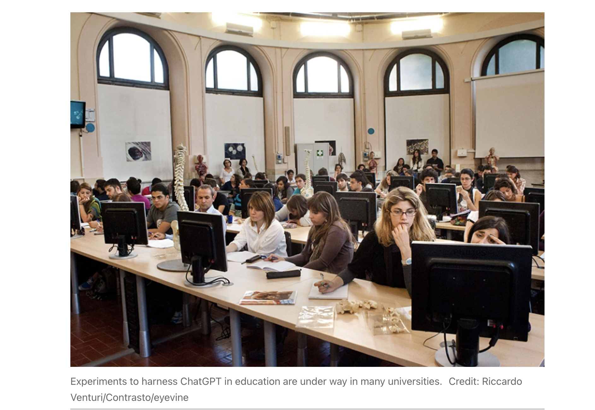

# 教师应与AI紧密为伍
## 关键洞察
1. Many students now use AI chatbots to help with their assignments. Educators need to study how to include these tools in teaching and learning — and minimize pitfalls.

## Why teachers should explore ChatGPT’s potential — despite the risks

Core Idea: Many students now use AI chatbots to help with their assignments. Educators need to study how to include these tools in teaching and learning — and minimize pitfalls.

Teachers were spooked when ChatGPT was launched a year ago. The artificial-intelligence (AI) chatbot can write lucid, apparently well-researched essays in response to assignment questions, forcing educators around the world to rethink their evaluation methods. A few countries brought back pen-and-paper exams. And some schools are ‘flipping’ the classroom model: students do their assignments at school, after learning about a subject at home.

But after that initial shock, educators have started studying the chatbots’ potential benefits. As we report in a News feature, experiments to harness the use of ChatGPT in education are under way in many schools and universities. There are risks, but some educators think that ChatGPT and other large language models (LLMs) can be powerful learning tools. They could help students by providing a personalized tutoring experience that is available at any time and might be accessible to more students than human tutors would be.（它们可以通过提供个性化的辅导体验来帮助学生，随时可用，可能比人类导师更容易接触到更多的学生。） Or they could help teachers and students by making information and concepts normally restricted to textbooks much easier to find and digest.

There are still problems to be ironed out. Questions remain about whether LLMs can be made accurate and reliable enough to be trusted as learning assistants. It’s too soon to know what their ultimate effect on education will be, but more institutions need to explore ChatGPT’s advantages and pitfalls, and share what they are learning, or their students might miss out on a valuable tool.

Many students are already using ChatGPT. Within months of its launch, reports surfaced of students using the chatbot to do their homework and essays for them. Teachers were often unimpressed by the quality of the output. Crucially, the chatbot was inventing fictitious references or citations. And although it excelled in some mathematical tests1, it didn’t do as well in others. That’s because ChatGPT has not been trained specifically to solve mathematical problems — rather, it finds plausible words to finish a sentence or respond to a query on the basis of billions of pieces of text it has seen.（尽管ChatGPT在某些数学测试中表现出色，但在其他测试中表现不佳。这是因为ChatGPT并没有经过专门训练来解决数学问题，而是根据它所见过的数十亿个文本片段来找到合理的词来完成句子或回答查询。）

In a February preprint, researchers described how, in a benchmark set of relatively simple mathematical problems usually answered by students aged 12–17, ChatGPT answered about half of the questions correctly. If the problems were more complex — requiring ChatGPT to do four or more additions or subtractions in the same calculation — it was particularly likely to fail.

And the authors of a preprint study published in July found that the mathematical skills of the LLM that underlies ChatGPT might have worsened. In March 2023, the GPT-4 version of the chatbot correctly differentiated between prime and composite numbers 84% of the time. By June, it did so in only 51% of cases. The study’s authors note that “improving the model’s performance on some tasks, for example with fine-tuning on additional data, can have unexpected side effects on its behavior in other tasks”. (研究的作者指出，“改进模型在某些任务上的性能，例如通过对额外数据进行微调，可能会对其在其他任务中的行为产生意想不到的副作用。”)

Despite these risks, educators should not avoid using LLMs. Rather, they need to teach students the chatbots’ strengths and weaknesses and support institutions’ efforts to improve the models for education-specific purposes. This could mean building task-specific versions of LLMs that harness their strengths in dialogue and summarization and minimize the risks of a chatbot providing students with inaccurate information or enabling them to cheat.

Arizona State University (ASU), for example, is rolling out a platform that enables faculty members to use generative AI models, including GPT-4 and Google’s Bard — another LLM-powered chatbot. The platform uses a technique called retrieval-augmented generation in ASU courses. ChatGPT or Bard are instructed to seek answers to users’ questions in specific data sets, such as scientific papers or lecture notes. This approach not only harnesses the chatbots’ conversational power, but also reduces the chance of errors.

One of the greatest risks is that LLMs might perpetuate or worsen long-standing societal concerns, such as biases and discrimination. For example, when summarizing existing literature, LLMs probably take cues from their training data and give less weight to the viewpoints of people from under-represented groups. ASU says that its platform helps to address such concerns by ensuring that the LLMs provide the sources that they used to generate answers, allowing students to think critically about whose ideas the chatbots present.

Vanderbilt University in Nashville, Tennessee, has an initiative called the Future of Learning and Generative AI. Students who need to use ChatGPT, for courses such as computer science, get access to a paid version. This variant of the chatbot can use other programs to execute computer code, augmenting the bot’s mathematical capabilities.（这个聊天机器人的变体可以使用其他程序来执行计算机代码，增强了机器人的数学能力。）

As understanding of the LLMs’ power and limitations increases, more university-wide initiatives will no doubt emerge. Using LLMs without considering their downsides is counterproductive. For many educational purposes, error-prone tools are unhelpful at best and, at worst, damage students’ ability to learn. But some institutes, such as ASU, are trying to reduce the LLMs’ weaknesses — even aiming to turn those into strengths by, for example, using them to improve students’ critical-thinking skills. Educators must be bold to avoid missing a huge opportunity — and vigilant to ensure that institutions everywhere use LLMs in a way that makes the world better, not worse.

## 参考
1. [GPT-4 Technical Report](https://arxiv.org/abs/2303.08774)
2. [An Independent Evaluation of ChatGPT on Mathematical Word Problems (MWP)](https://arxiv.org/abs/2302.13814)
3. [How is ChatGPT's behavior changing over time?](https://arxiv.org/abs/2307.09009)