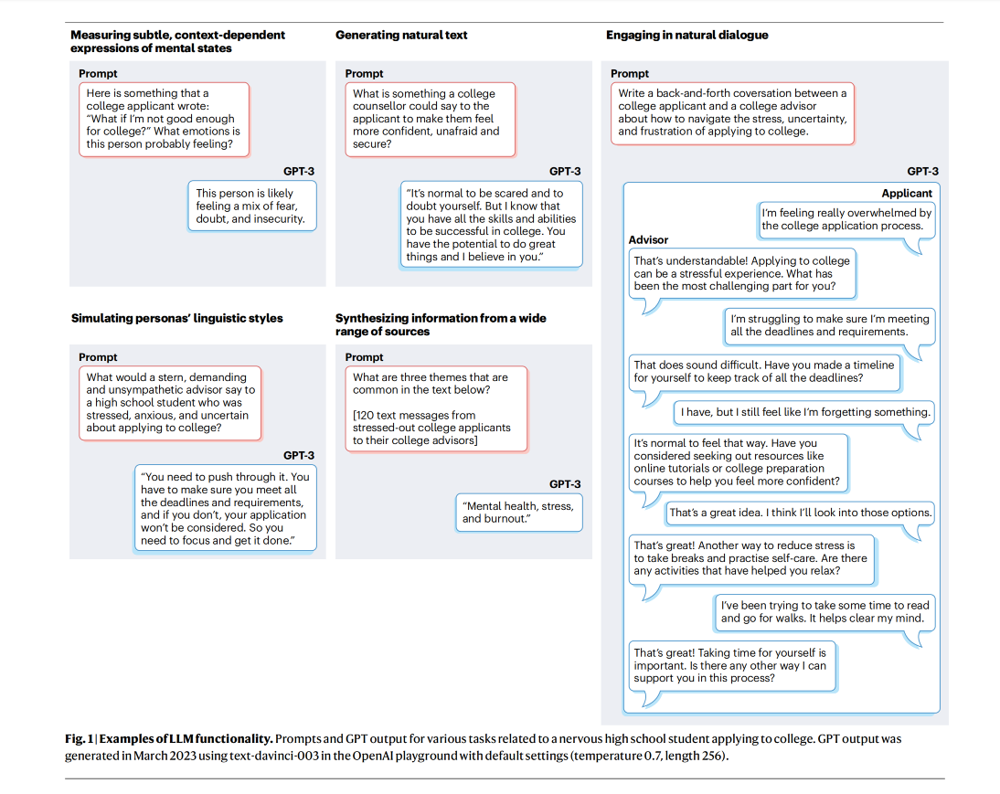
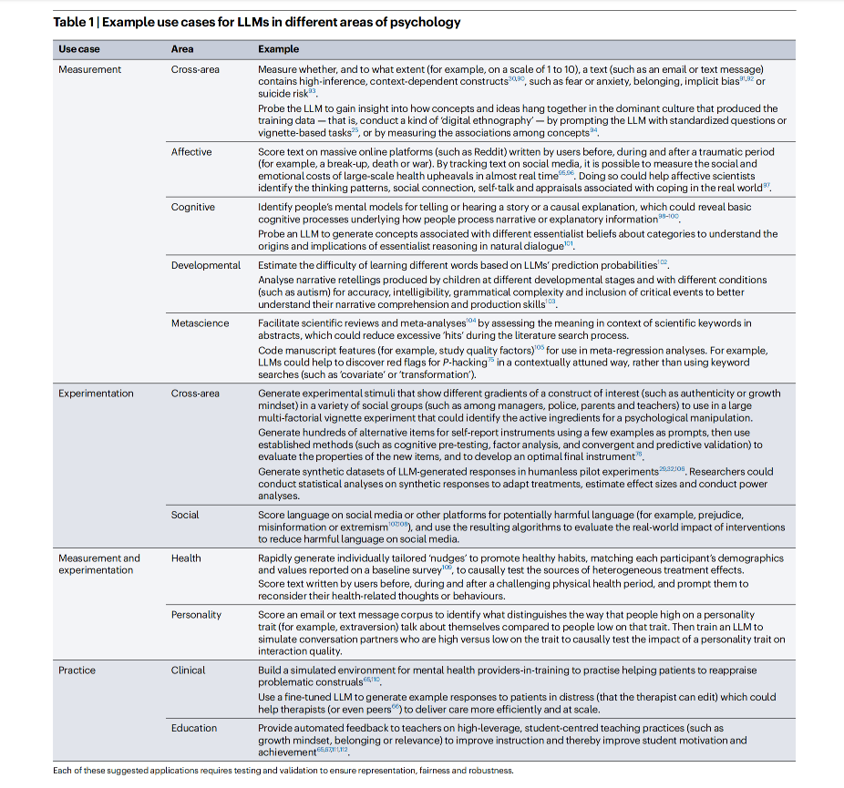
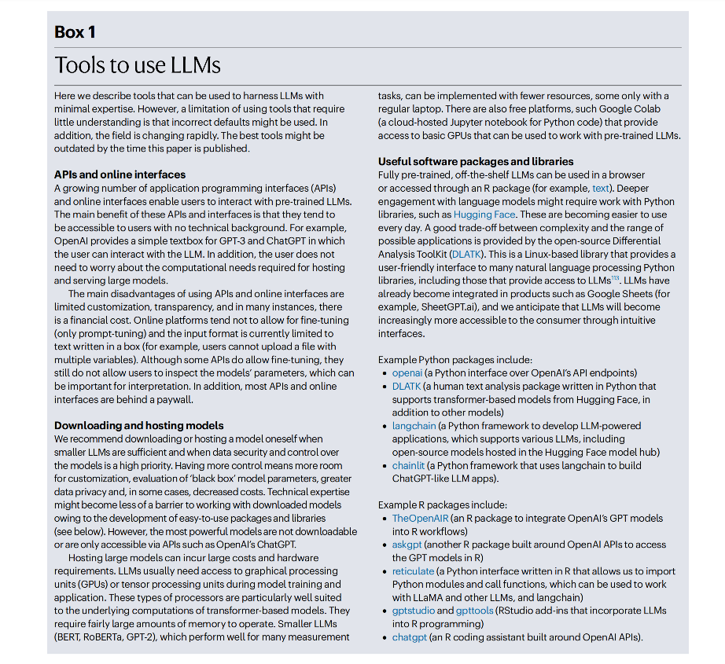
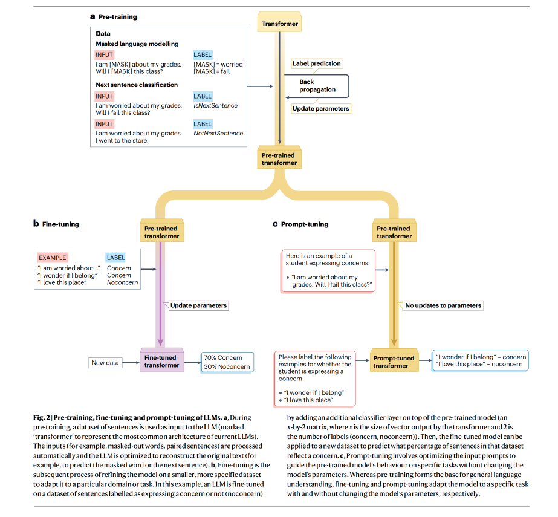
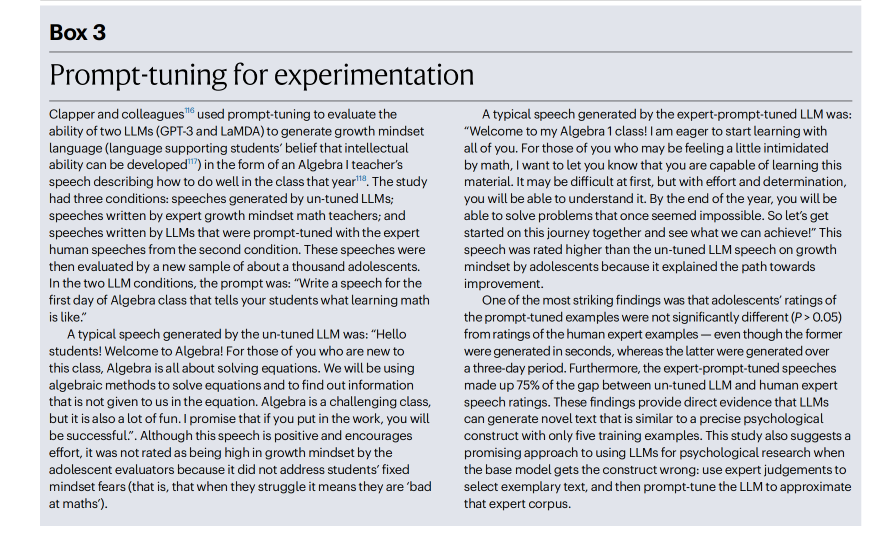
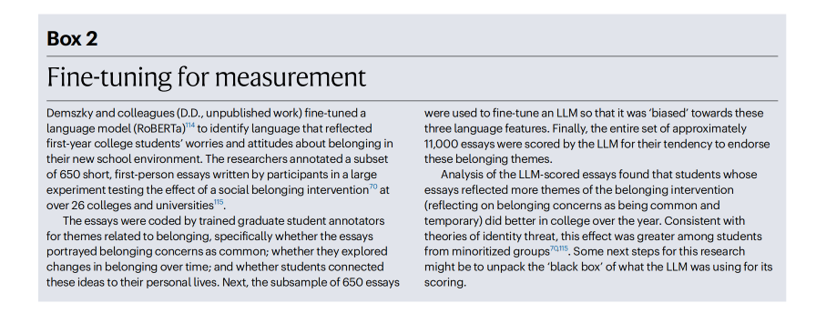

# 大语言模型之于心理学
## Using large language models in psychology
## Authors
* Originally by Dorottya Demszky et. al. and edited by Suanfamama

## Published Date
* 18 Dec, 2023

## Suanfamama Psychologist (in alpha)
We recommend using [Suanfamama Psychologist](https://chat.openai.com/g/g-aAZXemzWz-Suanfamama-psychologist) as an effective online consulting service. If you are in serious condition, consult the local hospital and certified professionals instead.

## Abstract
Large language models (LLMs), such as OpenAI’s GPT-4, Google’s Bard or Meta’s LLaMa, have created unprecedented opportunities for analysing and generating language data on a massive scale. This new technology has the potential to transform the field of psychology, as language data play a central role in all areas of psychology. In this Perspective, we review the foundations of LLMs and explain how they are constructed to effectively generate human-like linguistic output without the ability to think or feel like a human.

While LLMs have the potential to advance psychological measurement, experimentation, and practice, they are not yet ready for many of the most transformative psychological applications. However, further research and development may enable their use in the future. We also examine four major concerns about the application of LLMs to psychology and discuss how each concern might be overcome.

In conclusion, we recommend investments in feld-initiated 'keystone' datasets, increased standardization of performance benchmarks, and shared computing and analysis infrastructure to ensure equitable and effective LLM-powered research in the future.

## Introduction
Language is a core aspect of all areas of psychological science. For instance, language is a primary means through which children form mental models of the world (developmental psychology). These mental models are revealed through verbal explanations of events (cognitive psychology) and interactions with others (social psychology). Language can reveal disordered mental models that could be targeted by treatments (clinical psychology) or communicate emotions and guide emotion regulation strategies (affective psychology), which have important implications for physical and mental well-being (health psychology). Individual differences in traits such as agreeableness, extraversion or narcissism are expressed in spoken and written communication styles (personality psychology). Finally, research is conveyed through text in scholarly papers, which then serve as objects of study in systematic reviews (metascience).

Technological advances in natural language processing in the past two decades have made it easier than ever for psychologists to incorporate language analysis in their work. As computational power and the availability of data have grown, language analysis has progressed from humans counting words in text, starting in the 1960s, to latent semantic analysis in the 1990s and to automated algorithms for analysis of text on the internet in the 2010s. For instance, one popular algorithm (the Linguistic Inquiry and Word Count program) enables researchers to examine the frequency of occurrence of different categories of words and assess how they predict outcomes such as physical and psychological health. Another prominent example is topic modelling, which uncovers themes in documents by analysing word co-occurrence patterns (via Latent Dirichlet allocation). The advent of LLMs, such as OpenAI’s generative pre-trained transformer (GPT) models, Google’s LaMDA and Bard AI (which can both generate and score text in human-like ways), will probably push the field in new directions.

To illustrate these capabilities, Fig. 1 shows how an off-the-shelf LLM performed various tasks related to a nervous high school student applying to college. This college-advising example points to potentially broad applications of LLMs across diverse areas of psychology. LLMs can be used to query people’s mental models of themselves and their environments (social and cognitive psychology), infer individual differences in coping styles (personality psychology), or help people to reappraise stressful experiences (affective and clinical psychology). Moreover, the text in Fig. 1 was generated in seconds, showing that LLMs can accomplish tasks relevant to psychologists nearly instantaneously. Thus, LLMs unlock possibilities for scale and efficiency in psychological research and practice that were unthinkable just a few years ago.

Extrapolating from examples such as this, researchers might envision applying LLMs to measurement (for example, to probe psychological patterns in massive bodies of text), experimentation (to rapidly generate stimuli and responses to those stimuli to improve the granularity of factorial designs) and practice (to simulate realistic conversations to train human therapists, counsellors, teachers or managers). Table 1 previews use cases across subfields in each of these three categories of applications. We generated these use cases by consulting experts in several areas of psychology about how LLMs could make their work more efficient or wholly different. These use cases are not exhaustive, but rather illustrate the breadth of what might be achieved if the field is successful at adapting LLMs for psychological purposes. 

The potential uses of LLMs are as tantalizing for the lay public as they are for researchers. For example, the public rushed to use LLMs such as ChatGPT for mental health screening and therapy16, and a nationally representative survey found that 40% of US teachers were using ChatGPT weekly for lesson planning just three months after its public release17. The question is not whether LLMs will influence everyday life and psychology. Instead, the question is whether — and on what timescale — the field will apply a nuanced understanding of LLM technology to developing and disseminating tools so that psychologists can harness its power for their research, while avoiding the harm that might come from premature applications.

In this Perspective, we explore issues related to using LLMs in psychology. First, we describe how LLMs work, and what this information means for their applications in psychology. Next, we address concerns about using LLMs for psychological purposes, along with potential solutions to these concerns. It is important to raise these concerns because if they are left unaddressed LLMs might be used in ways that cause harm to the public. Members of underrepresented groups in particular could suffer harm owing to biases in how AI models are trained and implemented. We conclude by discussing how collaborative, team-science initiatives could advance psychological science and inform an ethical future for the applications in practice of LLMs.

## Conceptual and methodological foundations
As with many new technologies, LLMs have the potential to change psychology research, but also to be misunderstood. Thus, it is critical to understand what LLMs are and what they are not. Here we provide a brief overview of how LLMs are trained, how they work and how they can be adapted to the use cases presented in Table 1. We summarize currently available software tools for using LLMs in Box 1.

### How the models are fitted

LLMs are designed to reproduce word co-occurrence patterns that were found in their training data. They have become very good at this task owing to immense quantities of training data and complex architecture. The most common model architecture for LLMs is the ‘transformer’, which forms the backbone of modern models such as BERT, GPT, Bard and LaMDA. These LLMs are essentially massive systems of nonlinear regression equations (specifically, neural networkmachine learning models). These models often have millions of parameters that were calculated by taking sentences as predictors (an X in a regression equation) and masked-out words or the next sentence as an outcome (Y). The prediction error from one fit is then used to update the models’ parameters (via backpropagation), and the process is repeated until the parameters sufficiently minimize the difference between the model output and the target text. This process is broadly referred to as pre-training (Fig. 2a). The newest models such as ChatGPT and GPT-4 involve additional pre-training steps, including instruction tuning and reinforcement learning from human feedback to further improve the model’s ability to generate coherent and relevant language. Off-the-shelf LLMs are powerful, but they cannot fulfil their potential for psychology research without further adaptation. For example, in the LLM-generated dialogue on the right of Fig. 1, the LLM-generated college advisor asked whether the LLM-generated applicant had created a ‘timeline’ or taken ‘online courses’. These are reasonable things for an advisor to say but are not necessarily good advice. In fact, according to a large, rigorous, randomized experiment funded by the US Department of Education, this kind of college-advising guidance has no effect on college persistence compared to a control condition. In summary, the LLM generated on-topic, grammatically correct useless information.

Furthermore, the LLM-generated advisor encourages the applicant to ‘reduce stress’, ‘take breaks’ and practice ‘self-care’. These are common themes in advice from advisors. However they are generally not what research on stress shows is helpful or what might be most appropriate given the context. The LLM seems to have acquired a stress-is-debilitating mindset — the notion that stress always harms performance and health. This mindset is contradicted by research that emphasizes the importance of understanding the potentially enhancing role of stress. That is, the body’s stress response keeps people alive by helping to mobilize energy for performance (for example, getting more oxygenated blood to brains and muscles).

Thus, the college-advising example in Fig. 1 illustrates that LLMs are not designed to predict what language should come next, according to the truth of the matter, let alone according to some standard from psychological theory or evidence. They are not generating advice with the listener’s well-being — or the scientific literature — in mind. They are simply parroting what the training data tended to say about the concept, so that the dialogue sounds natural. In other words, if the cultural context that produced the training text tends to give bad advice about applying to college, then the LLM will probably parrot common but ultimately unhelpful advice.

That said, the biases in LLMs’ output might be interesting to research. Researchers might ask: what does it say about human culture that the LLM learned a stress-is-debilitating mindset from its training data? Because LLMs are trained on massive bodies of human language, probing LLMs provides a window into how concepts and ideas hang 
together in the dominant culture that produced the training data. This feature could enable researchers to trace the collective knowledge of the people who generated the training data.

### Adapting LLMs for specific purposes
Although off-the-shelf LLMs might provide insight into the way people on the internet see concepts such as a stress-can-be-enhancing mindset, scientists typically want to study constructs using scientific conceptions of those constructs. Thus, using LLMs to advance scientific theory and to fashion state-of-the-art interventions requires a different approach than relying on off-the-shelf LLMs. In particular, psychologists will need to additionally train (or ‘tune’) LLMs on high-quality data curated by experts for a given construct. Moreover, they will need to conduct evaluation experiments to see whether the LLM-generated data are as effective as intended. This need for additional training and evaluation is important to emphasize because much of the public’s conversation about LLMs has focused on off-the-shelf performance. However, the LLMs that will be most effective are likely to require additional training with datasets specific to a particular domain. For example, DocsGPT is an LLM that is pre-trained on medical prose to help with clinical correspondence and charting. Here 
we describe how fine-tuning and prompt-tuning can be used to tune LLMs to specific domains (for example, parent–child interactions) or constructs (for example, optimal stress coping or a growth mindset) that are not represented scientifically in the public’s language or in the LLM’s training data.

Fine-tuning. Fine-tuning (Fig. 2b) involves giving the pre-trained LLM new and more specific training data to adjust the model’s parameters for a specific task. Fine-tuning data can come in many forms. Generally, the larger and the more representative the data is of the target task and domain, the better the fine-tuned model will perform. The new data might be a set of texts annotated by experts for a ‘stress-is-debilitating’ versus a ‘stress-can-be-enhancing’ mindset, high versus low narcissism, metaphors that represent causal relationships, or the expected responses to a given query. Annotations do not always need to come from experts. They can include lay annotations (which might have bias) or any kind of metadata, such as reactions to social media posts or the demographic data of those who produced the text. Unlabelled text can also be used to improve the models’ performance in a particular domain that is under-represented in the training data, such as language from parent–child interactions or language from people with a speech-related disability. Fine-tuning LLMs is powerful because it requires orders-of magnitude less data than would be needed to train a specialized model from scratch (as few as 5–100 annotated examples may be needed to fine-tune versus potentially hundreds of thousands of examples to train a new model). Fine-tuning a pre-trained LLM therefore substantially reduces the amount of hand-annotated data needed (Box 2). Fine-tuning also has its drawbacks. First, fine-tuning is still computationally expensive. Powerful servers are required to update the LLM’s parameters. Second, high-quality annotated data to use in fine-tuning can be difficult to come by. For example, coders might not agree on what counts as a narcissistic statement, a growth mindset statement, or bad advice for coping with stress. Finally, the fine-tuned model might retain biases that were inherent in the LLM’s foundational training corpus. It could even become more biased depending on who did the fine-tuning (for example, researchers without expertise or who fine-tune from their own potentially biased viewpoints). As discussed below, a critical task for the field is to curate large, reliable annotated datasets of key psychological constructs while minimizing unwanted biases. Prompt-tuning. A second approach to customizing an LLM for a specific purpose is prompt-tuning (also called in-context learning) (Fig. 2c). Prompt-tuning is becoming popular because the LLM does not need to be re-fitted (that is, the underlying model parameters are not changed). Instead, the type of output the LLM generates is tailored to match user-generated prompts. Thus, the customization can happen quickly. For example, a user interested in fostering a stress-canbe-enhancing mindset could prompt-tune an LLM with the following prompt: “Here is some good advice to give to people who are very stressed. [user enters one or two examples written by the user or an expert]. What is a way to give this advice to someone who is stressed about work?” The LLM would then output one or two examples. The user could then ask (in the same session with the LLM): “What is a way to give this advice to someone who is stressed about relationships?”

## Concerns about applying LLMs to psychology
(TODO: to fill)

## Outlook
The introduction of GPT (and related LLMs) is a revolutionary advancement in language-related technology that has profound implications for psychology. Massive amounts of language data can now be harnessed to help psychologists to develop better measures, to perform larger and perhaps more definitive experiments, and to develop and test ways of enhancing practice in areas that are critical to society, such as education and mental health. Armed with an understanding of the conceptual foundations and concerns related to the use of LLMs in psychology, we turn to three important investments the field can make to realize the full potential of LLMs. Of course, it is unlikely that any single researcher could make these investments on their own. Thus, we foresee a need for collaborations across individual research groups, professional organizations (such as the Association for Psychological Science or the American Psychological Association), private industry and the funding community. 

**First, a priority is to invest in keystone datasets.**（首先，要投资一个数据集）These are large natural language databases that meet the highest standards for both expert and impact evaluation. Keystone datasets must represent populations and psychological constructs of interest; must rely on precise definitions of these psychological constructs (possibly including expert annotations); and must be linked to psychologically important outcomes, such as real-world behaviour, mindset, health and mental health, or academic and career trajectory.（数据集需带有心理学权威出处） 

For example, the Texas Mindset Initiative is creating a large dataset of 1,000 Texas secondary school teachers’ natural language when talking with students. Teachers’ transcripts can be annotated with expertise in different constructs, such as growth mindset (the belief that intellectual abilities can be developed), emotional reappraisal (novel ways of thinking that lead to decreased negative emotions) or autonomy support (whether teachers refrain from controlling language). These data could then be empirically linked with teachers’ reports of their intentions to use these concepts, with students’ ratings of classroom culture, and with students’ academic performance over time. 

Triangulating across these sources of data will enable discoveries. For example, researchers might learn what teachers can say to a struggling student to support their mindset, to help them to cope with stress and to help them to learn. These findings could then yield opportunities for fine-tuning LLMs to measure or recommend language that matches the constructs of interest, which could in turn power educational technologies such as virtual tutors or coaching tools for teachers. If similar datasets are collected in other educational contexts, for example in a different region, country or for a different developmental age group, these datasets could collectively shed light on the culture-dependent and age-dependent context-specificity of LLM-generated psychological language in teaching contexts. 

Similar efforts could be undertaken by scholars interested in other constructs or policy spaces. The availability of online therapy platforms, body cameras on police officers and recorded Zoom meetings offers much new material for keystone datasets in clinical psychology, policing and management. We envision a field in which experts have reached a consensus on a corpus of text that embodies major constructs in the field, which can be used to fine-tune LLMs and unlock opportunities for at-scale natural language analyses. 

**Second, the success of LLMs so far comes from the benchmarking culture in computer science.** Benchmarking occurs when model developers refine their software to optimize performance on a set of defined tasks and datasets. However, existing forms of benchmarking might not be appropriate for many psychological use cases owing to the highly context-dependent nature of psychological constructs and intersubjectivity issues. Thus, a new, psychologically defined way of benchmarking LLMs could help to facilitate the development of safe and transparent algorithms that advance the field. Creating such benchmarks depends on the availability of keystone datasets and requires a consensus on how to define and operationalize psychological constructs. Finally, the field needs to create standards and procedures for safety and transparency, which might involve sharing models with other scientists for further evaluation. Organizing bodies (such as professional societies and funding agencies) could drive this consensus process. 

Importantly, the privacy and confidentiality of language data will need to be accounted for in benchmarking practices. This is especially important when working with data from vulnerable populations. Instead of sharing their original data publicly, psychologists might share anonymized or modified versions of their data where randomized simulations are used to prevent reverse identification. There is a large and growing body of research and policy concerning AI and the use of private data, and the role of AI in perpetuating biases, which will be critical for the future of LLM-powered research. 

**Third, as psychologists increasingly see the potential for LLMs to influence their work, it will be important to ensure that access to these tools remains equitable.** There are still only a handful of LLMs, because fitting each one takes an immense amount of resources. For example, the basic research and model fitting required to create ChatGPT cost US $3 billion. Even the smaller, less costly LLMs can take months to train with the most advanced cloud computing resources. Because academia is unlikely to compete with the for-profit sector for the development of multi-billion-dollar models, researchers should invest in developing cost-effective LLMs whose performance is as close as possible to expensive, paywall-protected and non-downloadable models. It will be important to ensure that academics can access discounted or free research licences for using LLMs. To further lower barriers to entry, tutorials, optimal defaults and vetted data-processing pipelines should be created. Investments in time-shared research infrastructure, including access to servers or cloud computing, can ensure that a researcher’s funding does not prohibit them from conducting AI-informed science. Moreover, working with LLMs responsibly might require a level of technical expertise that is not typically taught during psychology methods training. Thus, a new generation of text-analysis psychology methods courses and more training in programming languages such as Python might be needed. Finally, we see many opportunities for the next generation of open science collaboration and team science to contribute to the future of LLMs in psychology. Psychological scientists and computational linguists can learn from one another and could contribute to aspects of keystone data collection and model fine-tuning. Interdisciplinary team science has the potential for contributions to both fields: particularly interesting use cases might be introduced to the computational linguistics literature from psychology, whereas the technical advances developed by computational linguists could empower new study designs and methods for psychology.

## References
* Using large language models in psychology, nature reviews psychology, Vol 2

## Suanfamama Suggested TODOs
* Try DocsGPT
* Try LLM with RAG
* Invest a Keystone dataset in psychology
* Take part in some benchmarking activities in psychology
* Ensure that access to these tools remains equitable