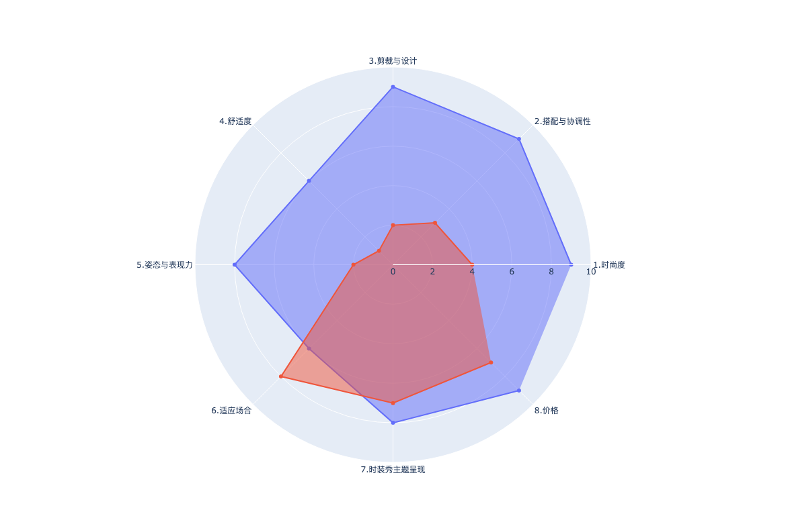

# 美感特征矩阵
AI原优舍是算法妈妈旗下服饰买手店，我们荣幸为业界时尚从业者提供美感特征工程。

### 一级指标
1. 整体印象（Overall Impression）：综合考虑所有因素，形成对整体look的印象，包括模特的外貌、氛围和整体感觉等。

### 二级指标
1. 时尚度（Fashionability）：评估服饰是否符合当下的时尚潮流和风格，以及是否具有独特的设计元素；
2. 搭配与协调性（Coordination）：着重考虑服饰搭配的协调性，包括颜色、图案和配件等元素是否相互匹配；
3. 剪裁与设计（Cut and Design）：考察服饰的剪裁是否合身，设计是否独特，是否展现出设计师的创意；
4. 舒适度（Comfort）：考虑模特在穿着这套服饰时是否感到舒适，特别是在走秀过程中是否受到影响；
5. 姿态与表现力（Posture and Expression）：考察模特走秀时的姿态、表情和自信度，这能够增强服饰的整体效果；
6. 适应场合（Appropriateness）：考虑服饰是否适应特定的场合，如晚礼服、日常休闲等，以及是否符合走秀活动的主题；
7. 时装秀主题呈现（Theme Presentation）：如果时装秀有特定的主题，评估模特是否成功地呈现了这个主题，并将其与服饰相结合；
8. 价格区间（Cost Range）：预估基本搭配服饰价格的上界和上界；

* 例子1：两个款，分别使用红色和蓝色进行覆盖，在算法妈妈美感特征矩阵中的表现

### 三级指标（起草中）
#### 1. 时尚度
1. 创新性
2. 是否符合流行趋势

#### 2. 搭配与协调性
1. 颜色
2. 基本搭配
3. 整体搭配

#### 3. 剪裁与设计
1. 廓形与款式
2. 风格
3. 剪裁细节

#### 4. 舒适度
1. 面料

#### 5. 姿态与表现力
1. 上装分数
2. 下装分数
3. 其他分数

#### 6. 适应场合
1. 落地能力
2. 目标市场偏好
3. 目标市场季节
4. 目标市场可穿戴性

#### 7. 时装秀主题的呈现
（暂无）

#### 8. 价格
1. 价格