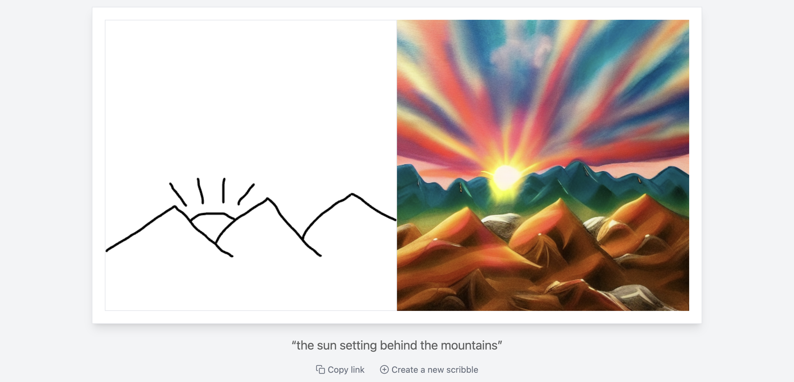

# AI设计
## 简介
* 目前此设计工具的完整版供公司内部设计团队使用，我们把基础版免费供大家[使用](https://www.designer.Suanfamama.com/)。

## 设计师工作流
* 我们主要使用Midjourney和Stable Diffusion以达到AI赋能时尚设计的目标；
* 我们主要使用Midjourney捕获灵感；
* 我们主要使用Stable Diffusion在灵感中加入部分控制；

## 关键设计步骤
### 1. 线稿设计
### 2. AI上色
### 3. 模特2D转3D