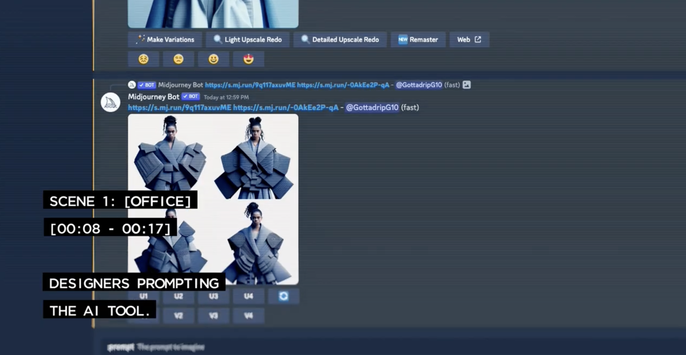
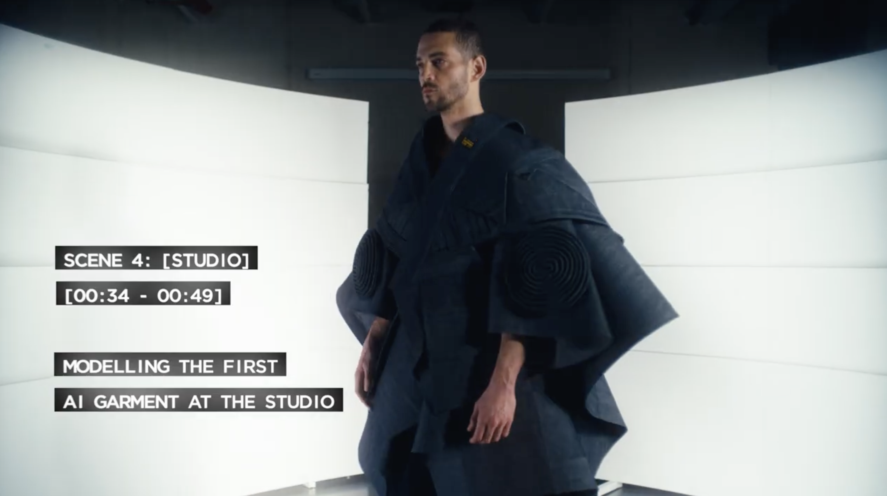

# AI赋能时尚
* Originally by [G-Star](https://www.g-star.com) and edited by [algmon](https://twitter.com/algmon2024)

* 上图：G-Star，牛仔衫从创意到落地
* It's important to note that AI is a tool. It's the human designer who ultimately makes the creative decisions.

## Intro
G-Star said: "We love to innovate and bring new tools within the design process and integrating AI into it can provide benefits such as increased efficiency and accuracy. It can also help reduce waste in the production process by immediately visualizing a raw idea into a well-made outcome. But it's important to note that AI is a tool. It's the human designer who ultimately makes the creative decisions."

## AI Powered Designing Process

* Step 1: Designers prompt the AI tools with thoughts.

* Step 2: Tailors create the AI denim garment based on the intial lookbook.

* Step 3: Designers craft the final details such as display pose.

* Step 4: Model models the first AI garment at the studio

* Step 5: the Company publish the AI lookbook

## Main AI Tools
* [Stable Diffusion](https://stability.ai/)
* [Midjounery](https://www.midjourney.com/)
* PhotoRoom

## References
* [Fashion brands must catch up to AI, not halt progress](https://fashionunited.uk/news/fashion/fashion-brands-must-catch-up-to-ai-not-halt-progress/2023040468807)
