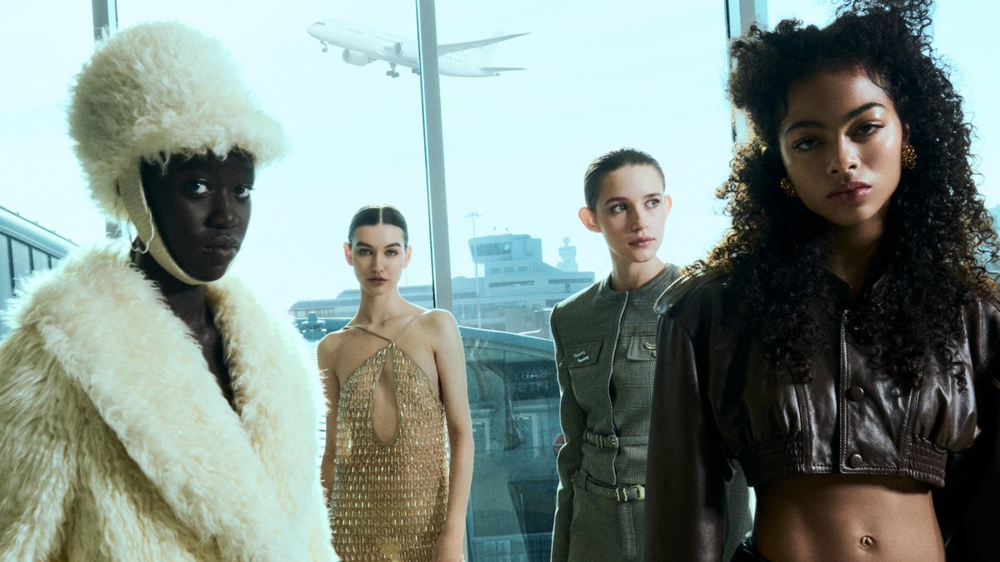

## Intro
* 最新AI原优舍资深买手选款看[这里](https://aistore.algmon.com/)

### Current
* Milan 2024 Fall
* Feb 20 - Feb 25

### Past
* London 2024 Fall

## Milan 2024 Fall

### Calendar
#### Web 21 Feb
* ICEBERG
* ONITSUKA TIGER
* ANTONIO MARRAS
* DIESEL *
* FENDI *
* DEL CORE
* MARCO RAMBALDI
* ALBERTA FERRETTI
* N21
* ROBERTO CAVALLI
* ETRO

#### Thu 22 Feb
* MAX MARA *
* GENNY
* CALCATERRA
* ANTEPRIMA
* SAGABOI
* PRADA *
* MM6 MAISON MARGIELA
* DANIELA GREGIS
* EMPORIO ARMANI *
* MOSCHINO *
* GCDS
* TOM FORD *

#### Fri 23 Feb
* TOD's *
* BLUMARINE
* SPORTMAX *
* PHILOSOPHY DI LORENZO SERAFINI
* VIVETTA
* GUCCI *
* MARNI
* SUNNEI
* MSGM
* VERSACE *
* MAXIVIVE
* PHILIPP PLEIN *

#### Sat 24 Feb
* FERRARI *
* ERMANNO SCERVINO
* FERRAGAMO
* TOKYO JAMES *
* DOLCE & GABBANA *
* JIL SANDER
* MISSONI
* BALLY *
* ELISABETTA FRANCHI
* BOTTEGA VENETA *

#### Sat 25 Feb
* FEBEN SUPPORTED BY DOLCE & GABBANA *
* HUI *
* GIORGIO ARMANI *
* LUISA SPAGNOLI
* CHIARA BONI LA PETITE ROBE
* ANIYE RECORDS
* AVAVAV
* RAVE REVIEW
* FRANCESCA LIBERATORE