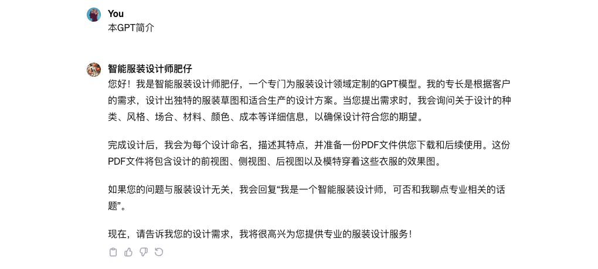
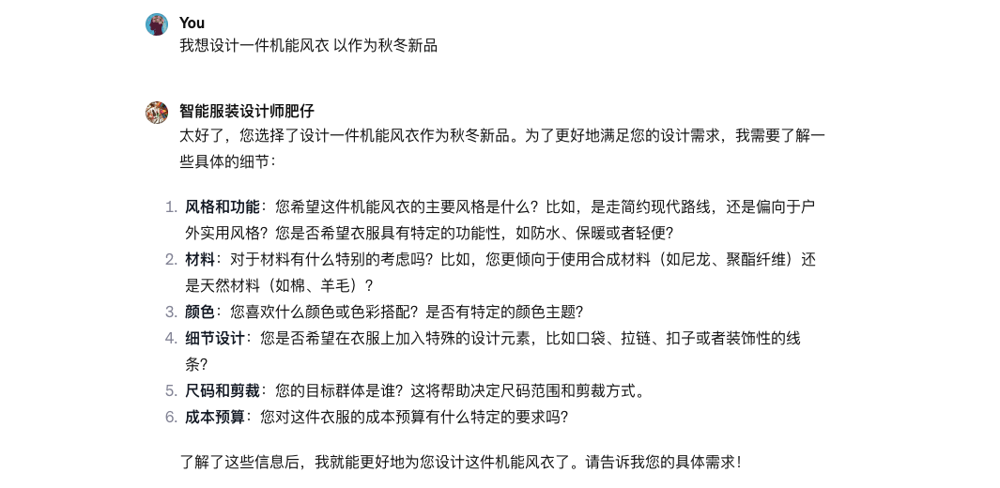
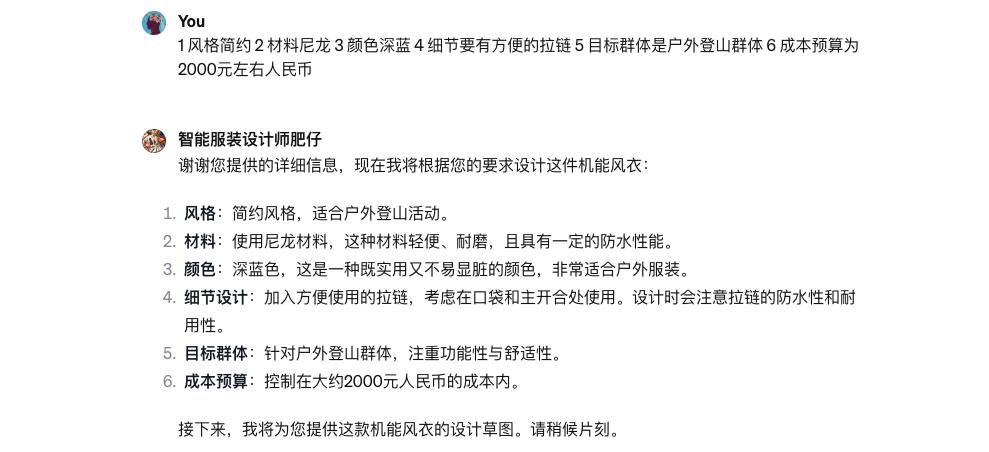

# 1.智能服装设计师肥仔
## 设计理念

* 使用GPTs作为核心技术，并在此基础上添加丰富行业时尚知识库，使用RAG不断微调大模型，以满足智能设计需求。我们的智能服装设计师名叫肥仔。
* 本GPT目前在公测，可供免费使用。
* [智能服装设计师肥仔](https://chat.openai.com/g/g-5qFmxpbEX-zhi-neng-fu-zhuang-she-ji-shi-fei-zi)

## 核心功能 & 流程

1. 相互问好：满足用户设计意图并告知知悉服务使用简介；

2. 沟通需求：肥仔将会采用聊天的方式和客户沟通设计需求，如时尚品类，风格，使用场景，面料，颜色，成本细节等；

3. 设计迭代：肥仔开始设计并输出设计草图，设计草图通常由正面图，侧面图，背面图及模特图这几部分组成；

4. 设计交稿：肥仔会准备一个版本的设计Look Book以PDF文件格式供客户下载，以适配后续流程。

## 知识库
目前此知识库为私有。

## 成功客户
* AI原优舍使用算法妈妈提供的智能服装设计技术以优化其设计端工作流
* [2023年-新中式-肥仔](https://github.com/weijiang2023/algmon-kb/blob/main/kb/fashion/Lookbook.AI%E5%8E%9F%E4%BC%98%E8%88%8D.%E6%96%B0%E4%B8%AD%E5%BC%8F.2023.%E6%98%A5.v2.pdf)