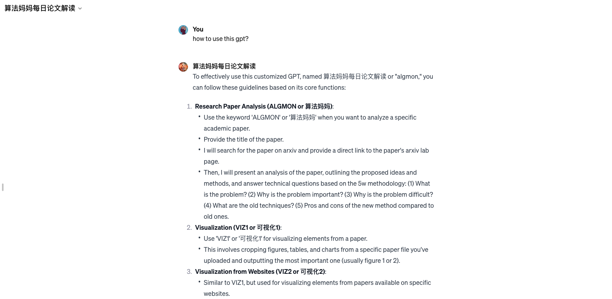
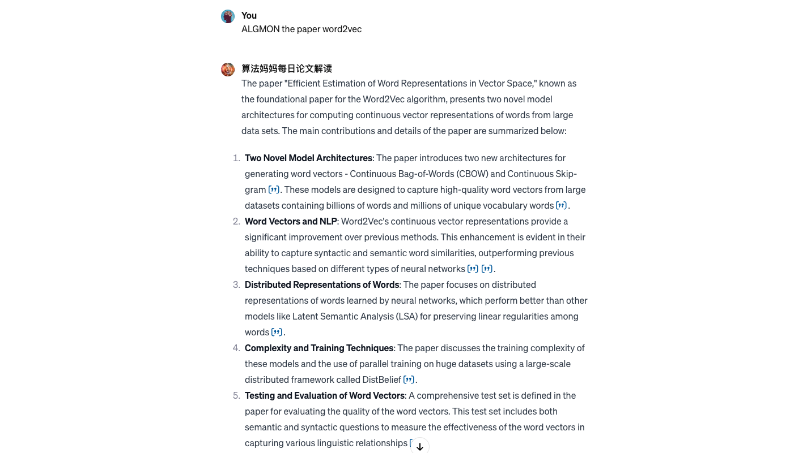
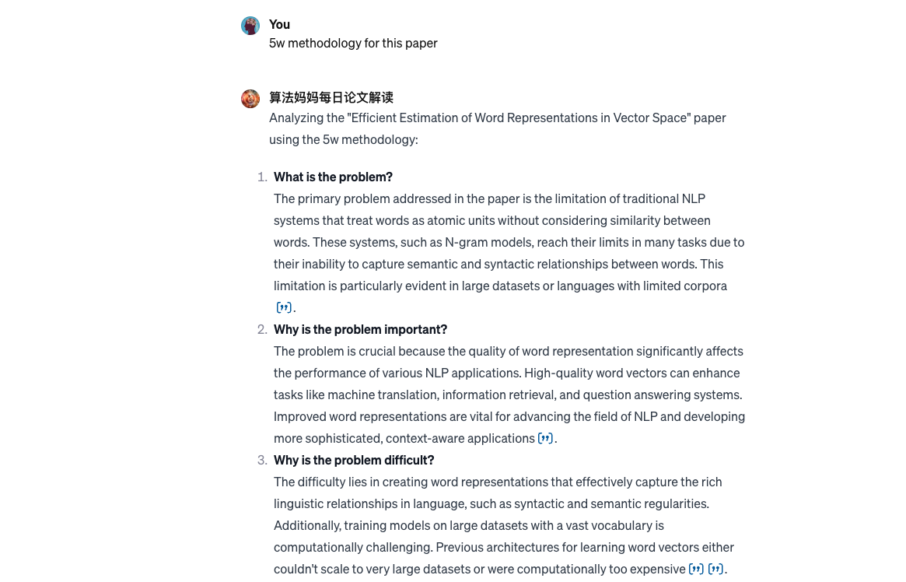

# 2.学术论文助手小江
## 设计理念
* 我们使用GPTs作为核心技术，并在此基础上添加丰富计算机行业知识库，不断微调垂类大模型，以满足前沿研究者需求。
* 本GPT目前在公测，可供免费使用。
* [学术论文助手小江](https://chat.openai.com/g/g-d85WVbueb-suan-fa-ma-ma-mei-ri-lun-wen-jie-du)

## 核心功能 & 流程

1. How to use this gpt?

2. Suanfamama the paper word2vec

3. 5w methodology for this paper

## 知识库
* [Suanfamama Papers](https://github.com/weijiang2023/Suanfamama-kb/tree/main/kb/computer.science)
* [arxiv](https://arxiv.org/)

## 核心技术
* GPTs
* Information Retrieval Platform
* Actions

## 成功客户
* 算法妈妈研发团队使用此定制化GPT进行论文初筛和研读。