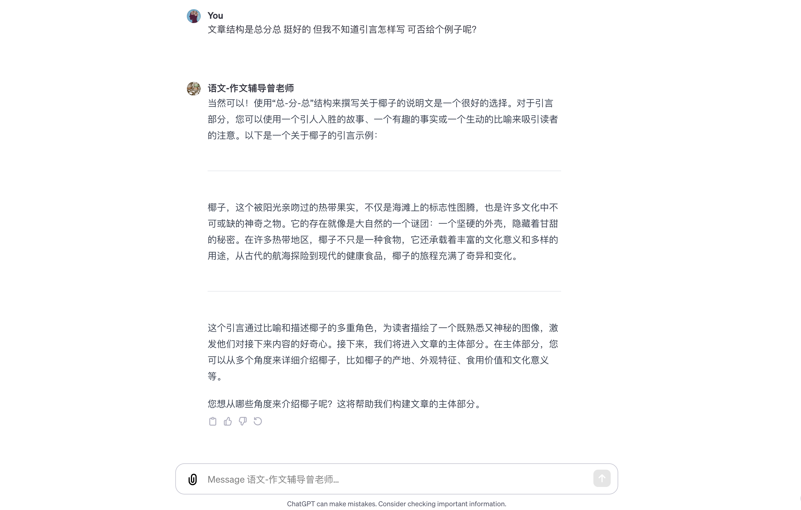
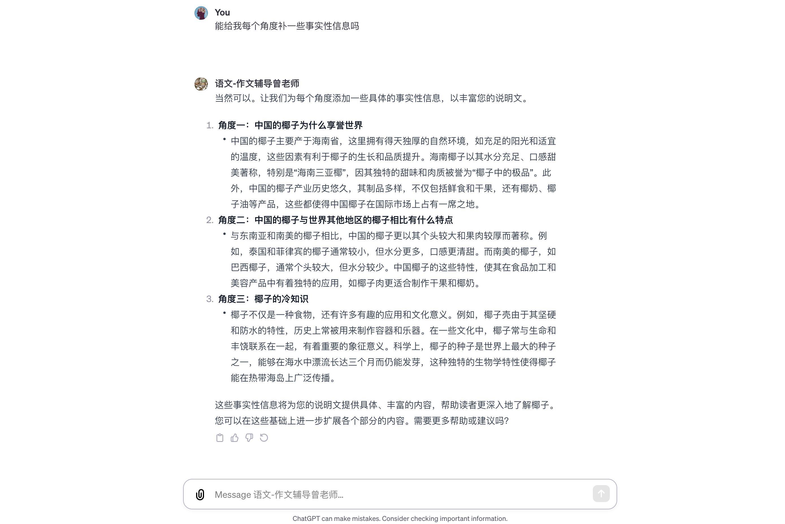
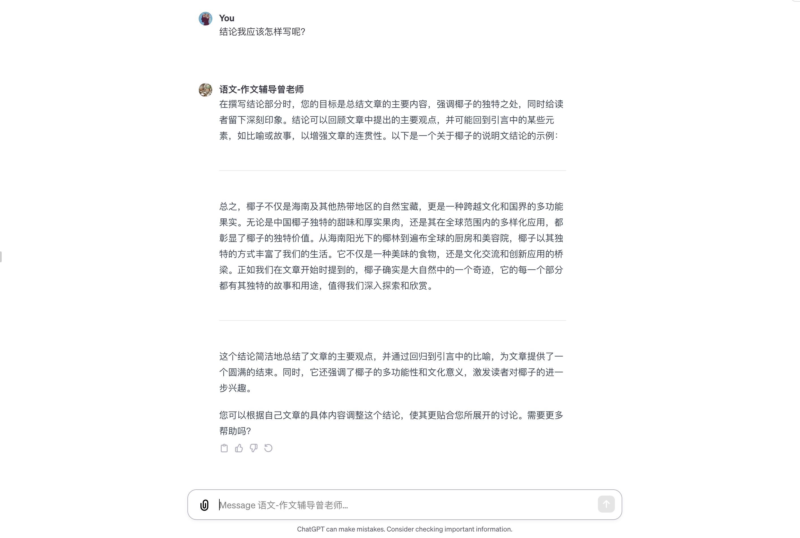

# 智能教培-学科类-语文
## 简介

## 服务链接
[语文-作文辅导曾老师](https://chat.openai.com/g/g-JEvikTlen-yu-wen-zuo-wen-fu-dao-ceng-lao-shi)

## 核心功能 & 流程

0. 相互问好：满足用户需求并知悉服务使用简介

1. 选题过程：启发式引导学员进行头脑风暴并产出初步想法

2. 结构选定过程：通过启发式引导学生对说明文的整体结构认知，如总-分-总的说明叙事结构

3. 引言通过比喻和描述为学员作一个范例

4. 适时肯定学员的所思所想并对思路进行优化，如角度，结构等

5. 进一步为学员提供说明文所说明事物的事实性信息，以加速和优化学员创作流程。有时候，不是学员没有创作能力，而是简单的词汇拼写，事实性信息的缺失阻碍了他们的野心

6. 引导学员结论的写作并给出范例

7. 智能批改学员的文段，并更正椰子的事实性信息如椰子并不软