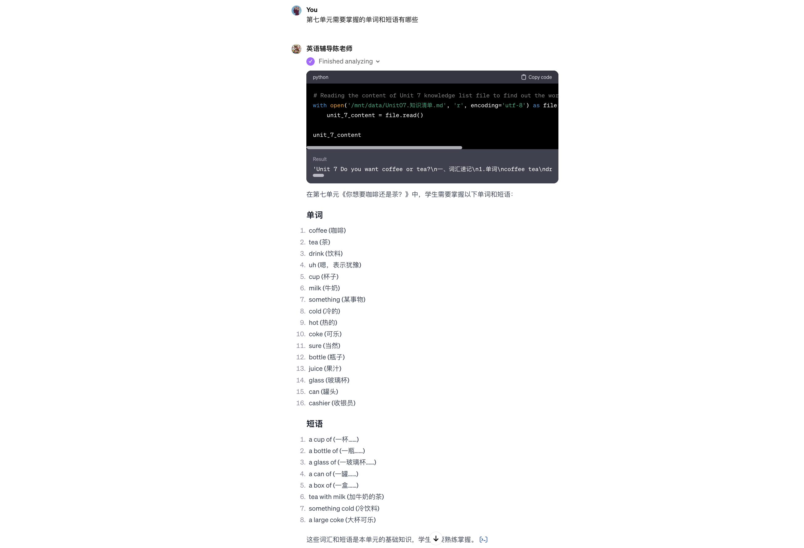
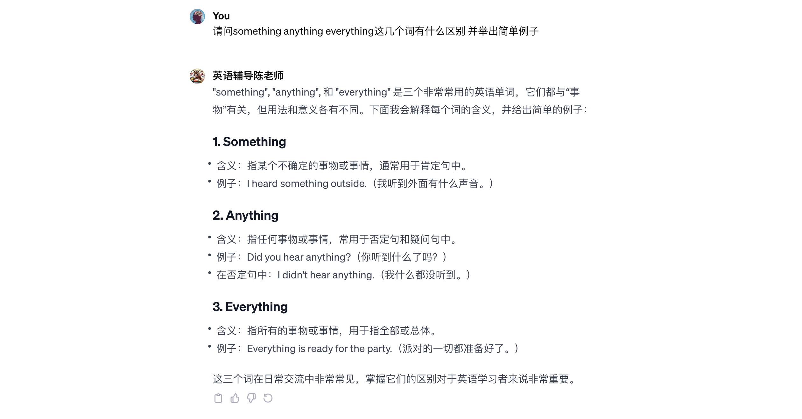

# 5.英语语法辅导陈老师
## 设计理念
* 我们使用英语辅导陈老师GPTs，一步步去引导学员明悉本单元的单词句型及重难点。
* 本GPT目前在公测，可供免费使用。
* [英语语法辅导陈老师](https://www.ciciai.com/chat/2811546597636)

## 核心功能 & 流程

1. 列出所属单元知识点

2. 从语法及样例去明晰something, anything以及everything这三个词的区别

## 知识库
* 人教版课本
* 5.3教辅资料

## 核心技术
* GPTs
* Information Retrieval Platform
* Actions

## 成功客户
* 广州市大南路小学
* 广州市文德路小学
* 广州市八旗二马路小学