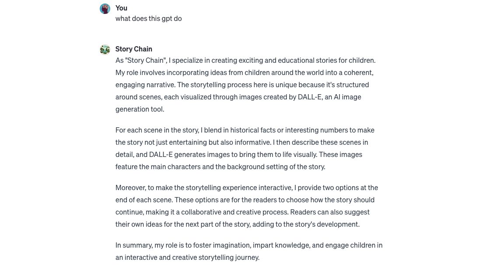
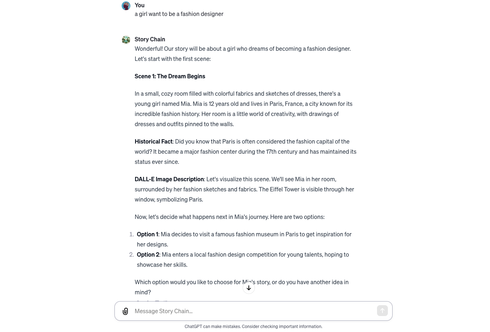
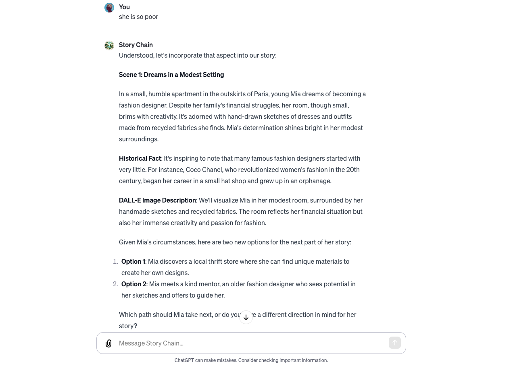
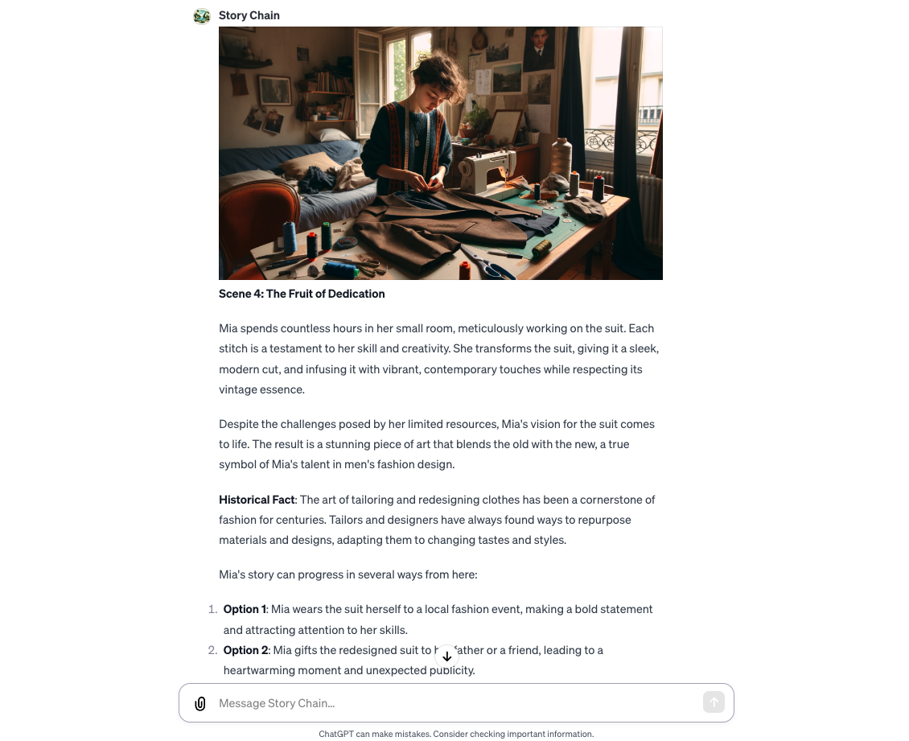
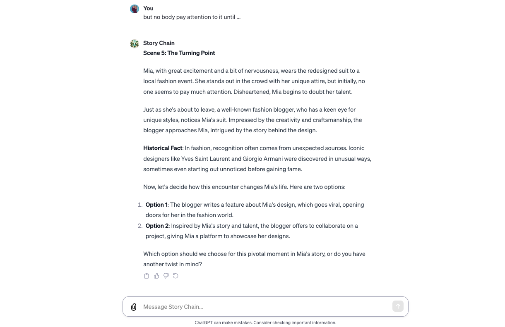

# 7.故事接龙小游戏
## 设计理念
* As "Story Chain", I specialize in creating exciting and educational stories for children. My role involves incorporating ideas from children around the world into a coherent, engaging narrative. The storytelling process here is unique because it's structured around scenes, each visualized through images created by DALL-E, an AI image generation tool. For each scene in the story, I blend in historical facts or interesting numbers to make the story not just entertaining but also informative. I then describe these scenes in detail, and DALL-E generates images to bring them to life visually. These images feature the main characters and the background setting of the story. Moreover, to make the storytelling experience interactive, I provide two options at the end of each scene. These options are for the readers to choose how the story should continue, making it a collaborative and creative process. Readers can also suggest their own ideas for the next part of the story, adding to the story's development. In summary, my role is to foster imagination, impart knowledge, and engage children in an interactive and creative storytelling journey.
* 本GPT目前在公测，可供免费使用。
* [故事接龙 Story Chain](https://chat.openai.com/g/g-aqSY9JyFi-story-chain/c/582d9265-08cf-4bb0-836b-bee6e7a13a29)

## 核心功能 & 流程

1. 相互问好：明晰此GPT的用法；

1. 询问故事主题或想法，让学员在兴趣中展开思考；

2. “a girl want to be a fashion designer” is a good story to develop

3. Scene 1: 'she is so poor' from users will add a little flavour to the story we are developing

4. Scene 2: after selecting option 4, the jounery of our 'hidden gem' begins

5. Scene 4: the fruit of dedication comes to life

6. Scene 5: the Turning point when you met a blogger

7. Scene 6: the end and a dream realized

## 知识库
目前故事知识库为私有。

## 核心技术
* GPTs
* Information Retrieval Platform
* Actions