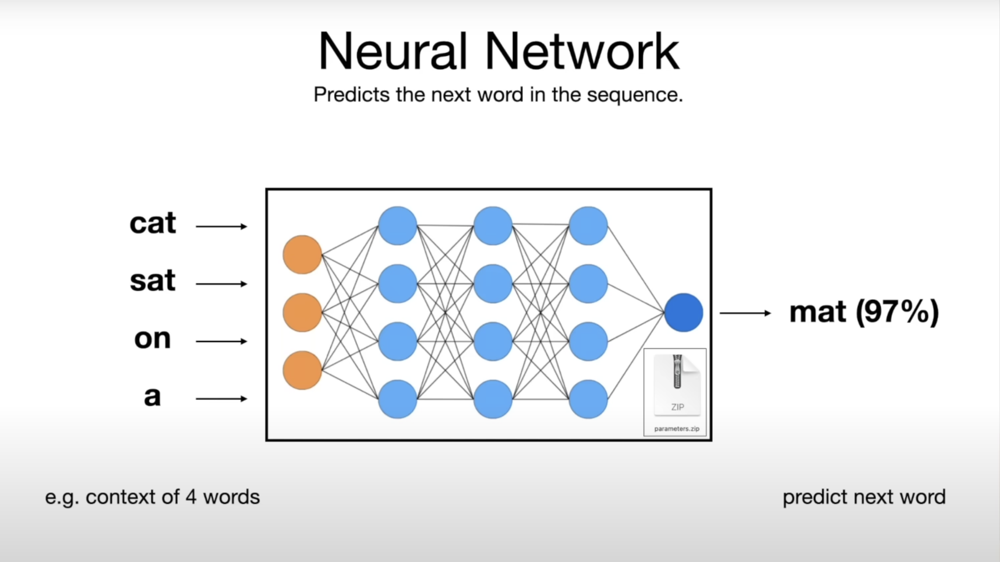
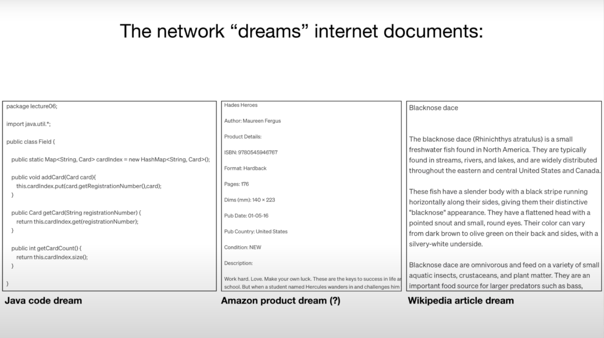
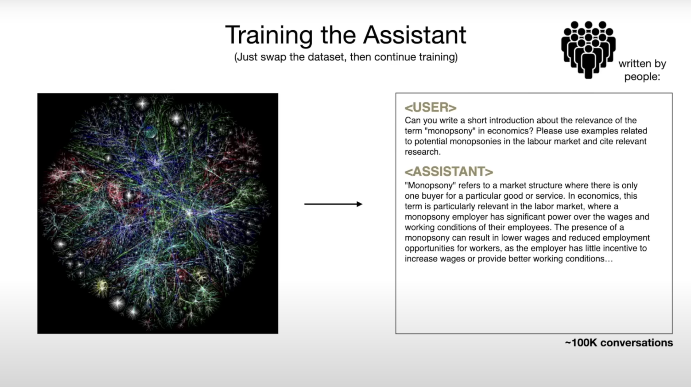
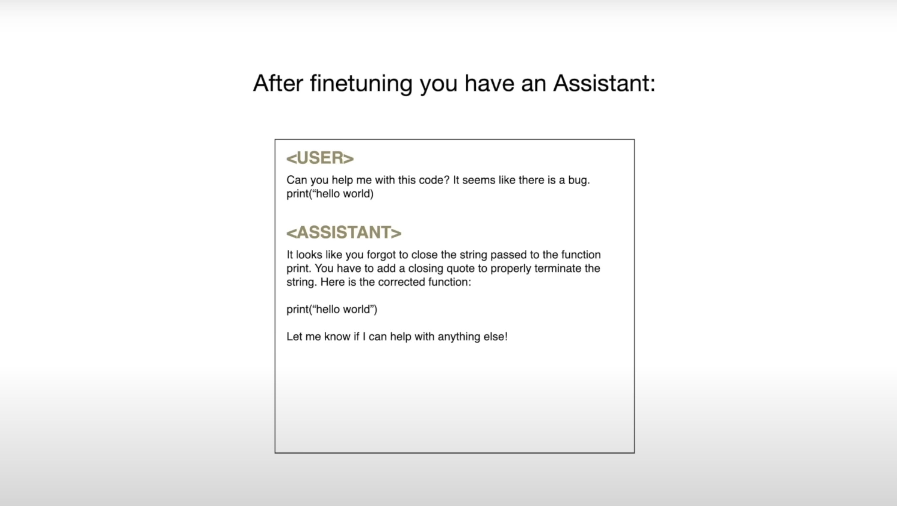
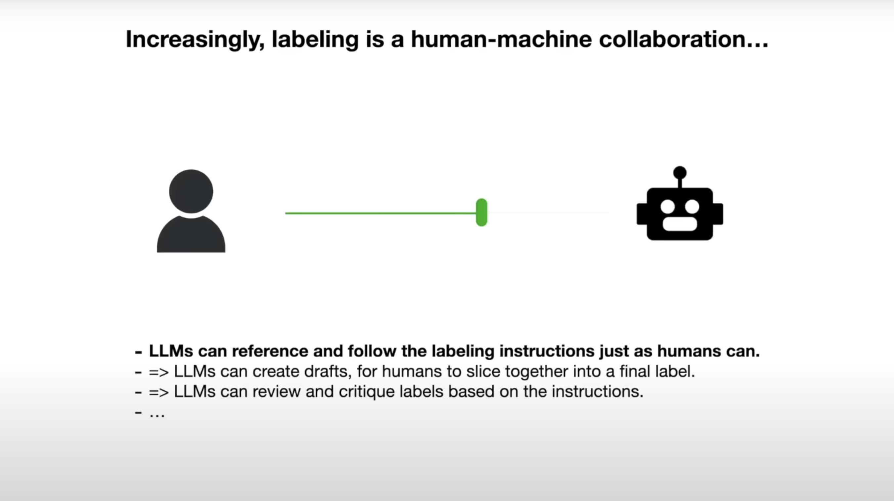

# 0.简介

大模型是一种人工智能技术，它利用大规模数据和强大的计算能力进行训练，以生成具有智能和创造力的模型。大模型技术的目标是模拟人类的认知能力，使计算机能够理解、推理和生成自然语言、图像、声音等多种形式的信息。通过大模型技术，计算机可以学习从海量数据中提取规律和知识，并应用于各种领域，如自然语言处理、计算机视觉、智能推荐等。大模型技术的发展将为人类带来更加便捷和有效的数字世界与现实世界的共生。

## 基础知识

* 2 files, 1 is the model weight, 2 is the program to run
* 2个文件即可以概括LLM的核心，1个是模型权重，另一个是运行在此之上的程序

* from text to model weights

* predict the next word

* LLM learns a lot from the real world.

* LLM's dream & hallucination

* stage1: pre-training 预训练
* We don't really know how the billions of parameters collaborate to do it.

* stage2: fine-tuning & alignment 微调 & 对齐
* assistant: high-quality conversations

* when prediction, being a helpful assistant

* the base & assistant model
* Open Source Example: LLama 2

* reinforcement learning from human feedback
* OpenAI use this technique

* human evaluation for the answer to be helpful, truthful and harmless
* from the paper InstructGPT 

* human & machine collaboration for labelling

* Proprietary models go first but the Open Source models will soon catch up the race

* One goal for all: Automation

* We can expect more intelligence "for free" by scaling

* We can expect a lot more "general capability" across all areas of knowledge
