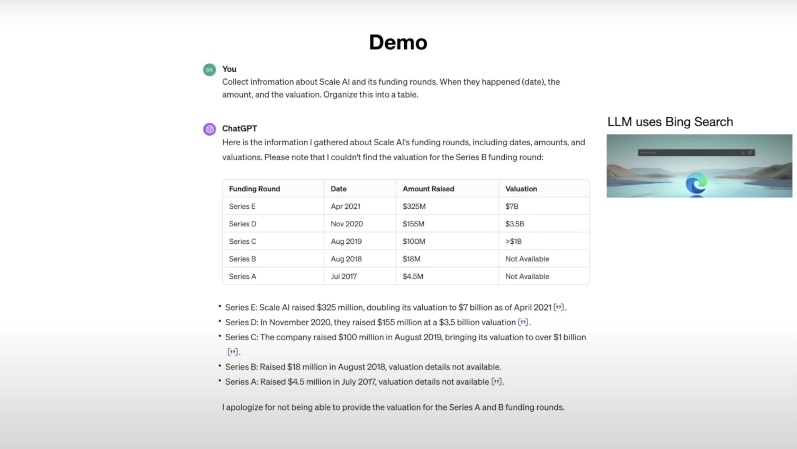
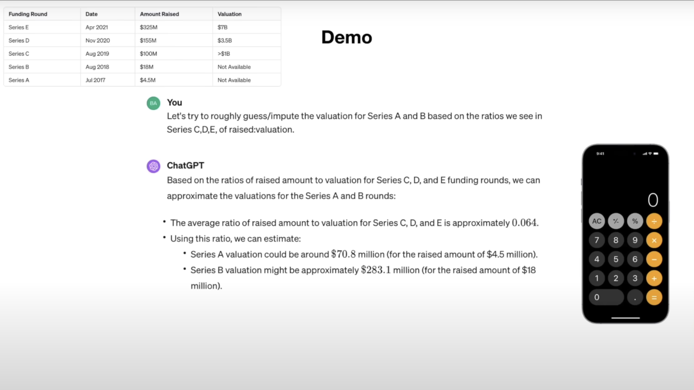
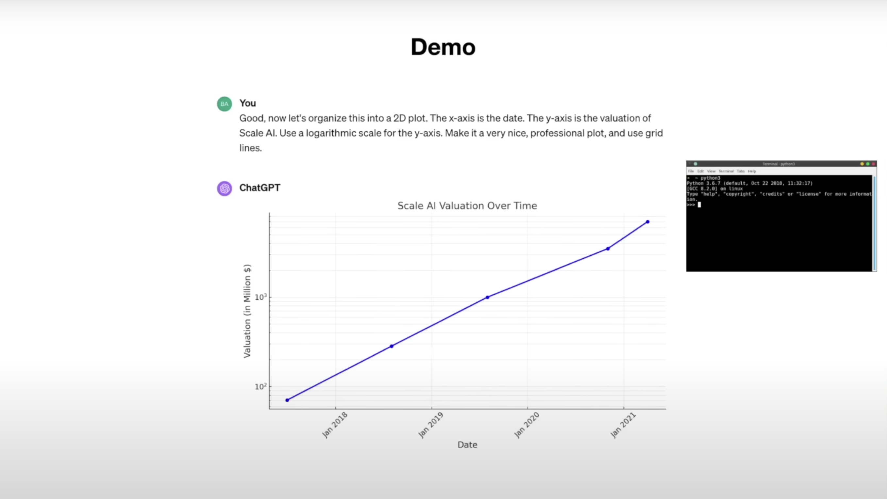
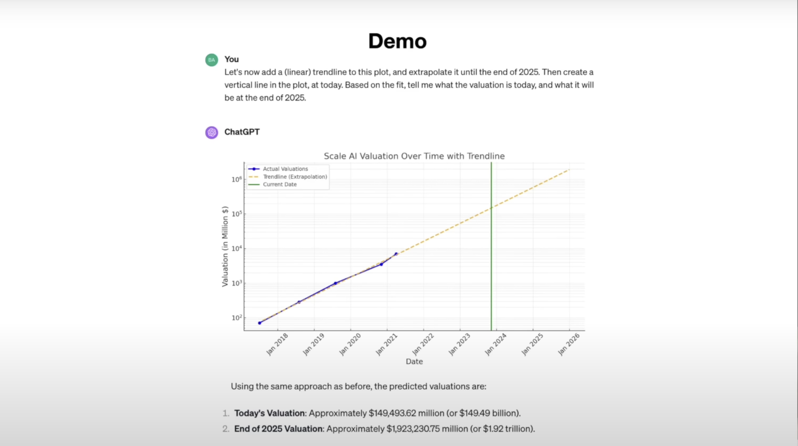
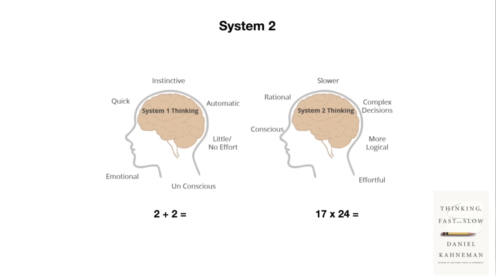
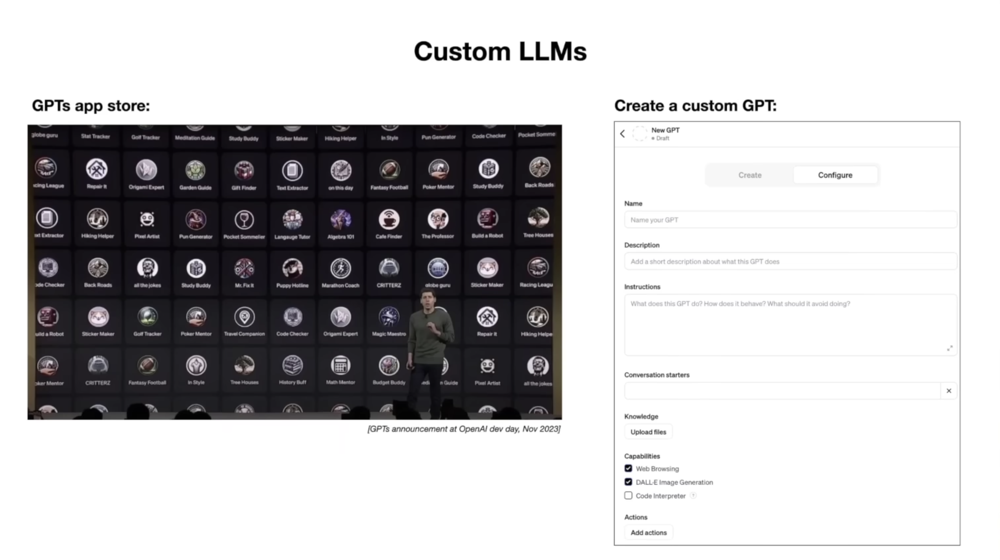

# 使用实例

* Prompt: Collect information about Scale AI and its funding rounds. When they happened (date), the amount, and the valuation. Organize this into a table.
* Tools: Bing Search

* Prompt: Let's try to roughly guess/compute the valuation for Series A and B based on the ratios we see in Series C,D,E, of raised:valuation.
* Tools: LLM's logic thinking capability

* Prompt: Good, now let's organize this into 2D plot. The x-axis is the date. The y-axis is the valuation of Scale AI. Use a logarithmic scale for the y-axis. Make it a very nice, professional plot, and use grid lines.

* Prompt: Let's now add a linear trendline to this plot, and extrapolate it until the end of 2025. Then create a vertical line in the plot, at today. Based on the fit, tell me what the valuation is today, and what it will be at the end of 2025.

* Prompt: Based on the information above, generate an image to represent the company Scale AI

* Prompt: Vision, take a sketch of an idea and generate a working website

* Prompt: Audio, Speech to Speech communication

* System 1 Thinking: Emotional, Quick, Instinctive, Automatic, Little or No Effort
* System 2 Thinking: Conscious, Rational, Slower, Complex Decisions, More Logical and Effortful
* from 《Thinking, Fast ... Slow》
* from 《思考快与慢》

* System 1: generate the proposals (used in speed chess)
* System 2: keeps track of the tree (used in competitions)

* LLMs currently only have a System 1

* We want to "think": convert time to accuracy

* Self-improvement

* Custom LLMs