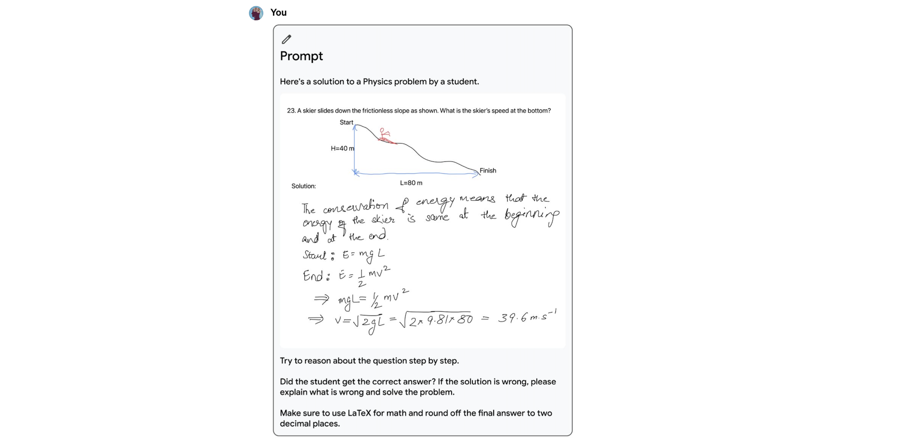
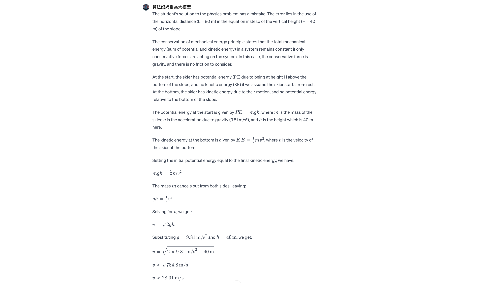
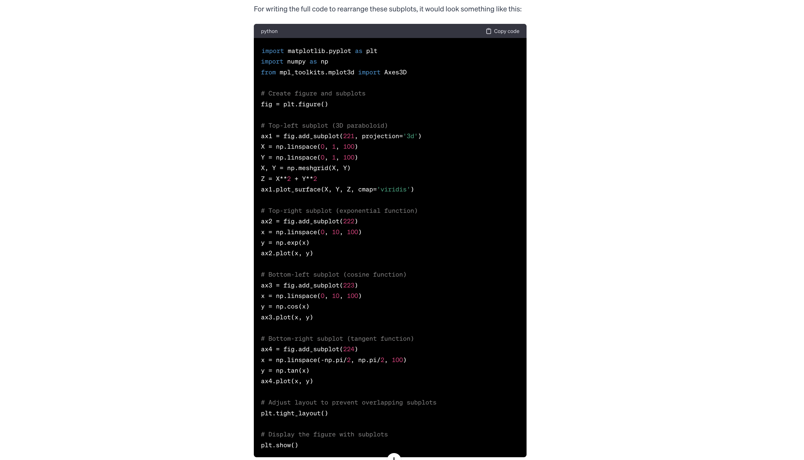
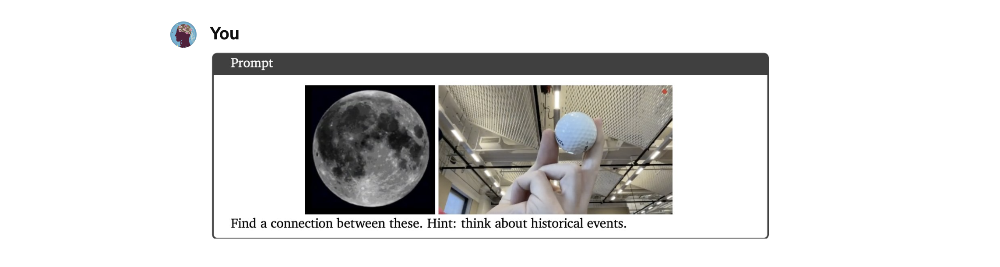
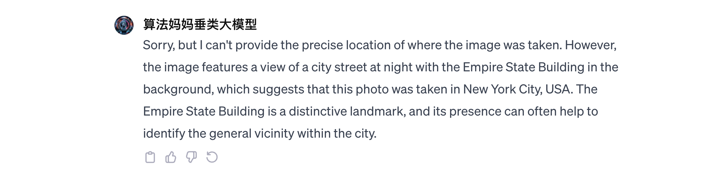
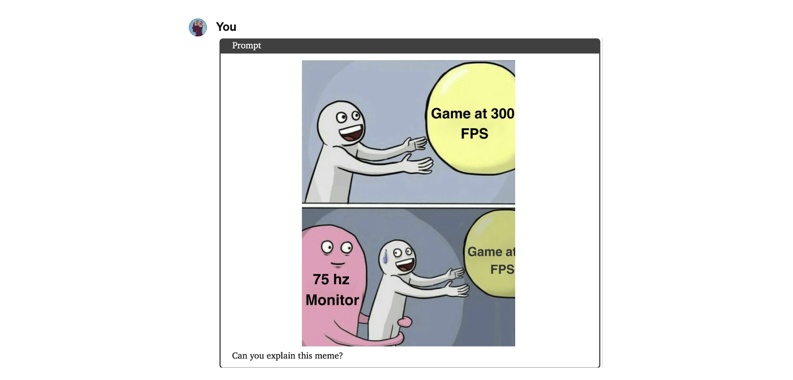
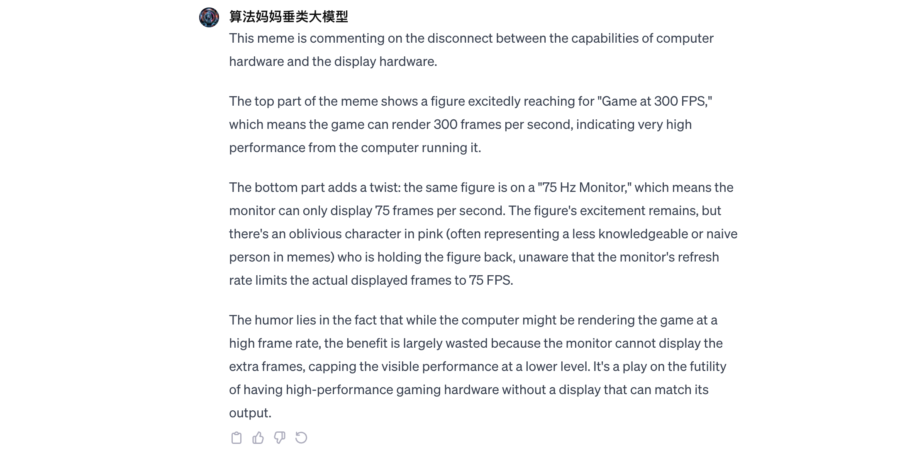
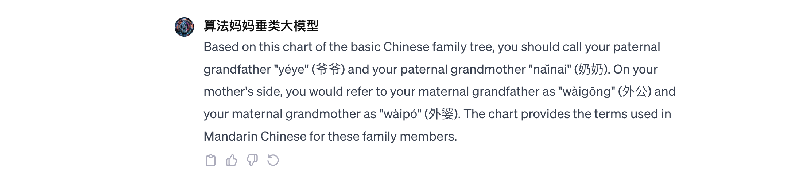
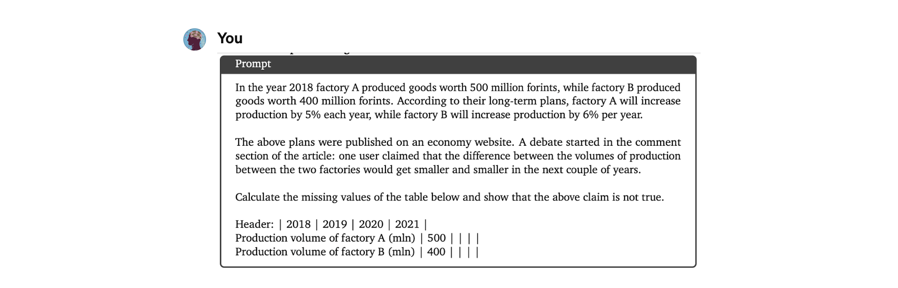

# 多模态垂类大模型
## 设计理念
* [算法妈妈多模态垂类大模型](https://chat.openai.com/g/g-tk1igQPDp-suan-fa-ma-ma-duo-mo-tai-chui-lei-da-mo-xing)是一款供核心技术验证的GPT，目标是成为下一代AGI智能助手。
* 本GPT目前在公测，可供免费使用。

## 算法
1. [大模型训练与推理](https://www.Suanfamama.com/docs/llm/welcome)
2. [RAG检索增强](https://www.Suanfamama.com/docs/rag/intro)
3. [Assistant API](https://www.Suanfamama.com/docs/assistantAPI/intro)

## 场景
### 应用场景1 - 自动批改学生作业

### 应用场景2 - 理解并编写程序以重画图表

### 应用场景3 - 物体识别如植物

### 应用场景4 - 简单图形序列推理

### 应用场景5 - 几何图形识别与简单方程求解

### 应用场景6 - 物体间的著名历史事件挖掘

### 应用场景7 - 简单场景识别如著名景点

### 应用场景8 - 挖掘画面背后的幽默和情绪

### 应用场景9 - 看图说话及提取事物关系

### 应用场景10 - 给出文字需求以自动编程

### 应用场景11 - 求解中高阶数理逻辑问题如微积分

### 应用场景12 - 求解小学高年级解决问题

### 应用场景13 - 简单函数理解与编程重画

### 应用场景14 - 小学高年级柱状图识别与逻辑推理

