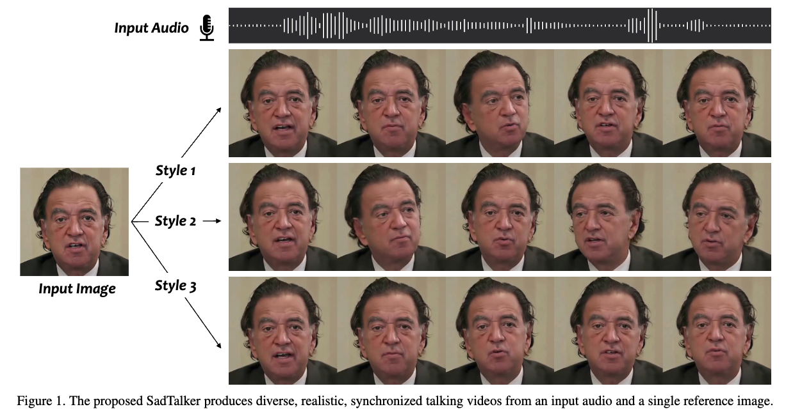
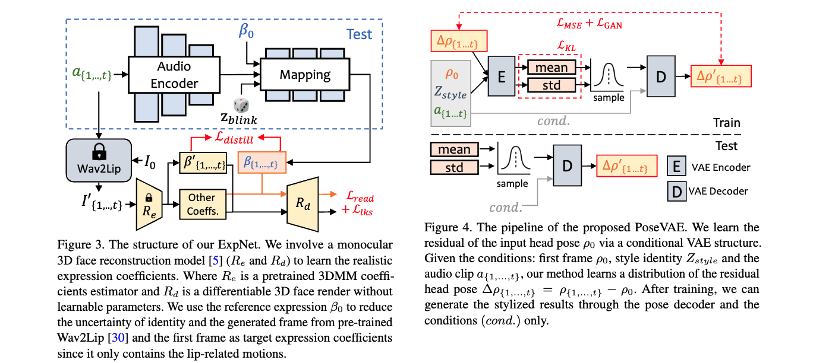
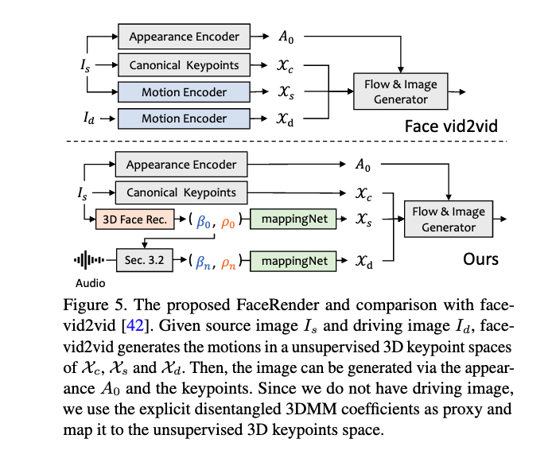
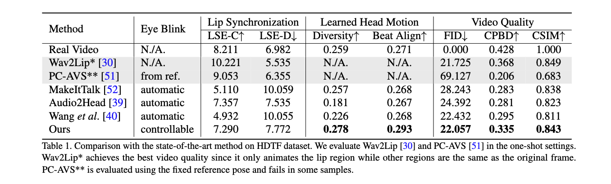
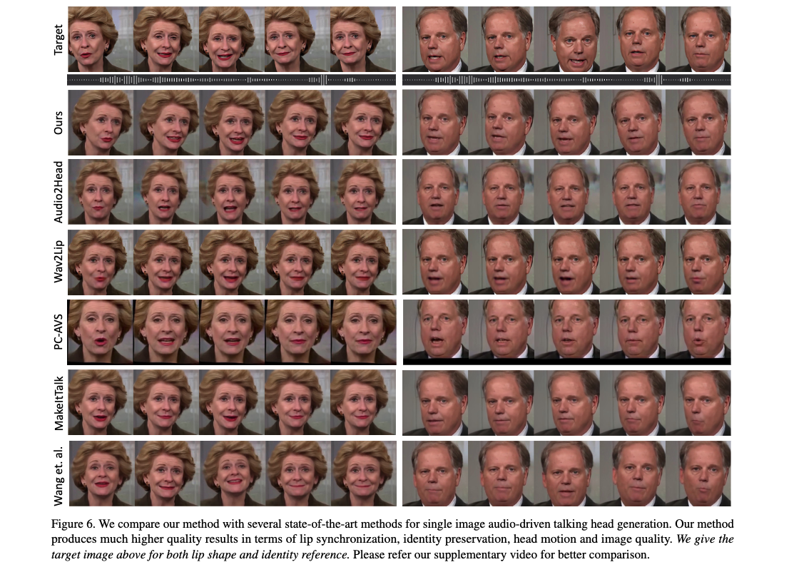

# 1. 视频翻译
## 简介
视频翻译功能目前在网络上流行，爆火的短视频均带有影响力，传播力及娱乐性，如“Tarlor Swift讲中文”等。他的输入是一段有影响力，有传播力的短视频，通常包含人物及语音。视频翻译的目标是在极短时间内克隆视频中人物语音并翻译成目标语言，语音识别其对话，经过文字及语义翻译，语音合成目标语言语音，并使用SaaS服务作为依托，提供云视频剪辑功能如添加文字，剪切语音或视频段落等。代表的公司与产品有RASK.AI，HeyGen等视频创作平台的高阶试验性功能等。

## 霉霉受访说“中文”

<iframe width="800" height="600" src="https://www.bilibili.com/video/BV1NN411g7Qk" frameborder="0" allowfullscreen></iframe>

* [bilibili链接](https://www.bilibili.com/video/BV1NN411g7Qk)

在对Tarlor Swift采访视频进行视频翻译时，技术提供商需要考虑（这里仅列出较为核心的几点）

1. 其翻译完后的音色表现如语气，语态是否符合其气质形象，不符合则需要精修视频并优化算法；
2. 使用算法在进行口型对齐或动作对齐时是否能精确还原原视频高清分辨率，是否有显而易见的模糊区别等；
3. 基于SaaS的云服务是否能对视频进行精确且有效的剪辑 即输出视频是否快速；

## 核心算法
这些爆款视频的背后离不开核心算法的加持，我们在此列出核心算法，技术成熟度及代表性技术提供商。

* 语音识别，技术成熟度80%，OpenAI Whisper
* 文字翻译，技术成熟度60%，OpenAI GPT-4
* 语音合成，技术成熟度80%，OpenAI TTS
* 语音克隆，技术成熟度70%，RASK.ai
* 口型及动作对齐，技术成熟度70%，腾讯智影与算法妈妈
* 视频剪辑，技术成熟度90%，剪影

## 算法优化方向
* （口型及动作对齐）高清用于口型及动作对齐的训练及测试用数据集
* （口型及动作对齐）优化GAN网络以生成更逼真口型及动作
* （口型及动作对齐）从离线变在线实时交互

## POC原型验证
* [算法妈妈LipSync](https://huggingface.co/spaces/weijiang2023/LipSync)
* [SadTalker](https://huggingface.co/spaces/vinthony/SadTalker)

## Paper References
* [SadTalker CVPR 2023](https://sadtalker.github.io/)
* [VideoReTalking](https://ar5iv.org/abs/2211.14758)
* [Wav2Lip](https://ar5iv.org/abs/2008.10010)

## Product Recommendation

* RASK.ai 视频创作平台
* D-ID 视频创作平台（偏数字人） 
* HeyGen 视频创作平台（偏数字人）
* 软通数字人视频创作平台
* 腾讯智影视频创作平台

## SadTalker 核心技术剖析

### Abstract
Generating talking head videos through a face image and a piece of speech audio still contains many challenges. ie, unnatural head movement, distorted expression, and identity modification. We argue that these issues are mainly because of learning from the coupled 2D motion fields. On the other hand, explicitly using 3D information also suffers problems of stiff expression and incoherent video. We present SadTalker, which generates 3D motion coefficients (head pose, expression) of the 3DMM from audio and implicitly modulates a novel 3D-aware face render for talking head generation. To learn the realistic motion coefficients, we explicitly model the connections between audio and different types of motion coefficients individually. Precisely, we present ExpNet to learn the accurate facial expression from audio by distilling both coefficients and 3D-rendered faces. As for the head pose, we design PoseVAE via a conditional VAE to synthesize head motion in different styles. Finally, the generated 3D motion coefficients are mapped to the unsupervised 3D keypoints space of the proposed face render, and synthesize the final video. We conduct extensive experiments to show the superior of our method in terms of motion and video quality.

### Pipeline

### Modules

### Experiments

### Outputs

other results SEE [here](https://sadtalker.github.io/)

## 声明

* 本原型验证（POC）市场与技术调研属免费版，任何人均可以在注明出处的前提下重修改与发布。若想了解更多技术细节，链接技术团队，可进一步咨询算法妈妈。