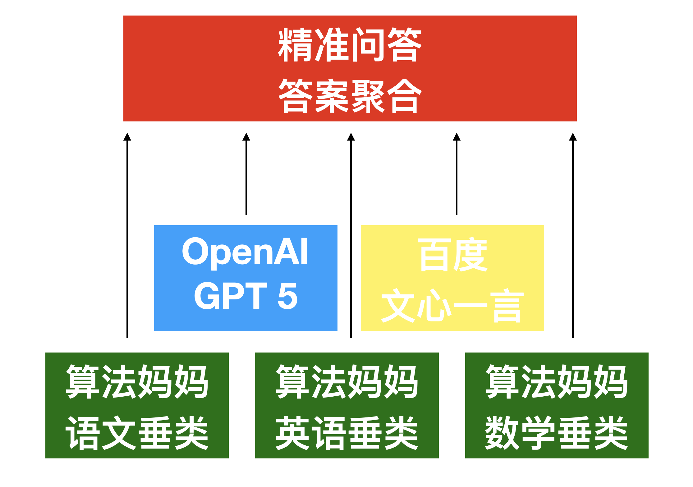
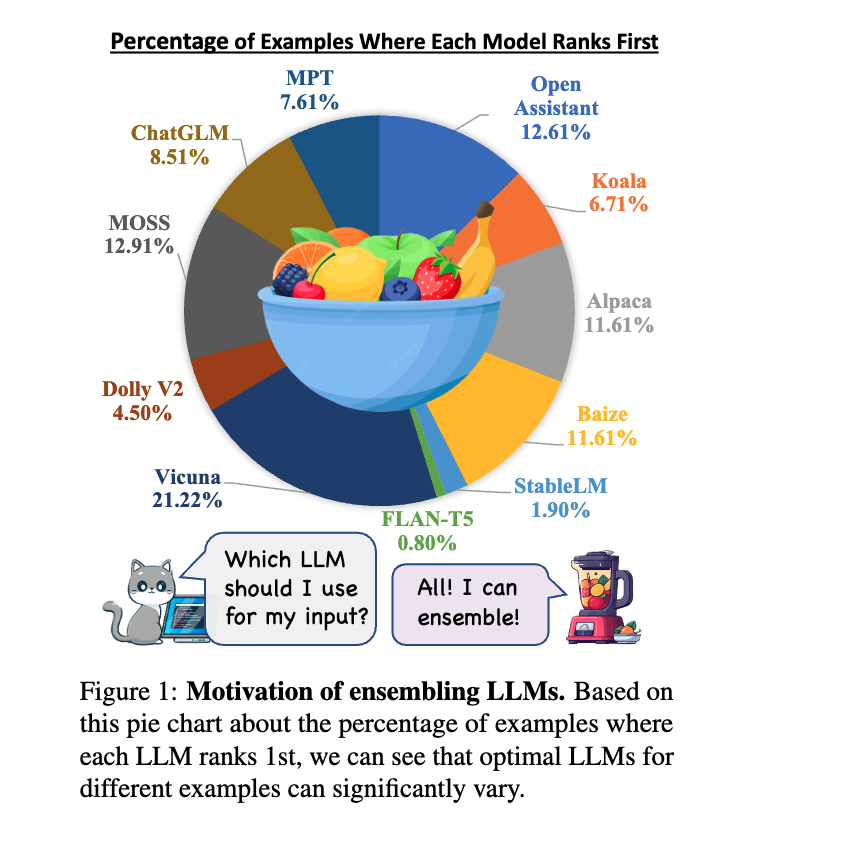
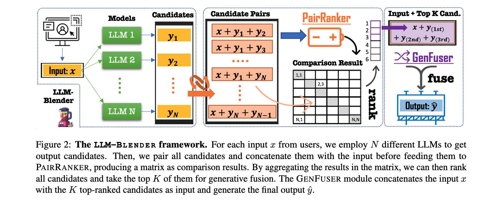
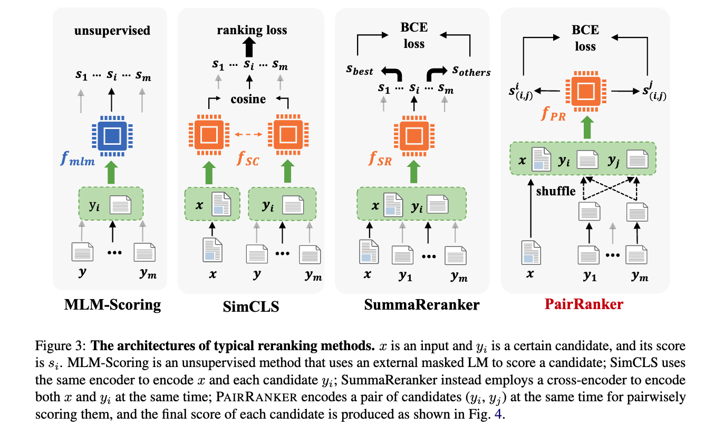

# 精准问答

## 简介
我们知道，并不是每一个大模型都能精准回答每一个问题，但一次同时查询十个通用和垂类大模型，综合总结其优秀答案并摘要输出，能大幅度提升大模型问答精确度和客户满意度，我们把此技术称为“精准问答”。

## 系统框架

## 理论依据
* [LLM-Blender: Ensembling Large Language Models with Pairwise Ranking and Generative Fusion](https://arxiv.org/abs/2306.02561)
* We present LLM-Blender, an ensembling framework designed to attain consistently superior performance by leveraging the diverse strengths of multiple open-source large language models (LLMs). Our framework consists of two modules: PairRanker and GenFuser, addressing the observation that optimal LLMs for different examples can significantly vary. PairRanker employs a specialized pairwise comparison method to distinguish subtle differences between candidate outputs. It jointly encodes the input text and a pair of candidates, using cross-attention encoders to determine the superior one. Our results demonstrate that PairRanker exhibits the highest correlation with ChatGPT-based ranking. Then, GenFuser aims to merge the top-ranked candidates, generating an improved output by capitalizing on their strengths and mitigating their weaknesses. To facilitate large-scale evaluation, we introduce a benchmark dataset, MixInstruct, which is a mixture of multiple instruction datasets featuring oracle pairwise comparisons. Our LLM-Blender significantly outperform individual LLMs and baseline methods across various metrics, establishing a substantial performance gap.

