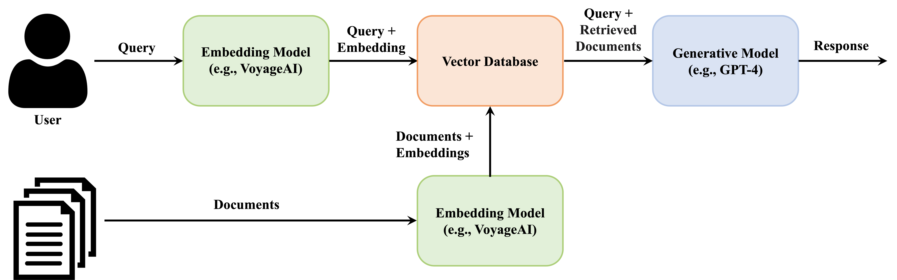

# 2.Quickstart

This tutorial is a step-by-step guidance on implementing a specialized chatbot with RAG stack using embedding models (e.g., Voyage embeddings) and large language models.

## Brief overview of the RAG stack

When presented with a search query, our initial step involves employing the embedding model, such as voyageai embeddings, to derive the vector representation of the query. Subsequently, we conduct a document search, identifying the most relevant documents through Vector Database. The most relevant document is then selected and combined with the original query. This composite input is then submitted to a generative model, such as GPT-4, to generate a comprehensive response to the query.



## Prepare data

You will need a pool of documents that your chatbot will specialize in. You can choose to save your documents as demonstrated below or use the following set of documents as a starting point.

```python "
documents = [
    "The Mediterranean diet emphasizes fish, olive oil, and vegetables, believed to reduce chronic diseases.",
    "Photosynthesis in plants converts light energy into glucose and produces essential oxygen.",
    "20th-century innovations, from radios to smartphones, centered on electronic advancements.",
    "Rivers provide water, irrigation, and habitat for aquatic species, vital for ecosystems.",
    "Apple’s conference call to discuss fourth fiscal quarter results and business updates is scheduled for Thursday, November 2, 2023 at 2:00 p.m. PT / 5:00 p.m. ET.",
    "Shakespeare's works, like 'Hamlet' and 'A Midsummer Night's Dream,' endure in literature."
]
```

## Vectorize/Embed the documents

First, follow the Insallation guide to install the Python package and get your API key. Then, we can use the get_embeddings method to create embeddings.

```python "
import voyageai 
from voyageai import get_embeddings

voyageai.api_key = "[ Your VOYAGE API KEY ]"  # add you voyage API KEY

# Embed the documents
documents_embeddings = get_embeddings(documents, model="voyage-01")

```

If you are working with more than 8 documents, you will need to use a for loop to encode them:

```python "
# Embed the documents
batch_size = 8  # the maximum batch size allowed for voyage-01
iters = range(0, len(documents), batch_size)
documents_embeddings = []
for i in iters:
    documents_embeddings += get_embeddings(documents[i : i + batch_size], batch_size=batch_size, model="voyage-01")

```