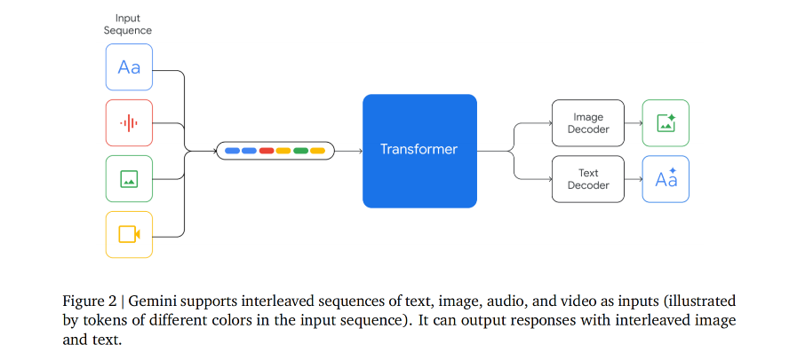

## Paper Title
[GEMINI: A Family of Highly Capable Multimodal Models](https://github.com/weijiang2023/Suanfamama-kb/blob/main/kb/computer.science/GEMINI.technical.report.pdf)

#### Authors
Gemini Team

#### Affiliations
Google

#### Date
Dec 8th, 2023

#### Key Takeaways

1. Written in Jax and trained using TPUs. The architecture, while not explained in details, seems similar to Flamigo's.

2. Gemini Pro's performance is similar to GPT-3.5 and Gemini Ultra is reported to be better than GPT-4. Nano-1 (1.8B params) and Nano-2 (3.25B params) are designed to run on-device.

3. 32K context length.

4. Very good at understanding vision and speech.

5. Coding ability: the big jump in HumanEval compared to GPT-4 (74.4% vs. 67%), if true, is awesome. However, the Natural2Code benchmark (no leakage on the Internet) shows a much smaller gap (74.9% vs. 73.9%).

6. On MMLU: using COT@32 (32 samples) to show that Gemini is better than GPT-4 seems forced. In 5-shot setting, GPT-4 is better (86.4% vs. 83.7%).

7. No information at all on the training data, other than they ensured "all data enrichment workers are paid at least a local living wage."

#### Abstract
This report introduces a new family of multimodal models, Gemini, that exhibit remarkable capabilities across image, audio, video, and text understanding. The Gemini family consists of Ultra, Pro, and Nano sizes, suitable for applications ranging from complex reasoning tasks to on-device memory-constrained use-cases. Evaluation on a broad range of benchmarks shows that our most-capable Gemini Ultra model advances the state of the art in 30 of 32 of these benchmarks — notably being the first model to achieve human-expert performance on the well-studied exam benchmark MMLU, and improving the state of the art in every one of the 20 multimodal benchmarks we examined. We believe that the new capabilities of Gemini models in cross-modal reasoning and language understanding will enable a wide variety of use cases and we discuss our approach toward deploying them responsibly to users.

#### 1. Introduction

#### 2. Model Architecuture

#### 3. Training Infrastructure

#### 4. Training Dataset

#### 5. Evaluation

* The Gemini models are natively multimodal, as they are trained jointly across text, image, audio,
and video.

#### 6. Responsible Deployment

#### 7. Discussion and Conclusion
