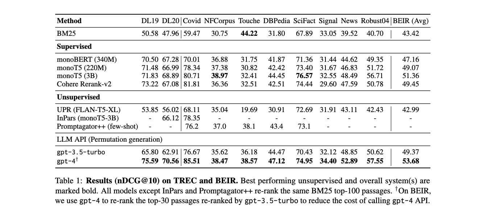

## Paper Title
* （EMNLP 2023 杰出论文奖）
* [Is ChatGPT Good at Search?](https://github.com/weijiang2023/Suanfamama-kb/blob/main/kb/computer.science/SEARCH.2304.09542.pdf)

#### Authors
Weiwei Sun et. al.

#### Affiliations
Shandong U et. al.

#### Date
Oct 27, 2023

#### Abstract
Large Language Models (LLMs) have demonstrated remarkable zero-shot generalization across various language-related tasks, including search engines. However, existing work utilizes the generative ability of LLMs for Information Retrieval (IR) rather than direct passage ranking. The discrepancy between the pretraining objectives of LLMs and the ranking objective poses another challenge. In this paper, we first investigate generative LLMs such as ChatGPT and GPT-4 for relevance ranking in IR. Surprisingly, our experiments reveal that
properly instructed LLMs can deliver competitive, even superior results to state-of-the-art supervised methods on popular IR benchmarks. Furthermore, to address concerns about data contamination of LLMs, we collect a new test set called NovelEval, based on the latest knowledge and aiming to verify the model’s ability to rank unknown knowledge. Finally, to improve efficiency in real-world applications, we delve into the potential for distilling the ranking capabilities of ChatGPT into small specialized models using a permutation distillation scheme. Our evaluation results turn out that a distilled 440M model outperforms a 3B supervised model on the BEIR benchmark. The code to reproduce our results is available at www.github.com/sunnweiwei/RankGPT.

#### 5Ws
##### 1. What is the problem?
The problem addressed in the paper is the efficacy of Large Language Models (LLMs) like ChatGPT and GPT-4 in the context of Information Retrieval (IR), particularly in relevance ranking tasks. While LLMs have been extensively used for various language-related tasks, their application in directly ranking passages in IR systems, as opposed to generating content, remains underexplored.

##### 2. Why is the problem IMPORTANT?
This problem is important because of the growing reliance on IR systems in various applications like web search, ad-hoc search, and open-domain question answering. Current IR systems, especially in the re-ranking stage, depend heavily on manual supervision signals, requiring significant human effort and often showing weak generalizability. Leveraging LLMs could potentially revolutionize this field by reducing reliance on human-generated supervision and improving the efficiency and accuracy of IR systems.

##### 3. Why is the problem DIFFICULT?
The difficulty arises from the discrepancy between the pre-training objectives of LLMs, which are generally not designed for passage ranking, and the specific requirements of the ranking task in IR. Ranking requires a deep understanding of user queries, the ability to compare and rank passages based on relevance, and to deal with the limitations of context length inherent to LLMs.

##### 4. What are the OLD techniques?
Old techniques in IR primarily include systems that rely on manual supervision and signals for passage retrieval and re-ranking. Examples are methods based on manual annotations, as well as traditional IR models like BM25. Additionally, previous approaches using LLMs in IR have focused more on content generation (like query or passage generation) rather than directly on relevance ranking.

##### 5. Advantages and Disadvantages of the new techniques compared to the old ones?

Advantages:
* LLMs demonstrate strong zero-shot and few-shot generalization capabilities, potentially reducing the need for extensive supervised datasets.
* The research indicates that properly instructed LLMs can deliver competitive, even superior results to state-of-the-art supervised methods in IR benchmarks.
* LLMs have a strong capacity for text understanding, instruction following, and reasoning, which are crucial for effective ranking in IR.
* The paper introduces a novel instructional permutation generation approach and a sliding window strategy to overcome the context length limitations of LLMs.

Disadvantages:
* The high computational cost and complexity of LLMs like GPT-4 make their deployment in commercial search systems expensive.
* There are concerns about data contamination in LLMs and their ability to rank unknown knowledge accurately.
* Large language models can suffer from unstable generation, which can be a limitation in the consistency of their ranking performance.

In summary, the paper presents a novel approach to leverage LLMs in IR by focusing on passage re-ranking tasks and introduces new techniques to address the challenges posed by the application of LLMs in this domain.