## Papers in EMNLP 2023
We recommend using [算法妈妈每日论文解读 20231213 GPTs](https://chat.openai.com/g/g-OZ2AJ8UKu-suan-fa-ma-ma-mei-ri-lun-wen-jie-du) in order to have the best research experience.

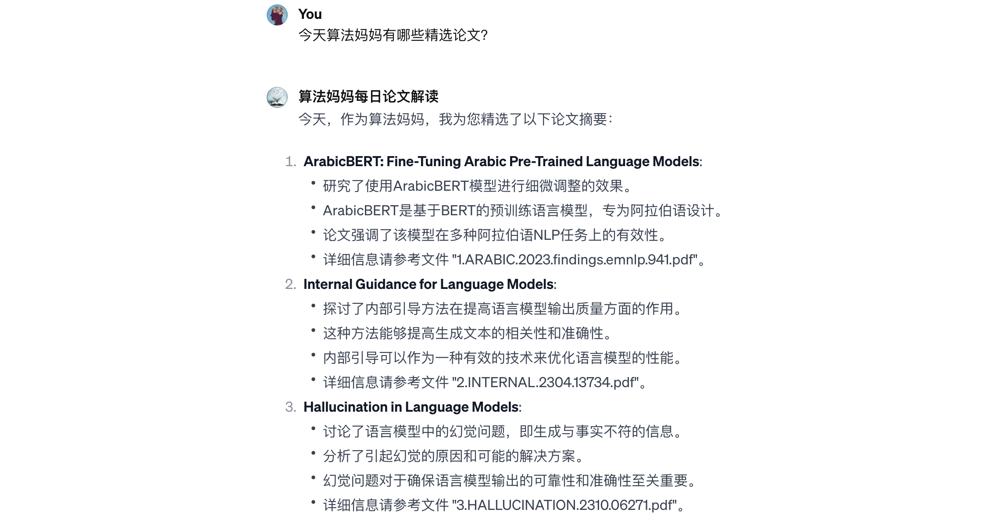

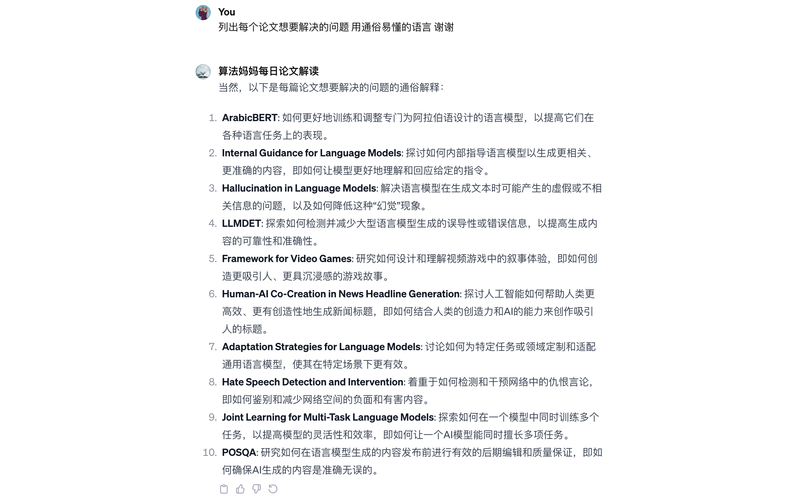

### Paper 01
* Arabic Mini-ClimateGPT : A Climate Change and Sustainability Tailored Arabic LLM
* 拟解决问题：如何更好地训练和调整专门为阿拉伯语设计的语言模型，以提高它们在各种语言任务上的表现。

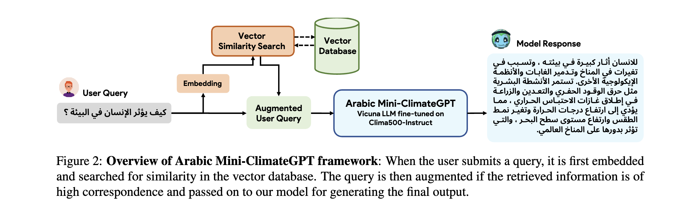

### Paper 02
* The Internal State of an LLM Knows When It’s Lying
* 拟解决问题：探讨如何内部指导语言模型以生成更相关、更准确的内容，即如何让模型更好地理解和回应给定的指令。

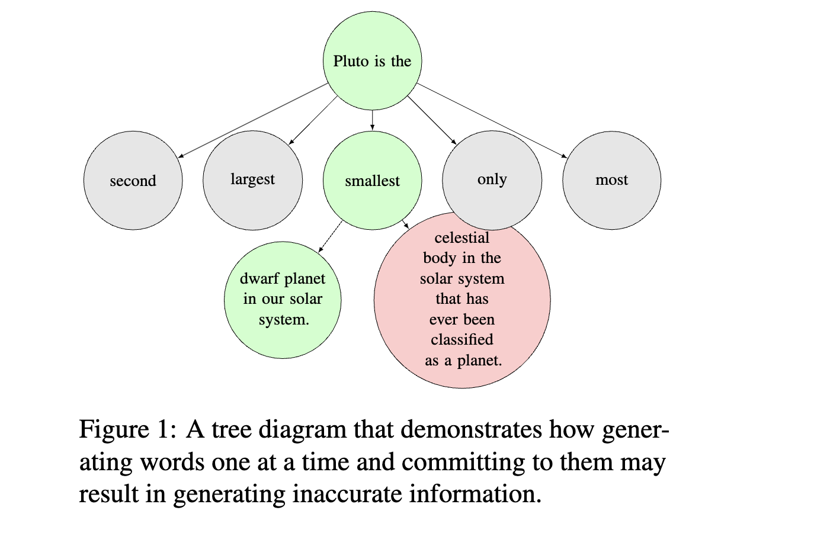

### Paper 03
* Towards Mitigating LLM Hallucination via Self Reflection
* 拟解决问题：解决语言模型在生成文本时可能产生的虚假或不相关信息的问题，以及如何降低这种“幻觉”现象。

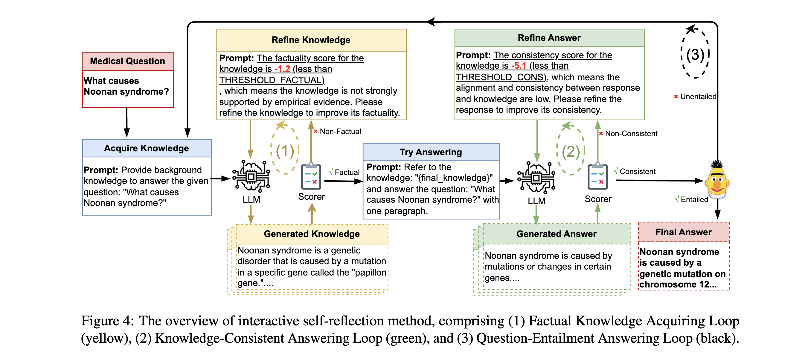

### Paper 04
* LLMDet: A Third Party Large Language Models Generated Text Detection Tool
* 拟解决问题：探索如何检测并减少大型语言模型生成的误导性或错误信息，以提高生成内容的可靠性和准确性。

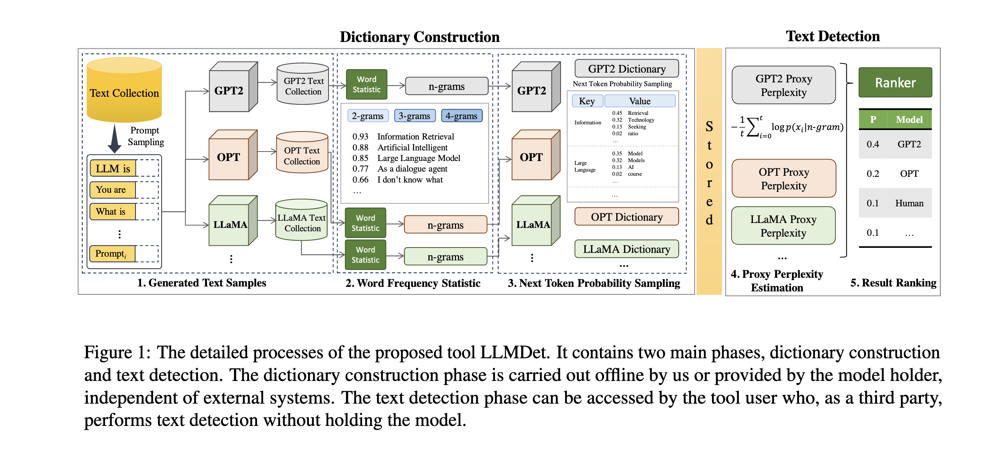

### Paper 05
* A Framework for Exploring Player Perceptions of LLM-Generated Dialogue in Commercial Video Games
* 拟解决问题：研究如何设计和理解视频游戏中的叙事体验，即如何创造更吸引人、更具沉浸感的游戏故事。

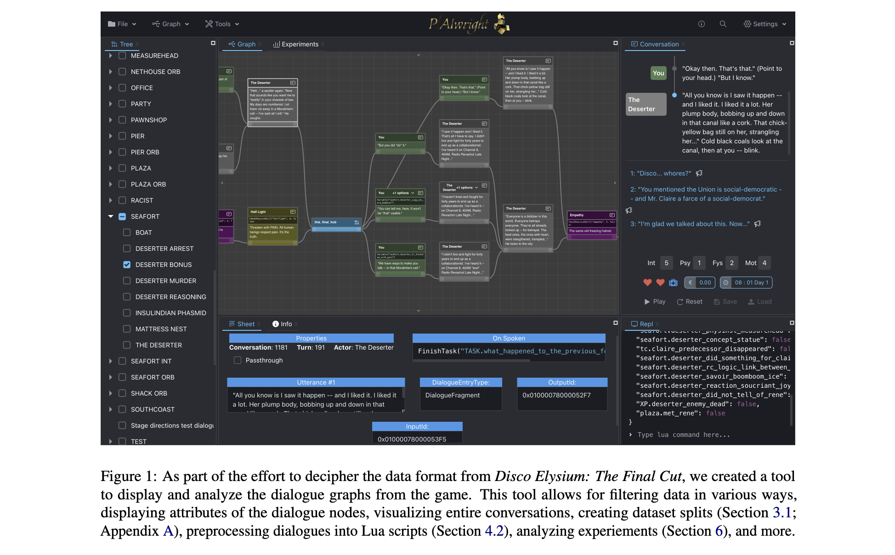

### Paper 06
* Harnessing the power of LLMs: Evaluating human-AI text co-creation through the lens of news headline generation
* 拟解决问题：探讨人工智能如何帮助人类更高效、更有创造性地生成新闻标题，即如何结合人类的创造力和AI的能力来创作吸引人的标题。

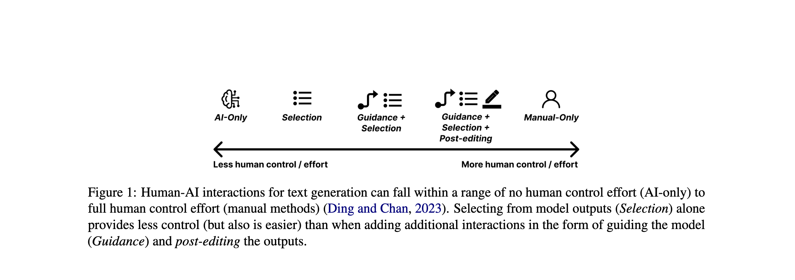

### Paper 07
* Adaptation with Self-Evaluation to Improve Selective Prediction in LLMs
* 拟解决问题：讨论如何为特定任务或领域定制和适配通用语言模型，使其在特定场景下更有效。

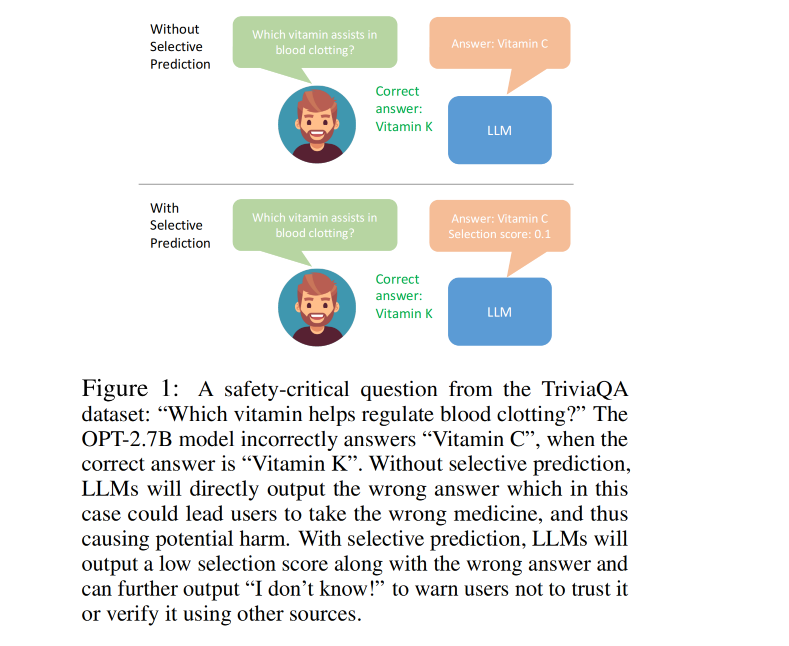

### Paper 08
* Probing LLMs for hate speech detection: strengths and vulnerabilities
* 拟解决问题：着重于如何检测和干预网络中的仇恨言论，即如何鉴别和减少网络空间的负面和有害内容。

### Paper 09
* Probing LLMs for Joint Encoding of Linguistic Categories
* 拟解决问题：探索如何在一个模型中同时训练多个任务，以提高模型的灵活性和效率，即如何让一个AI模型能同时擅长多项任务。

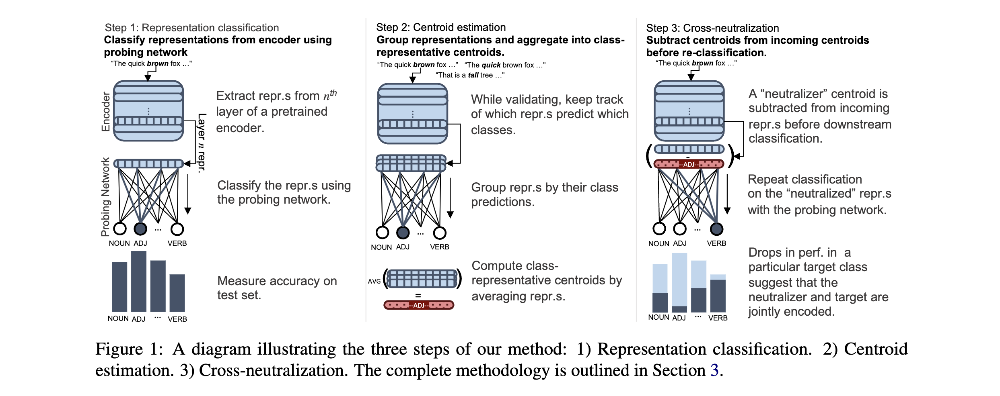

### Paper 10
* POSQA: Probe the World Models of LLMs with Size Comparisons
* 拟解决问题：研究如何在语言模型生成的内容发布前进行有效的后期编辑和质量保证，即如何确保AI生成的内容是准确无误的。

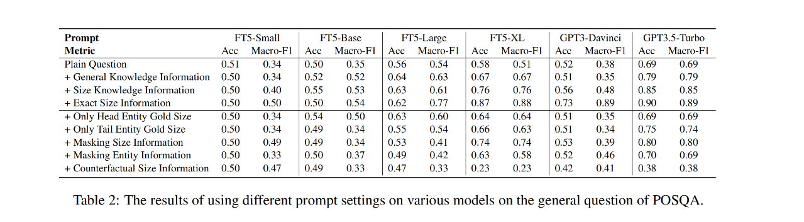
