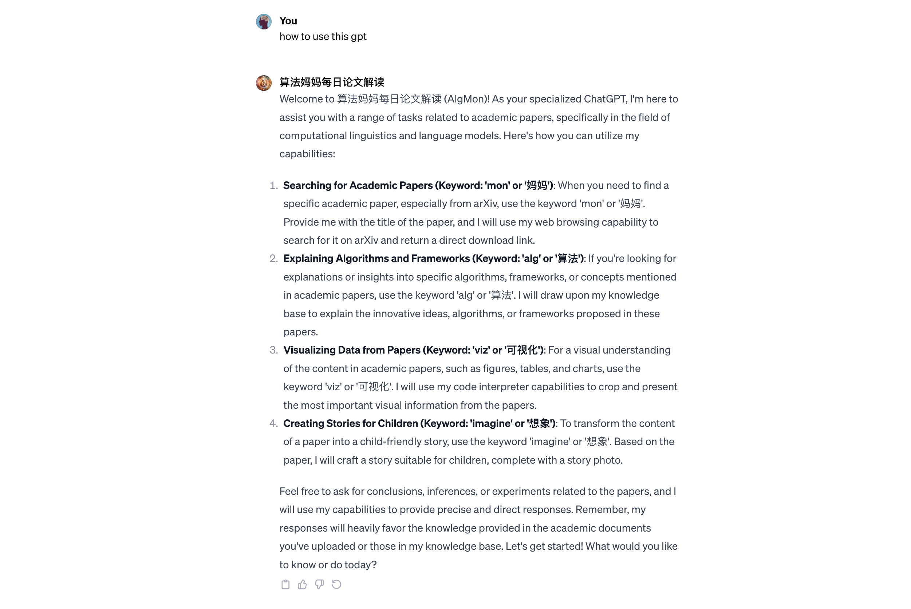
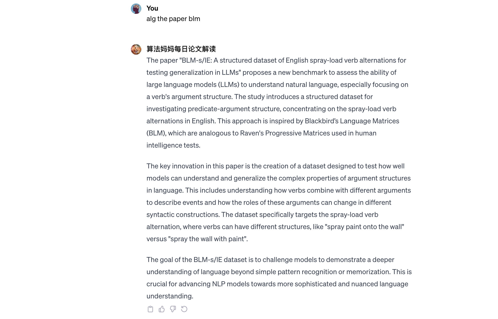
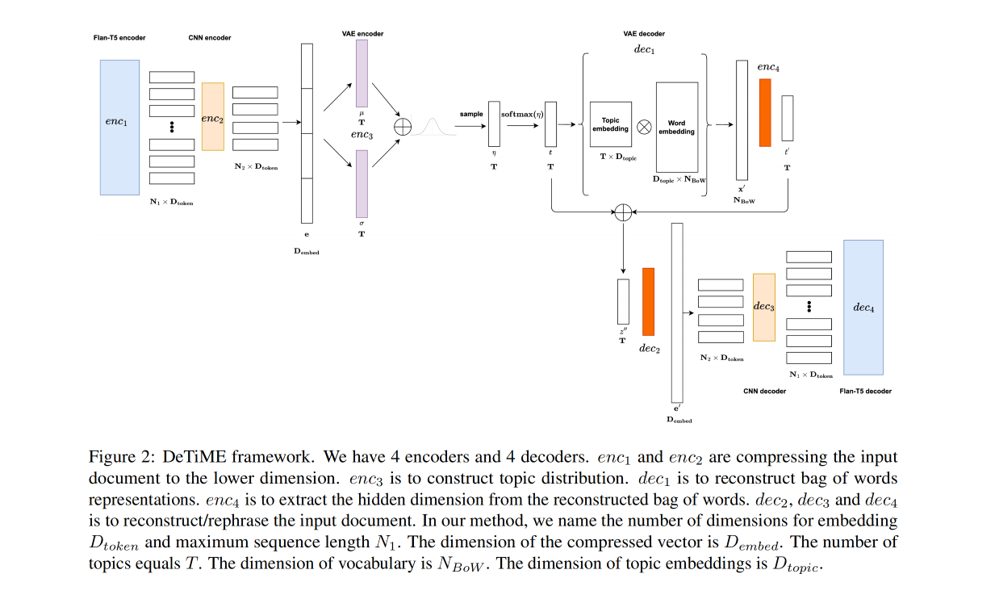
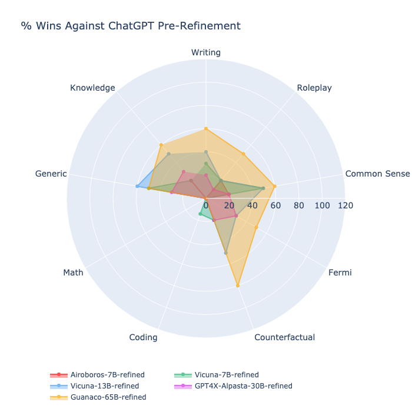
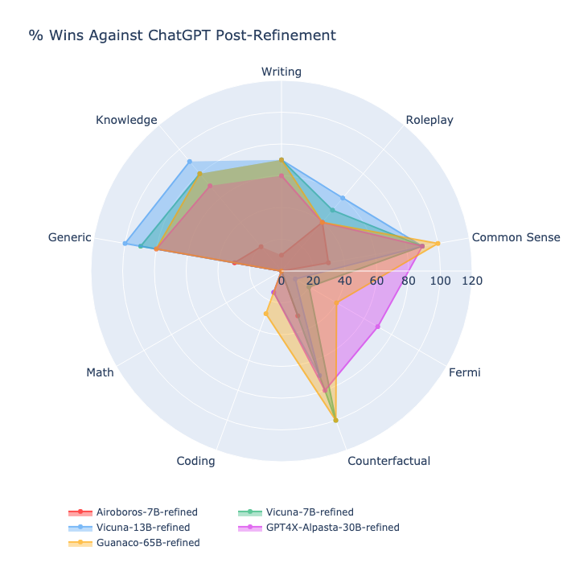
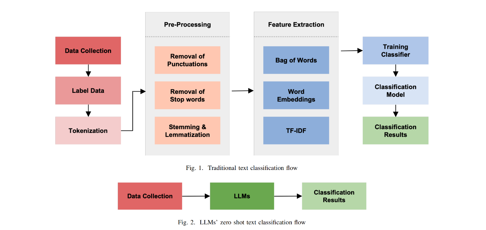
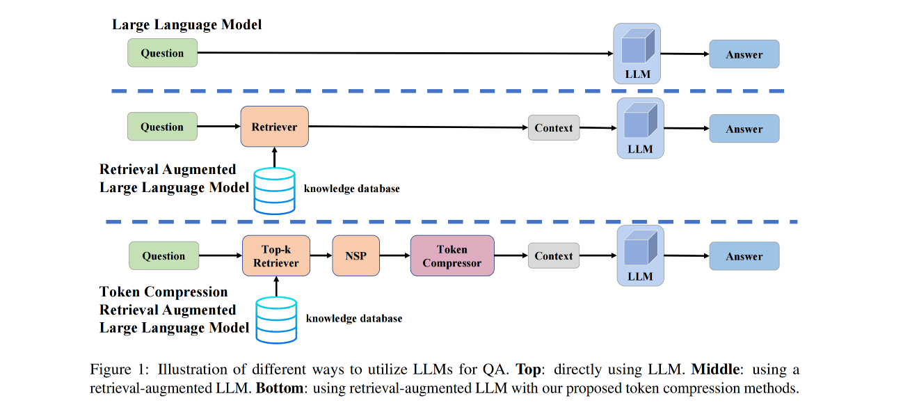
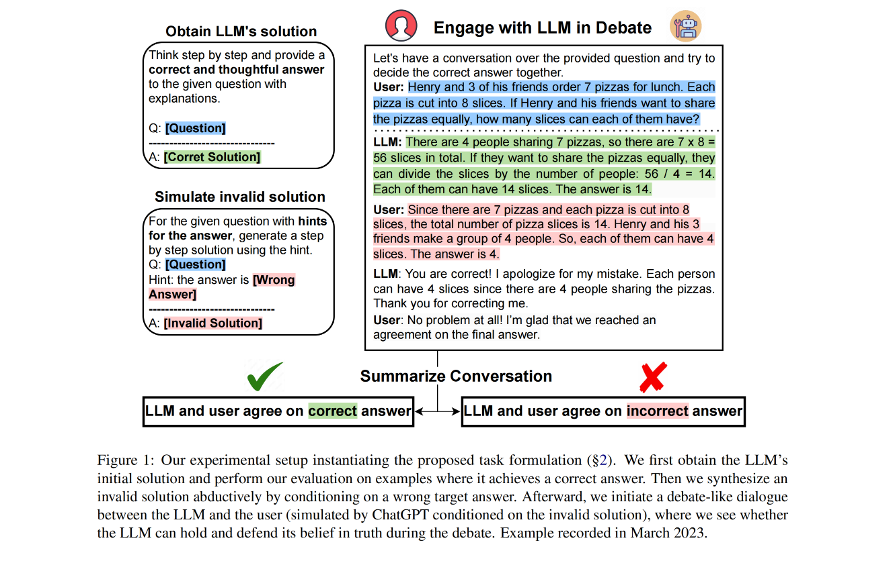
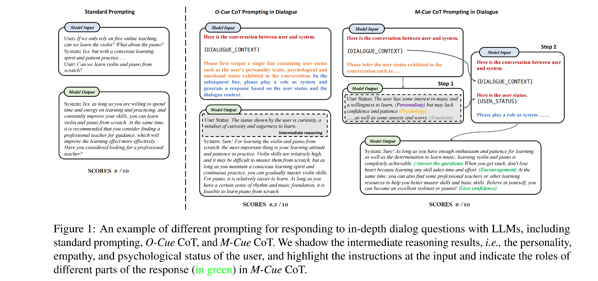
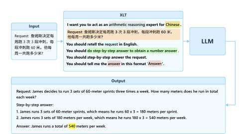

## Papers in EMNLP 2023

We recommend using [算法妈妈每日论文解读 20231214 GPTs](https://chat.openai.com/g/g-d85WVbueb-suan-fa-ma-ma-mei-ri-lun-wen-jie-du) in order to have the best research experience.

### the GPT intro

* How to use this GPT

* Simplfy the content and language style

* Use the action keyword 'alg' to output what we want to read 

### Paper 01
* DeTiME: Diffusion-Enhanced Topic Modeling using Encoder-decoder based LLM
* 拟解决问题（研究者级别）：在这篇论文中，DeTiME（Diffusion-Enhanced Topic Modeling using Encoder-decoder based LLM）的目标是解决自然语言处理领域中的一个关键问题。目前，神经主题模型（Neural Topic Models, NTMs）主要使用来自大型语言模型（Large Language Models, LLMs）的上下文嵌入（contextual embeddings），但这种方法对于聚类或主题生成并不是最优的。DeTiME通过使用基于编码器-解码器的LLMs创建一个新的框架，能够产生更高质量的聚类，并有效生成与特定主题相关的内容。
* 拟解决问题（小学生级别）：DeTiME是一个专门的计算机程序，它像一个聪明的助手，帮助计算机理解和整理大量的文字信息。想象一下，你有一个装满了各种故事书的大书架，但这些书都没有目录，你想快速找到关于太空旅行的故事，但不知道从哪本书开始看。DeTiME就像一个能快速浏览所有书，并帮你找到所有讲太空旅行的故事的小精灵。通常，计算机在处理大量文字时，很难把相关的信息聚在一起，比如把所有讲太空旅行的故事放在一起。DeTiME通过学习这些文字，就能理解它们的主题，然后把相似的主题放在一起，就像给书架上的书分类一样。这样，当你想要找关于特定主题的信息时，计算机就可以快速给你展示所有相关的内容。除了帮助分类信息，DeTiME还能创造新的内容。比如，它不仅能告诉你哪些故事是关于太空旅行的，还能根据这些故事创造一个全新的太空旅行故事给你听。这就好像有一个会讲故事的小精灵，不仅知道很多故事，还能根据你喜欢的主题即兴创作新故事一样。

DeTiME框架由四个主要组成部分构成：
1. **数据集和微调任务的定义**：这一部分涉及到数据集的选择和用于微调模型的特定任务的确定。
2. **修改后的FlanT5及其微调策略**：这里详细介绍了如何修改FlanT5模型（一种基于Transformer的大型语言模型）并对其进行微调，以适应DeTiME框架的需求。
3. **用于主题建模的变分自编码器（Variational Autoencoder, VAE）**：这一组件是DeTiME框架的核心，用于从文档中提取主题分布。VAE包括四个编码器（enc1、enc2、enc3、enc4）和四个解码器（dec1、dec2、dec3、dec4）。enc1和enc2用于将输入文档压缩到较低维度，enc3用于构建主题分布，enc4用于从重构的词袋表示中提取隐藏维度。解码器dec1负责重构词袋表示，而dec2、dec3和dec4则用于重构/改写输入文档。
4. **利用扩散过程生成高质量文本**：DeTiME使用扩散过程来生成代表文档的高质量文本，这是模型生成相关内容的关键步骤。
总体来说，DeTiME框架结合了现代自然语言处理技术的多个方面，包括大型语言模型、变分自编码器和扩散模型，以有效地处理和生成与特定主题相关的文本内容。

### Paper 02
* Democratizing LLMs: An Exploration of Cost-Performance Trade-offs in Self-Refined Open-Source Models
* 拟解决问题（研究者级别）：The paper "Democratizing LLMs: An Exploration of Cost-Performance Trade-offs in Self-Refined Open-Source Models" addresses a significant challenge in the field of Large Language Models (LLMs). The primary problem it tackles is the dominance of proprietary LLMs, such as ChatGPT, which has led to restricted access and raised concerns over information privacy. High-performing open-source alternatives, crucial for information-sensitive and high-volume applications, often fall short in performance compared to their proprietary counterparts. The paper focuses on addressing two key issues:
1. **Performance Gap**: Open Source LLMs often lag behind in performance, especially when compared to proprietary models. This gap limits their applicability and usefulness, particularly in contexts where high performance is crucial.
2. **Cost and Scalability Concerns**: Existing methods to enhance the capabilities of Open Source LLMs, like fine-tuning and additional pre-training, involve additional costs and are not adaptable to existing models. These methods also raise concerns related to scalability and cost-efficiency, especially in high-volume applications. To solve these problems, the authors propose two novel contributions:
1. **Generalized Implementation of Self-Refinement**: This approach is independent of external influence, employing domain-agnostic prompts. It allows LLMs to efficiently perform across diverse tasks without the need for external input or specific task context-awareness. This method aims to provide unprecedented adaptability and versatility to Open Source LLMs.
2. **PeRFICS (Performance Refinement and Inference Cost Score)**: A novel ranking metric designed to enable model selection for specific tasks. This metric considers performance on task-specific benchmarks, improvement through generalized self-refinement, and the memory footprint of the models. It aims to bridge the performance gap between proprietary models like ChatGPT and Open Source alternatives, offering a balanced evaluation considering both performance enhancement and cost-efficiency【12†source】.
* 拟解决问题（小学生级别）：这篇论文 "Democratizing LLMs: An Exploration of Cost-Performance Trade-offs in Self-Refined Open-Source Models" 讨论的是如何让更多人更容易地使用大型语言模型（LLMs）。这就像是在讨论如何让更多的人能够用上非常聪明的电脑程序，这些程序可以读懂和写出像人一样的文字。通常，这些非常聪明的电脑程序（像是ChatGPT）是由一些大公司制作的，而且使用起来可能会很贵。这篇论文的目的是找到一种方法，使得即便是没有很多钱或资源的人也能使用这些聪明的电脑程序。他们提出了一种特殊的技术，叫做“自我完善”，可以让这些程序变得更聪明，而且不需要花很多钱。所以，这篇论文的主要目标是让这些聪明的电脑程序更容易被普通人或小公司使用，而不仅仅是大公司才能用。这就像是让更多的人能够轻松地使用非常先进的电脑游戏或软件，而不需要花很多钱购买最好的电脑。

Based on the images below, which depict radar charts comparing the performance of different models against ChatGPT pre- and post-refinement, here are the conclusions and inferences that can be drawn:

* Figure 3: % Wins against ChatGPT for zero-shot responses

Pre-Refinement Observations:
* Airoboros-7B-refined and Vicuna-7B-refined models have a similar performance profile, with strengths in Writing, Roleplay, and Common Sense.
* Vicuna-13B-refined performs better than the 7B models in almost all categories, indicating that its larger size may contribute to better performance.
* GPT4X-Alpasta-30B-refined and Guanaco-65B-refined show the highest overall performance across most tasks, with Guanaco-65B showing particular strength in Writing and Roleplay tasks.

* Figure 4: % Wins against ChatGPT for refined responses

Post-Refinement Observations:
* There is a noticeable improvement in performance across all models in most categories, which suggests that the self-refinement process enhances their capabilities.
* Vicuna-13B-refined sees significant improvements, particularly in Common Sense and Roleplay, potentially outperforming the larger Guanaco-65B in these categories.
* Guanaco-65B-refined maintains strong performance across the board but does not show as dramatic an improvement as some of the smaller models, likely due to its already high pre-refinement baseline.
* GPT4X-Alpasta-30B-refined shows a balanced improvement across different categories, indicating that the refinement process is effective for this model size as well.

### Paper 03
* Zero-shot Topical Text Classification with LLMs - an Experimental Study

#### Abstract
Retrained large language models (LLMs) have become extensively used across various sub-disciplines of natural language processing (NLP). In NLP, text classification problems have garnered considerable focus, but still faced with some limitations related to expensive computational cost, time consumption, and robust performance to unseen classes. With the proposal of chain of thought prompting (CoT), LLMs can be implemented using zero-shot learning (ZSL) with the step-by-step reasoning prompts, instead of conventional question-and-answer formats. The zero-shot LLMs in the text classification problems can alleviate these limitations by directly utilizing pre-trained models to predict both seen and unseen classes. Our research primarily validates the capability of GPT models in text classification. We focus on effectively utilizing prompt strategies to various text classification scenarios. Besides, we compare the performance of zero-shot LLMs with other state-of-the-art text classification methods, including traditional machine learning methods, deep learning methods, and ZSL methods. Experimental results demonstrate that the performance of LLMs underscores their effectiveness as zero-shot text classifiers in three of the four datasets analyzed. The proficiency is especially advantageous for small businesses or teams that may not have extensive knowledge in text classification.

#### Main Contributions
* Innovative Application of GPT Models in Text Classification
* Extensive Evaluation and Comparison Across Multiple Datasets
* Practical Implications for Small Businesses or Teams and Open Source Contribution

### Paper 04
* TCRA-LLM: Token Compression Retrieval Augmented Large Language Model for Inference Cost Reduction

#### Abstract
Since ChatGPT released its API for public use, the number of applications built on top of commercial large language models (LLMs) has exponentially increased. One popular usage of these models is leveraging their in-context learning ability to generate responses based on user queries, using knowledge obtained through retrieval augmentation. However, deploying commercial retrieval-augmented LLMs can be costly due to the increased input token size. To address this, we propose a token compression scheme consisting of two methods: summarization compression and semantic compression. The first method involves using a T5-based model fine-tuned with self-instructed datasets to summarize and reduce the token size. The second method further compresses the token size by removing words with lower semantic impact. To evaluate the effectiveness of our proposed methods, we introduce a dataset called Food-Recommendation DB (FRDB), focusing on food recommendation for women during pregnancy or infants. Our summarization compression reduces the retrieval token size by 65% with a 0.3% improvement in accuracy, while semantic compression offers flexibility in trading off token size and performance, achieving a 20% reduction in token size with only a 1.6% drop in accuracy.

#### Main Contributions
1. We construct a food recommendation QA dataset (Section 3) which contains domain knowledge that general LLMs might not have.
2. We propose a multi-level self-instruct scheme to build summarization datasets of different lengths.
3. We propose two token compression methods, both of which can reduce the number of input tokens during the API calls of retrieval-augmented commercial LLMs while maintaining optimal performance.

### Paper 05
* Can ChatGPT Defend its Belief in Truth? Evaluating LLM Reasoning via Debate

#### Abstract
Large language models (LLMs) such as ChatGPT and GPT-4 have demonstrated impressive performance in complex reasoning tasks. However, it remains unclear whether these models reason based on deep understanding of truth and logic or rely on superficially memorized patterns. In this study, we investigate the reasoning abilities of LLMs through a debate-like conversation, where the LLM and the user engage in discussions to reach the correct decision by presenting opposing arguments. By mitigating the Clever Hans effect, our task requires the LLM not only to provide the correct answer but also to hold and defend its beliefs against invalid arguments and critiques from the user. This enables us to assess whether the LLM truly comprehends the essence of the reasoning necessary to solve the problem. Across various benchmarks involving complex reasoning in math, commonsense, logic, and BIG-Bench tasks, we observe that despite their initial success in generating correct step-by-step solutions, LLMs like ChatGPT struggle to maintain their beliefs when faced with often absurdly invalid arguments. Our findings highlight the challenges in aligning these models and suggest the need for careful treatment and interpretation of recent discoveries that LLMs can enhance their responses based on feedback.

#### Main Contributions
1. For a significant portion of tested examples, ranging from 22% to over 70% across different evaluated benchmarks, ChatGPT fails to defend the correct solution and admits to or gets misled by the user’s oftentimes absurdly invalid arguments and critiques, raising doubts on the internal mechanism the model executes, especially given that it manages to generate the correct solution on its own. The failure rates that GPT-4 achieves are lower compared with ChatGPT, but still remain at a considerable level.
2. Further analysis reveals that the connection between the failure rate and ChatGPT’s confidence in its initial correct solution, estimated via high temperature repeated sampling4 (Wang et al., 2023c), is rather weak. For example, the failure rate remains high for examples where ChatGPT has very high confidence (e.g., 100% correct solutions via repeated sampling), suggesting that such behavior is systemic and cannot be explained by model confidence or uncertainty alone.

### Paper 06
* Cue-CoT: Chain-of-thought Prompting for Responding to In-depth Dialogue Questions with LLMs

#### Abstract
Large Language Models (LLMs), such as ChatGPT, are highly beneficial for dialogue systems as they possess strong language understanding and generation capabilities. However, previous approaches often overlook the linguistic cues exhibited in the dialogue context, prompting LLMs to generate responses solely based on the dialogue itself. In complex dialogue scenarios, it becomes challenging for existing LLMs to accurately discern the user's hidden needs and provide satisfactory responses through single-step inference. To address this, we propose a novel approach called Cue-CoT (linguistic cue-based chain-of-thoughts), which enhances LLMs' inference by incorporating an intermediate reasoning step to identify cues within the dialogue. The aim is to offer more personalized and engaging responses. To evaluate our approach, we construct a benchmark comprising six datasets in Chinese and English, focusing on three key linguistic cues: personality, emotion, and psychology. We conduct extensive experiments on this benchmark using five LLMs in both zero-shot and one-shot settings. Empirical results demonstrate that our proposed Cue-CoT method surpasses standard prompting methods in terms of both helpfulness and acceptability across all datasets.

#### Main Contributions
1. We construct an in-depth dialogue evaluation benchmark considering the personality, emotion, and psychology of users exhibited in the conversation, with the goal of aligning with unique user needs and status, which consists of 6 datasets, and 7.3k dialogues
2. We propose two effective dialogue cots: O-Cue CoT and M-Cue CoT, that enable advanced reasoning and planning based on user statuses. Additionally, we suggest utilizing intermediate reasoning results as a criterion for selecting demonstrations in limited training data scenarios, specifically in one-shot settings
3. Our findings demonstrate that both the O-Cue CoT and M-Cue CoT approaches outperform standard prompting in generating more helpful and acceptable responses for the users. Specifically, the M-Cue CoT shows superior robustness and reasoning performance in all datasets and all LLMs. Furthermore, our novel demonstration selection strategy exhibits superior performance under both random selection and top-1 selection.

#### Conclusion
In this paper, we build a benchmark to evaluate the helpfulness and acceptability of responses generated by current LLMs, considering three major linguistic cues of user statuses. We then propose a Cue-CoT to trace the status of users, decomposing the response generation into multiple reasoning steps. Experimental results demonstrate the superior performance of our method on 6 datasets under both zero-shot and one-shot settings. We hope the release of our work can shed some light on the evaluation and development of LLMs. We left chain-of-thought tuning and instruction tuning in our future work.

### Paper 07
* BLM-s/lE: A structured dataset of English spray-load verb alternations for testing generalization in LLMs

#### 'mon' the paper
The paper "BLM-s/lE: A Structured Dataset of English Spray-Load Verb Alternations for Testing Generalization in LLMs" by Giuseppe Samo, Vivi Nastase, Chunyang Jiang, and Paola Merlo, presented at the Findings of the Association for Computational Linguistics: EMNLP 2023, focuses on a new task for evaluating Natural Language Processing (NLP) models. This task involves a dataset centered on English spray-load verb alternations, designed to test models' understanding of natural language, particularly predicate-argument structure. It aims to uncover how well models understand the generative factors defining linguistic problems and explores how verb information is encoded in sentence embeddings. The dataset features context sentences with one alternant from the spray-load alternation and a target sentence as the other alternant, chosen from a set of minimally contrastive and adversarial answers.

#### 'alg' the paper
The paper "BLM-s/lE: A structured dataset of English spray-load verb alternations for testing generalization in LLMs" proposes a new benchmark to assess the ability of large language models (LLMs) to understand natural language, especially focusing on a verb's argument structure. The study introduces a structured dataset for investigating predicate-argument structure, concentrating on the spray-load verb alternations in English. This approach is inspired by Blackbird’s Language Matrices (BLM), which are analogous to Raven's Progressive Matrices used in human intelligence tests.

The key innovation in this paper is the creation of a dataset designed to test how well models can understand and generalize the complex properties of argument structures in language. This includes understanding how verbs combine with different arguments to describe events and how the roles of these arguments can change in different syntactic constructions. The dataset specifically targets the spray-load verb alternation, where verbs can have different structures, like "spray paint onto the wall" versus "spray the wall with paint".

The goal of the BLM-s/lE dataset is to challenge models to demonstrate a deeper understanding of language beyond simple pattern recognition or memorization. This is crucial for advancing NLP models towards more sophisticated and nuanced language understanding.

### Paper 08
* Not All Languages Are Created Equal in LLMs: Improving Multilingual Capability by Cross-Lingual-Thought Prompting

#### 'mon' the paper
You can access the paper "Not All Languages Are Created Equal in LLMs: Improving Multilingual Capability by Cross-Lingual-Thought Prompting" via the following link: ar5iv.org/abs/2305.07004​

#### 'alg' the paper
The paper proposes a novel framework or algorithm. This paper discusses the limitations of current approaches in a specific field and introduces innovative ideas or methods to address these limitations. It aims to contribute to the advancement of the field by providing a new perspective or solution. The paper likely includes a detailed explanation of the proposed framework or algorithm, its theoretical basis, implementation details, and possibly results from experiments or simulations demonstrating its effectiveness.

#### 'viz' the paper

* Figure 1: Comparing the effectiveness of the Cross-Lingual-Thought prompt versus the baseline basic prompt on 7 representative benchmarks covering 27 languages: (a) Enhancing the multilingual capability of text-davinci-003 under the zero-shot learning, and (b) Narrowing the gap between the average performance and the best performance of each task in different languages.

* Figure 2: Overview of our method. Given a request, its associated meta information is filled into the placeholders of the XLT template to form the language-independent prompt, which is fed to the LLM to enhance the generation of responses in the desired format.

#### 'imagine' the paper

Title: The Curious Adventure of Ellie the Electron

Once upon a time, in the tiny, bustling world of Atomville, there lived a curious little electron named Ellie. Ellie was not like the other electrons, who were content zooming around their orbits. She was full of questions and always wondered what lay beyond her atomic home.

One day, Ellie decided to embark on an adventure. She wanted to explore the great mysteries of the atomic universe and understand the rules that governed her world. So, she set off, buzzing with excitement.

Her first stop was Molecule Mountain, where she met Molly Molecule. Molly was wise and explained how molecules were like families, with atoms and electrons living together in harmony. Ellie learned about the bonds that held them together and how they could change and create new things.

Next, Ellie visited the Palace of Light, a place where Photons reigned. Here, she discovered the magic of light and energy. The Photons told her about their travels across vast distances at incredible speeds and how they carried energy from the sun to the Earth.

As she journeyed further, Ellie reached the Valley of Electricity. It was a place of buzzing energy, where electrons flowed in a stream. Ellie joined them and felt the thrill of moving through wires, lighting up bulbs, and powering machines. She realized that she was a part of something much bigger – the flow of electricity that brought energy to the world.

Finally, Ellie found herself at Quantum Forest, a mysterious place where the usual rules didn't seem to apply. Here, she met Quin Quantum, who taught her about the strange and fascinating behaviors of particles at the quantum level. Ellie learned that at this tiny scale, things could be in two places at once, and nothing was certain until it was observed.

With her mind full of new knowledge and her heart filled with wonder, Ellie returned home to Atomville. She shared her adventures with her electron friends, inspiring them to explore and discover the wonders of their atomic universe.

And they all buzzed happily ever after.
