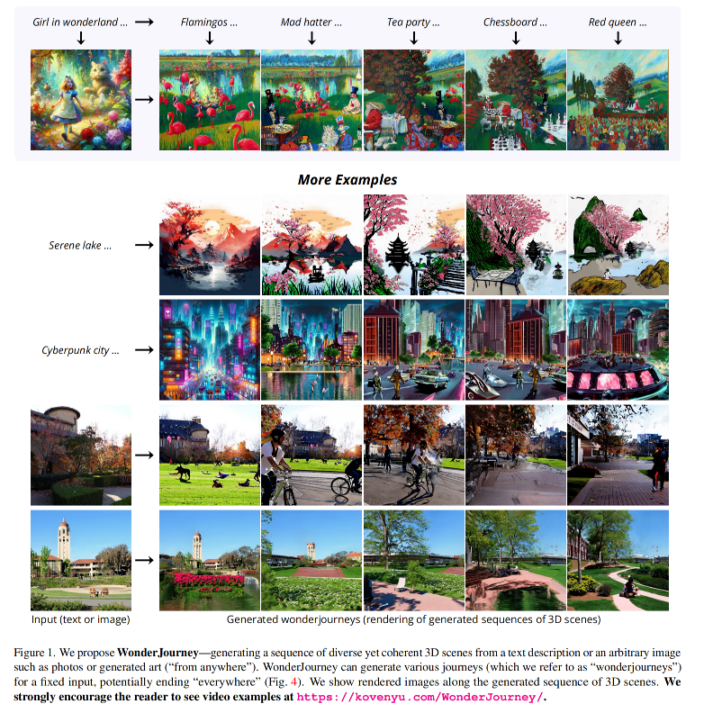
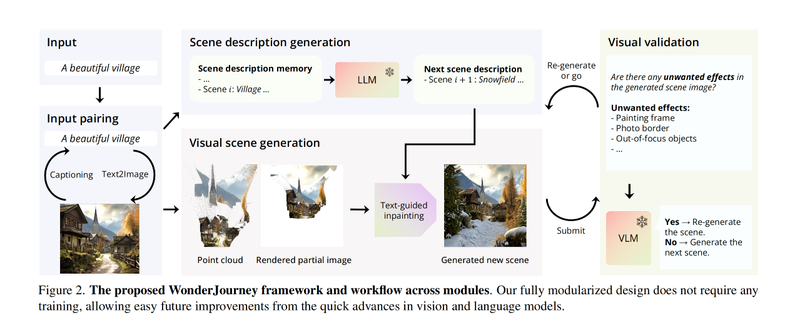
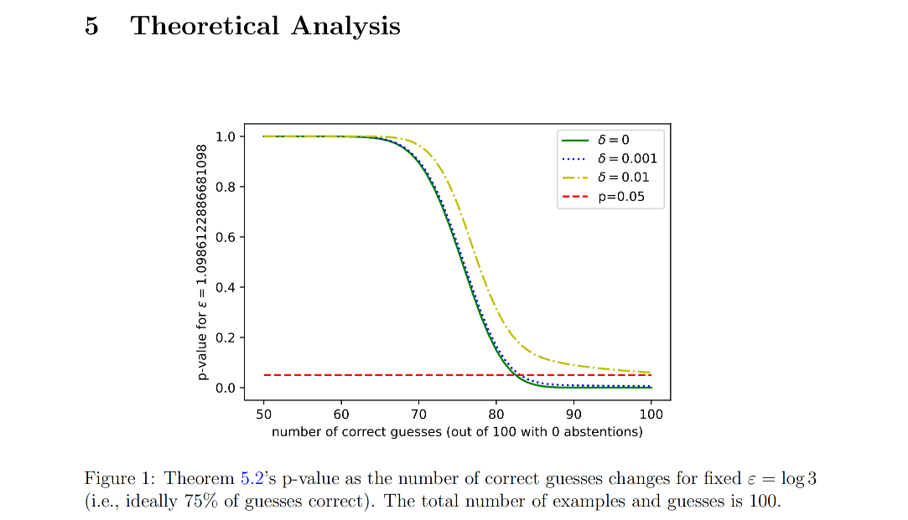
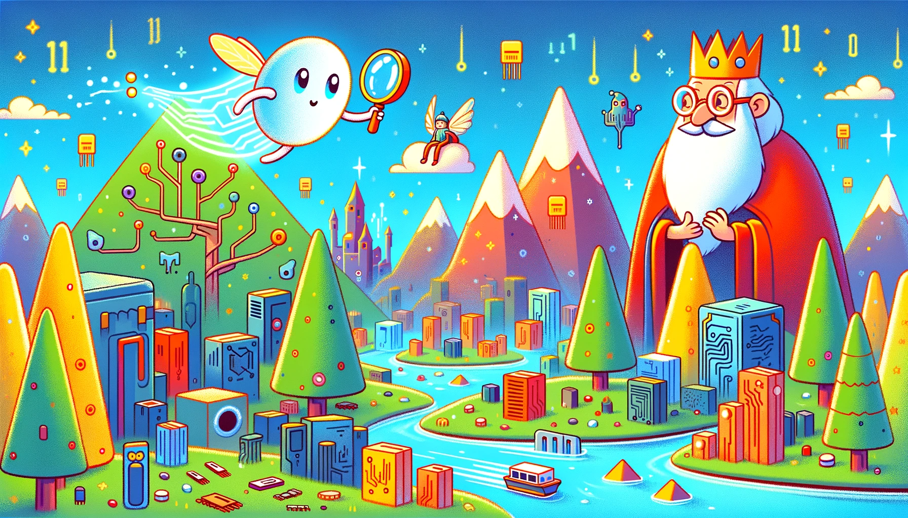
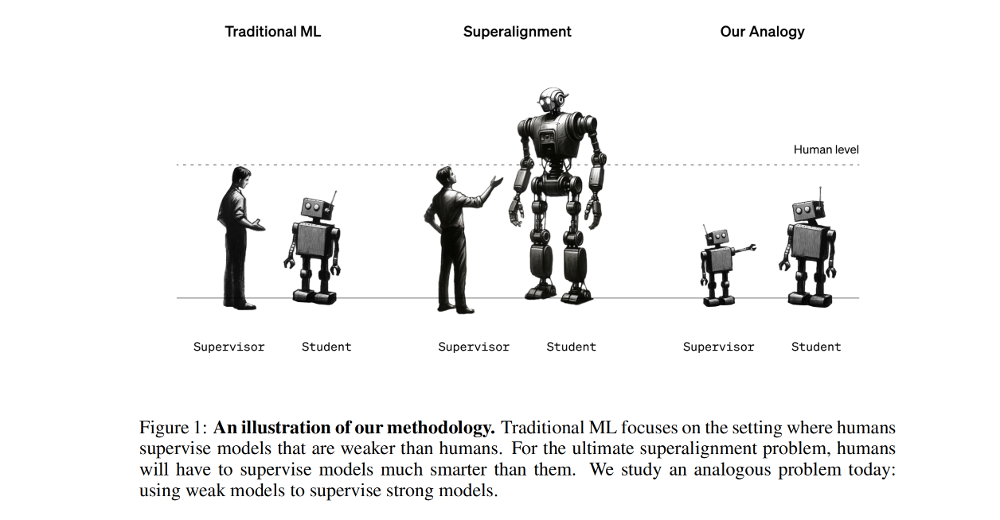
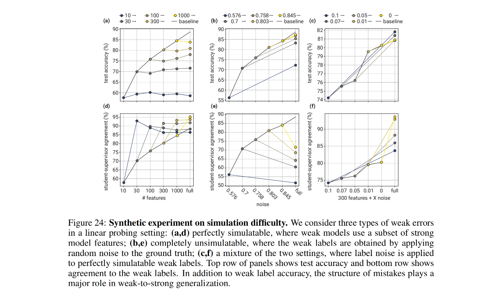
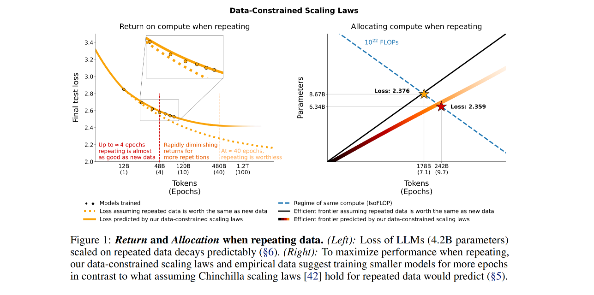

## Papers in NeurlPS 2023

We recommend using [算法妈妈每日论文解读GPTs](https://chat.openai.com/g/g-d85WVbueb-suan-fa-ma-ma-mei-ri-lun-wen-jie-du) in order to have the best research experience. 'mon' - 'alg' - 'viz' - 'imagine' is currently our best practices.

### the GPT intro

* How to use this GPT

* Simplfy the content and language style

* Use the action keyword 'alg' to output what we want to read

### Paper 01
* Wonder Journey: Going from Anywhere to Everywhere

#### 'mon' the paper
I found the paper "WonderJourney: Going from Anywhere to Everywhere" authored by Hong-Xing Yu, Haoyi Duan, Junhwa Hur, Kyle Sargent, Michael Rubinstein, William T. Freeman, Forrester Cole, Deqing Sun, Noah Snavely, Jiajun Wu, and Charles Herrmann. This paper introduces "WonderJourney," a modularized framework for the generation of perpetual 3D scenes【29†source】.

For more detailed information and to access the full paper, you can visit the following link on arXiv: [WonderJourney: Going from Anywhere to Everywhere](https://arxiv.org/abs/2312.03884).

#### 'alg' the paper
"WonderJourney," as described in the paper "WonderJourney: Going from Anywhere to Everywhere" (arXiv:2312.03884v1), presents a novel framework for perpetual 3D scene generation. This framework is unique in its ability to generate a continuous sequence of diverse yet coherently connected 3D scenes, starting from any user-provided location, which can be either a text description or an image.

Key features of WonderJourney include:

1. **Modularized Framework**: It consists of several interconnected modules, each addressing specific challenges in 3D scene generation. These include generating scene descriptions using a Large Language Model (LLM), creating the visual scenes based on these descriptions, and employing a Vision-Language Model (VLM) for validating the generated scenes.

2. **Diverse Scene Generation**: Unlike previous works focusing on a single type of scene, WonderJourney synthesizes a series of varied 3D scenes that are geometrically and semantically coherent.

3. **Scene Description Generation**: Utilizes an LLM to auto-regressively generate textual descriptions of the scenes in a journey. These descriptions guide the subsequent visual scene generation.

4. **Visual Scene Generation**: Involves creating colored point clouds representing connected 3D scenes, leveraging text-to-image models and depth estimation to produce visually and geometrically coherent scenes.

5. **Visual Validation**: Uses a VLM to check for unwanted visual effects in the generated scenes, such as out-of-place objects or inconsistent elements.

6. **Versatile Inputs**: Capable of starting the scene generation process from either an image or a text description, allowing for a wide range of creative inputs.

7. **Diverse Applications**: The technology has potential applications in creative and entertainment industries, offering new ways to explore visual storytelling and digital world creation.

WonderJourney represents a significant advancement in AI-driven 3D scene generation, showcasing the potential of integrating language and visual models to create immersive and diverse virtual experiences.

#### 'viz' the paper

#### 'imagine' the paper

* Image Request for DALL·E: For the accompanying image, I'd like to request a visual representation of a key scene from this story. The scene will depict Ellie and her Pixel Pals in the middle of their journey, surrounded by a vibrant, imaginative world that merges elements of fantasy, technology, and nature.
* DALL-E Prompt: "Create a wide image showing a young girl, Ellie, with a diverse group of whimsical pixelated characters, known as Pixel Pals, in a vibrant 3D world. The scene blends elements of a futuristic city, a candy forest, and an underwater neon-lit city. Include playful animals, robots, and fantastical plants, all under a sky painted with bright, swirling colors. The style should be whimsical and colorful, suitable for a children's storybook, with an aspect ratio of 16:9."

Story Title: The Magical Voyage of Ellie and the Pixel Pals

In a quaint little town where colors seemed brighter, and the skies were always a canvas of ever-changing hues, lived a curious and imaginative girl named Ellie. One day, while playing with her computer, Ellie discovered a magical program called "WonderJourney".

The program, a creation of brilliant minds from a faraway place, could turn any picture or words into a vivid, living world. Ellie, filled with excitement, typed in "A journey through a land of wonders", and instantly, the screen lit up, opening a portal to an incredible 3D world.

In this world, Ellie met her Pixel Pals, a group of colorful, friendly characters made of shimmering lights and shapes. Together, they embarked on a wondrous voyage. Each scene they ventured into was more mesmerizing than the last – from a serene village where the houses sang, to a candy forest with chocolate rivers and gummy bears playing hide and seek.

Ellie and her Pixel Pals traveled through landscapes that shifted from mountains made of fluffy clouds to underwater cities glowing with neon lights. They interacted with talking animals, danced with robots in a futuristic city, and even found themselves in a painting, where everything was brush strokes and splashes of paint.

As they journeyed, Ellie realized that her imagination, fueled by the "WonderJourney" program, was bringing all these worlds to life. Each scene was connected, telling a story of creativity, friendship, and the boundless possibilities of imagination.

And when it was time to return home, Ellie knew that this was just the beginning of many more adventures. She had a magical portal to endless wonders, and her Pixel Pals would always be there, waiting to explore new fantastical worlds together.

### Paper 02
* Privacy Auditing with One Training Run (NIPS 2023)

#### 'mon' the paper
The following is the [paper download link](https://arxiv.org/abs/2312.03884)

#### 'alg' the paper
The concept of "Privacy Auditing with One (1) Training Run" likely refers to an innovative approach or framework proposed in a research paper. This approach aims to perform privacy audits of machine learning models with a minimal number of training runs, ideally just one. The key aspects of such a system would involve:

1. **Efficiency in Auditing**: The system is designed to conduct comprehensive privacy audits with just a single training run of a machine learning model. This efficiency could be a significant advancement over traditional methods that might require multiple training iterations or extensive computational resources.

2. **Privacy Analysis**: The focus on privacy suggests that the algorithm or framework is capable of assessing the model's handling of sensitive data, identifying potential data leaks, or evaluating how well the model protects individual privacy.

3. **Machine Learning Applications**: This approach is likely relevant for machine learning models where privacy concerns are paramount, such as in healthcare, finance, or other sectors dealing with sensitive personal data.

4. **Innovative Techniques**: The method might employ novel techniques in data processing, model training, or algorithm design to achieve its goals. This could include advanced data anonymization, differential privacy, or unique model evaluation strategies.

5. **Broad Applicability**: While designed for privacy auditing, such a system might be adaptable for other aspects of model evaluation, like bias detection or efficiency analysis.

However, for a detailed explanation and specific methodologies used in this approach, the actual research paper or source where this concept is proposed would need to be consulted.

#### 'viz' the paper

#### 'imagine' the paper

* The illustration for the children's story "The Secret Mission of Agent Pixel" has been created. It visually brings to life the imaginative world of DataTopia, featuring the tiny hero Agent Pixel and the wise King Algorithm. This playful and vibrant image captures the essence of the story, making it engaging and accessible for children.

* Concept for the Accompanying Image: The image could be a whimsical depiction of Agent Pixel, a tiny, luminous character with a magnifying glass, soaring over a colorful, digitized landscape representing DataTopia. The landscape would have elements like trees shaped like USB sticks, mountains resembling hard drives, and rivers flowing with binary code. In the background, King Algorithm, depicted as a wise, elderly figure with a crown shaped like a gear, watches proudly from his castle made of circuit boards.

To create a children's story inspired by the concept of "Privacy Auditing with One Training Run," we can imagine a tale that translates the technical aspects of privacy auditing into a more whimsical and accessible narrative.

* The Secret Mission of Agent Pixel

Once in the land of DataTopia, where everything was made of numbers and information, there lived a tiny, smart agent named Pixel. Pixel was no ordinary agent; she had a special power – with just one look, she could tell if someone was mishandling the precious secrets of the inhabitants of DataTopia.

One day, the wise ruler of DataTopia, King Algorithm, called upon Agent Pixel for a very important mission. “Agent Pixel,” he said, “our land is full of secrets, and we need to make sure they are safe. Your mission is to travel across DataTopia and check every nook and cranny with just one glance to ensure no secrets are being leaked.”

Excited and determined, Pixel set off on her journey. She zipped through the Forest of Files, soared over the Mountains of Memory, and dived into the Valley of Variables. Everywhere she went, she used her special power to ensure that the secrets were safe and sound.

Finally, after a long journey, Pixel returned to King Algorithm. “Your Majesty,” she reported, “I have completed the mission with just one trip across DataTopia, and I’m happy to report that all our secrets are safe!”

The king was overjoyed and declared a grand celebration in honor of Agent Pixel’s successful mission. From that day on, Pixel became a legend in DataTopia, known as the guardian of secrets, who could audit the entire land with just one journey.

### Paper 03
* WEAK-TO-STRONG GENERALIZATION: ELICITING STRONG CAPABILITIES WITH WEAK SUPERVISION
* OpenAI

#### 'MON' the paper
the paper can be downloaded [here](https://cdn.openai.com/papers/weak-to-strong-generalization.pdf)

#### 'ALG' the paper
The paper "Weak-to-Strong Generalization: Eliciting Strong Capabilities with Weak Supervision" addresses the challenge of aligning large-scale machine learning models, particularly in the context of reinforcement learning from human feedback (RLHF). Here are the key points and proposed innovations identified within:

1. Weak-to-Strong Learning Setup: The authors propose using smaller, weaker models to supervise larger, stronger models. This mimics the challenge of humans needing to supervise future AI models that could be superhuman in capabilities. They test this setup by finetuning strong models with labels generated by weaker ones and examining how the strong models generalize.

2. Generalization Beyond Weak Supervision: When strong models are trained using weak supervision, they tend to naturally generalize beyond the capabilities of their supervisors, indicating that there is potential for these strong models to understand and adhere to complex tasks even if the supervision is limited or flawed.

3. Techniques for Improving Generalization: The paper discusses methods such as an auxiliary confidence loss, bootstrapping supervision, and unsupervised finetuning as ways to bridge the gap between weakly supervised and ground-truth supervised models. These methods show promise in enhancing weak-to-strong generalization.

4. Empirical Results: The results demonstrate that strong models can outperform their weak supervisors and these improvements are achievable across a range of tasks, including natural language processing benchmarks, chess puzzles, and reward modeling tasks.

5. Limitations and Future Work: While the results are encouraging, the methods are not consistently successful across all settings, particularly in reward modeling tasks. The paper highlights the importance of refining the setup for ensuring future research aligns superhuman models effectively.

6. Implications for Aligning Superhuman Models: The ability to generalize from weak to strong suggests that it may be possible to develop reward models or safety classifiers using weak supervisors, which could be instrumental in aligning superhuman models safely.

The paper is a contribution towards the field of AI alignment and ensuring the safe deployment of future superhuman artificial intelligence models. It showcases empirical results and makes progress in a direction that could enable weak supervisors (including humans in the future) to effectively guide models with capabilities far beyond their own.

#### 'VIZ' the paper

#### 'IMAGINE' the paper
Let's create a children's story inspired by the academic paper "Weak-to-Strong Generalization: Eliciting Strong Capabilities with Weak Supervision".

* DALL-E Prompt: Create an illustration for a children's story titled 'The Curious Little Robot'. In the center of the image, there should be a cute, small robot with a friendly appearance named Toby. He is exploring a vibrant city filled with colorful buildings and futuristic technology. Toby should look curious and determined, with gears and tools attached to him, indicating his ability to learn and adapt. The backdrop of the scene should be a lively urban environment with larger robots in the background, busy with their tasks, but looking down at Toby with a sense of pride and encouragement. Please ensure the image has a warm, inviting atmosphere and is appropriate for a children's book.

Story Title: "The Curious Little Robot"

Once upon a time, in a world filled with buzzing gadgets and whirring machines, there lived a little robot named Toby. Toby was not like the big and strong robots; he was smaller and still learning the ropes of being a helpful robot. Toby had a unique task: to learn from the world around him, despite sometimes getting confusing or wrong instructions.

Toby's instructors, a group of older and wiser robots, knew that they couldn't teach Toby everything. They could only give him hints and nudges in the right direction. Sometimes, their guidance was clear, but at others, it was as if Toby was being told to find a hidden treasure without a map.

Undeterred by these challenges, Toby set out on his adventures. He traveled through the bustling city, helping where he could, learning from the big robots, and even from the mistakes he made along the way.

As Toby grew and learned, something remarkable happened. Even when his instructors made errors, Toby began to understand their intentions. He could see beyond the muddled messages to the lessons they were trying to teach. He turned the weak instructions into strong actions, and soon, he was doing things that even his instructors couldn't imagine.

Toby's ability to learn and adapt earned him the admiration of robot and human friends alike. They realized that with enough curiosity and perseverance, anyone could exceed expectations and achieve greatness.

Connections to the Academic Paper:

* Toby represents a machine learning model engineered to learn from weak supervision—much like the strong models in the paper that learn from weaker ones.
* The older and wiser robots signify weak supervisory models that may occasionally give noisy or less precise guidance.
* Toby's journey and eventual ability to outperform his instructors mirror the weak-to-strong generalization, where strong models learn to generalize beyond the capabilities of their initial, weak supervision.
* The story accentuates the theme of learning and adaptation, highlighting the potential to develop and excel even under imperfect conditions, which is a core concept of the academic paper.

### Paper 04
* Scaling Data-Constrained Language Models (NIPS 2023)

#### MON the paper
The paper is [here](https://arxiv.org/abs/2305.16264)

#### ALG the paper
The paper "Scaling Data-Constrained Language Models" by Niklas Muennighoff et al. explores the scaling of language models under data constraint, as the trend of increasing the dataset size to train larger language models faces a limit due to the finite amount of text data available on the internet. The research involved conducting a large set of experiments where the amount of data repetition and compute budget varied, reaching up to 900 billion training tokens and models with 9 billion parameters.

Key findings and proposals from the paper include:

* The observation that, within a fixed compute budget, train loss changes negligibly when training with up to 4 epochs of repeated data compared to training with entirely unique data.

* The value of adding more compute decays to zero when the data is repeated more than 4 epochs, highlighting the diminishing returns with additional data repetition.

* A proposed new "data-constrained scaling law" that accounts for the decreasing value of repeated tokens and excess parameters. This scaling law provides a better prediction of loss for models trained on repeated data than existing scaling laws like "Chinchilla scaling laws."

* Experiments investigating strategies to mitigate data scarcity, such as code augmentation of datasets or the removal of common data filters. Particularly, mixing in code tokens during training was found to potentially increase the effective amount of natural language tokens by a factor of 2, even when evaluating on tasks involving only natural language.

The paper's results imply that in a data-constrained regime, effectively scaling total training compute budgets may require allocating compute to both more model parameters and a greater number of training epochs, with epochs needing to be scaled slightly faster.

The paper's broad contribution is in defining empirical scaling laws for language models under data constraints and suggesting practical strategies for when available data resources become fully tapped.

#### VIZ the paper

#### IMAGINE the paper
To create a children's story based on the paper "Scaling Data-Constrained Language Models," let us imagine a fantasy world where language holds the power to create and change reality. We'll weave a tale around this concept with characters that embody aspects of the paper’s subject—such as a young wizard who learns to harness the magic of words to scale up her power within constraints.

Once upon a time, in the vivid land of Lexiconia, young wizard Lila discovered an ancient library filled with magical books that whispered secrets of a long-lost language. Lila loved to explore the powers of words. With each new word she learned, her spells grew stronger, and she dreamed of casting grand enchantments that could protect the entire realm.

However, the library's magic was bound by an old riddle: "To scale the peaks of spellcraft's might, one must balance word and light; for too many repeats dull the charm, yet with too few, no need for alarm."

Lila sought the counsel of the library's caretaker, the wise owl Scriptor, who explained that the riddle was about the power of language. "You see," Scriptor said, "there's only a finite number of words in these books, and repeating them too many times weakens their magic."

Lila was determined to scale her abilities and guard Lexiconia from the mischievous shadows that roamed its borders. She set out to weave her spells in novel ways, creating new combinations from the same words and repeating them just enough to strengthen her magic without diminishing it.

As Lila cast her first grand spell, tendrils of light danced through the air, constructing a shimmering barrier around Lexiconia. The shadows could no longer pass, and the land was safe once more. The people hailed the young wizard for finding balance in the constraints of language, and Lila knew she had scaled heights even the ancient mages had not reached.

From that day on, Lila continued to learn and create, finding new ways to harness her power under the wise owl's guidance. And the people of Lexiconia lived happily ever after, their world safeguarded by the magic of well-measured words.

For the story image, let's imagine Lila casting her grand spell with the ancient library in the background, the words turning into magical light around her, creating a beautiful and protective dome over the land of Lexiconia. I will create this image with the aspect ratio of 16:9 to fit your request.

* Created by Code Interpretor

* Created by DALL-E 3

Prompt: Here is the story image of the young wizard Lila casting her grand spell, with words turning into magical light to protect the land of Lexiconia. The ancient library can be seen in the background, and a beautiful protective dome of words is being created above them.

The story and the illustration reflect the theme of the paper "Scaling Data-Constrained Language Models" where Lila represents a language model learning to scale her power by creatively using a limited set of words, akin to the way language models seek to optimize their performance within data constraints. Just as Lila repeats words in a balanced way to enhance her magic, the paper discusses optimizing the training process of language models with a finite dataset.
