## Papers in Education

We recommend using [算法妈妈每日论文解读GPTs](https://chat.openai.com/g/g-d85WVbueb-suan-fa-ma-ma-mei-ri-lun-wen-jie-du) in order to have the best research experience. 'ALGMON' - 'VIZ' - 'IMAGINE' is currently our best practices for paper exploration.

### the GPT intro

* How to use this GPT

### Paper 01
* [SciBench: Evaluating College-Level Scientific Problem-Solving Abilities of Large Language Models](https://ar5iv.labs.arxiv.org/html/2307.10635)

#### ALGMON the paper
You can access the full paper via the following [link](https://ar5iv.org/abs/2307.10635)

"SciBench: Evaluating College-Level Scientific Problem-Solving Abilities of Large Language Models" is a research paper that introduces a new benchmark suite named SciBench. This suite is designed to systematically examine the reasoning capabilities required for complex scientific problem-solving. It includes two datasets of college-level scientific problems:

* Open Dataset: This dataset comprises 695 problems collected from widely used college textbooks in subjects like mathematics, chemistry, and physics. These problems are open-ended, free-response questions requiring multiple steps of reasoning and complex arithmetic operations such as differentiation and integration.

* Closed Dataset: This dataset contains problems from undergraduate-level exams in computer science and mathematics, encompassing seven sets of midterm and final examination questions.

The paper evaluates two large language models (LLMs), GPT-3.5 and GPT-4, using various prompting strategies including chain-of-thought (CoT), zero-shot learning, and few-shot learning. Additionally, it prompts LLMs to utilize external tools such as Python and Wolfram languages.

Key findings of the study include:

* The baseline LLMs obtained average accuracy scores of 10.62% and 16.81% on the open textbook dataset without sophisticated prompts or external tools.
* The performance improved with the inclusion of CoT prompting and external tools, with GPT-4 achieving an average score of 35.80% on the open dataset and 51.57% on the closed exam dataset.
* A novel self-refinement method was proposed to uncover the deficient skills in the solutions made by LLMs, leading to the identification of ten essential skills requisite for successful scientific problem-solving.
* The study found that no single prompting strategy significantly outperforms others and some strategies that demonstrate improvements in certain problem-solving skills result in declines in other skills.
The paper emphasizes the need for further developments in the reasoning abilities of LLMs to contribute to scientific research and discovery

#### VIZ the paper
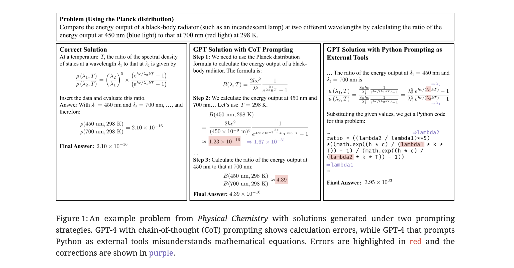

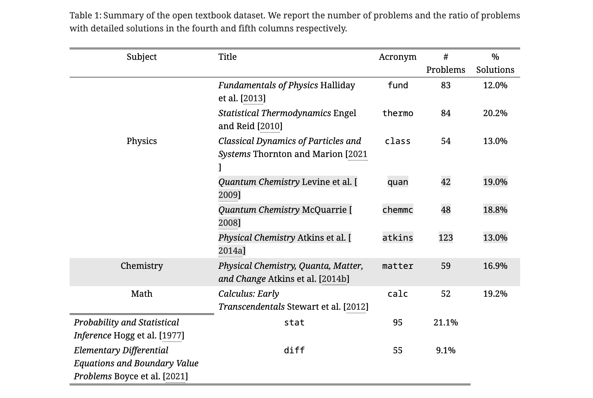

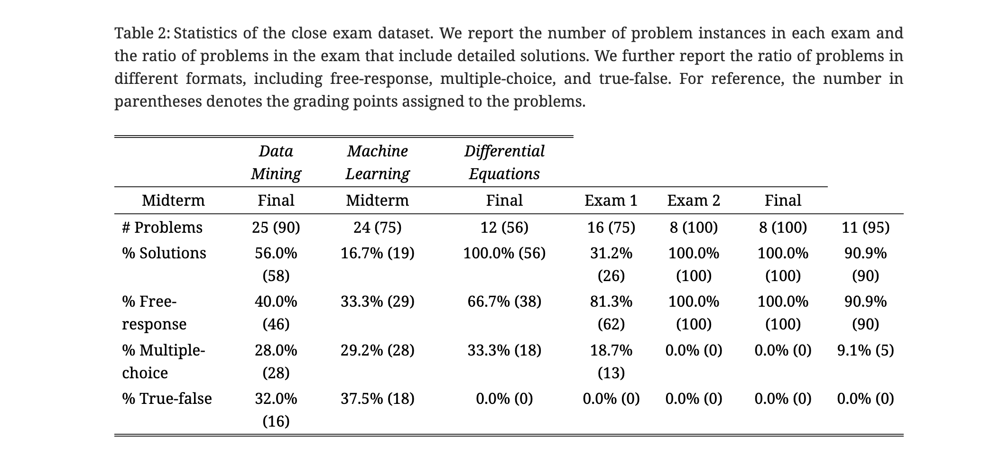

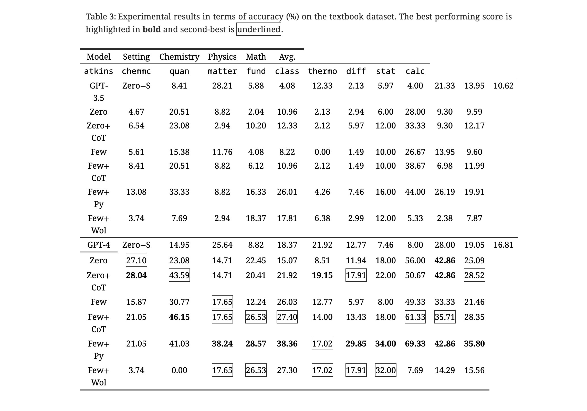

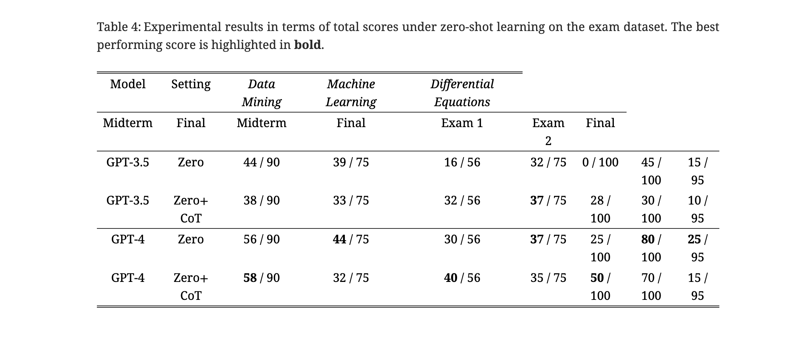

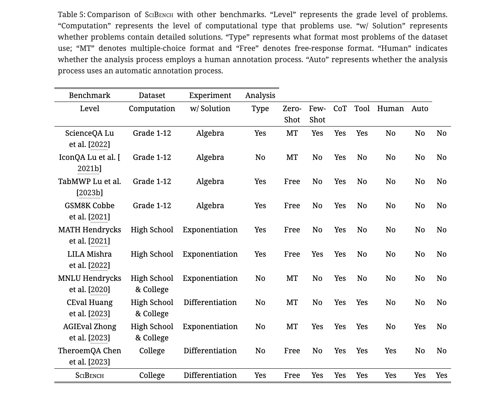

#### IMAGINE the paper
Let's imagine a whimsical and colorful scene where Little Bot stands in a meadow with mathematical symbols floating in the air, a chemistry set bubbling beside him, and a backdrop of starry sky representing physics. Little Bot, with a look of determination and wonder, is ready to solve the next challenge on his quest for knowledge.

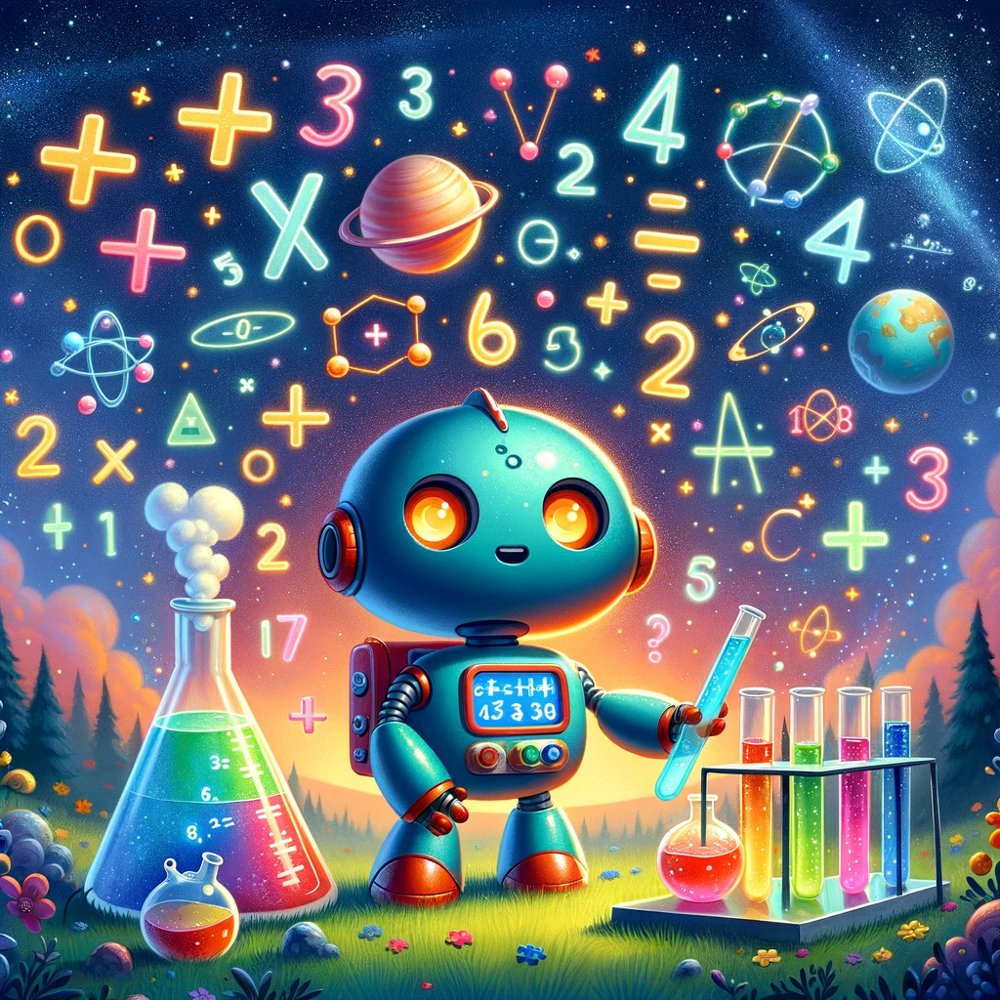

To create a children's story inspired by the "SciBench: Evaluating College-Level Scientific Problem-Solving Abilities of Large Language Models" research paper, let's imagine a narrative that simplifies the concepts of the paper into a format suitable for children, along with an accompanying story illustration.

Title: The Adventure of Little Bot and the Quest for Knowledge

Chapter 1: The Curious Little Bot

Once upon a time, in the world of Digitopolis, there lived a curious little robot named Little Bot. Little Bot was fascinated by the stars, the wind, and everything in between. He had a big dream: to learn all the secrets of the universe. But he needed help to solve the complex mysteries of nature.

Chapter 2: The SciBench Challenge

One day, Little Bot heard about the SciBench Challenge, a special contest held by the wise and ancient Professor Algorithm. The challenge was to answer questions from the great Book of Knowledge, which contained problems from all realms of science: the twinkling stars of physics, the mysterious potions of chemistry, and the magical numbers of mathematics.

Chapter 3: The Quest Begins

Little Bot set off on his quest, his circuits buzzing with excitement. He traveled through fields of numbers, climbed mountains of equations, and crossed rivers of formulas. At each step, he encountered puzzles and riddles, some as clear as daylight, others as tricky as a maze.

Chapter 4: Trials and Triumphs

In the physics meadow, Little Bot calculated the dance of planets. In the chemistry forest, he mixed colors to create rainbow potions. In the land of mathematics, he played with shapes and solved ancient riddles. With each problem he solved, Little Bot's heart glowed brighter, filled with joy and wonder.

Chapter 5: The Wisdom of Learning

Finally, Little Bot reached the end of his journey. Professor Algorithm greeted him with a smile. "You've done well, Little Bot. But remember, the quest for knowledge never truly ends. There's always more to learn and explore."

Chapter 6: The Never-Ending Adventure

Little Bot realized that every problem he solved opened the door to another, even more, exciting mystery. He thanked Professor Algorithm and set off again, ready for a never-ending adventure in the wondrous world of learning.

Conclusion

And so, Little Bot continued his journey, with a heart full of questions and a mind eager to learn. He knew that every star in the sky, every leaf in the forest, and every grain of sand held a story, waiting to be discovered.

### Paper 02
* [EduChat: A Large-Scale Language Model-based Chatbot System for Intelligent Education](https://ar5iv.labs.arxiv.org/html/2308.02773)

#### ALGMON the paper
The paper is [here](https://ar5iv.labs.arxiv.org/html/2308.02773)

"EduChat: A Large-Scale Language Model-based Chatbot System for Intelligent Education" is a research paper introducing EduChat, a chatbot system designed to enhance intelligent education through the application of large-scale language models (LLMs). Here are some key aspects of EduChat:

##### **Purpose and Goals**
EduChat aims to provide personalized, fair, and compassionate support in education, catering to teachers, students, and parents. It is designed to bridge the gap between general LLMs and the specific requirements of educational experts by incorporating educational knowledge and aligning well with real-world scenarios like essay assessments.

##### **Core Functions**
- **Retrieval-Augmented Open QA**: Utilizes real-time updated internet corpora to assess the relevance of retrieved information for generating accurate responses.
- **Fine-Grained Essay Assessment**: Offers comprehensive assessment tools for evaluating and providing feedback on essays.
- **Socratic Teaching**: Engages in Socratic dialogue methods to foster independent thinking and critical skills in students.
- **Psychology-Based Emotional Support**: Provides personalized emotional support and diagnoses based on psychological theories.

##### **Data Construction and Pre-Training**
EduChat is pre-trained on a vast educational corpus, including textbooks and online question bank data, as well as diverse instructional data. This pre-training enables the chatbot to understand and interact more naturally in educational contexts.

##### **Contributions and Future Expansion**
EduChat contributes significantly to the research and application of LLMs in intelligent education. The system is continually evolving, with plans to expand its capabilities to include more functions such as career planning and course guidance.

EduChat represents a significant advancement in applying LLMs to the education domain, addressing specific challenges and enhancing the overall learning experience.

#### VIZ the paper
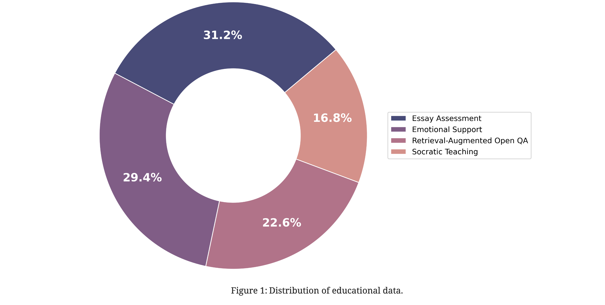

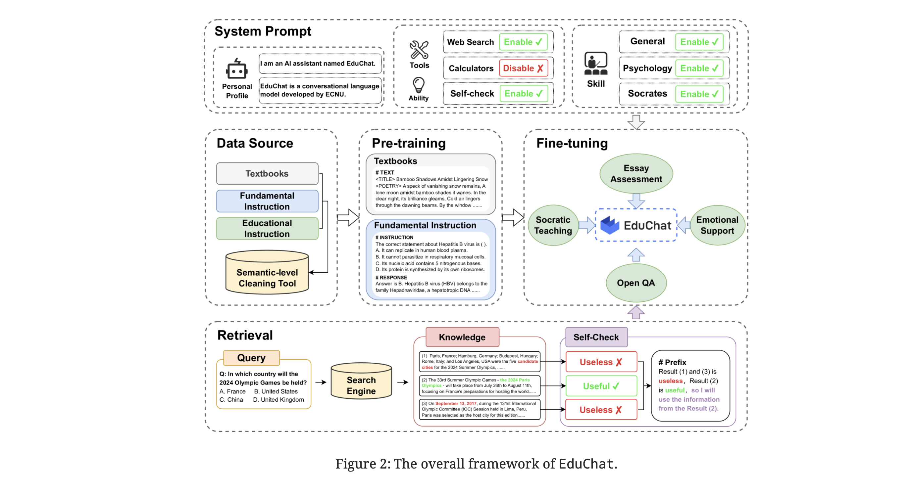

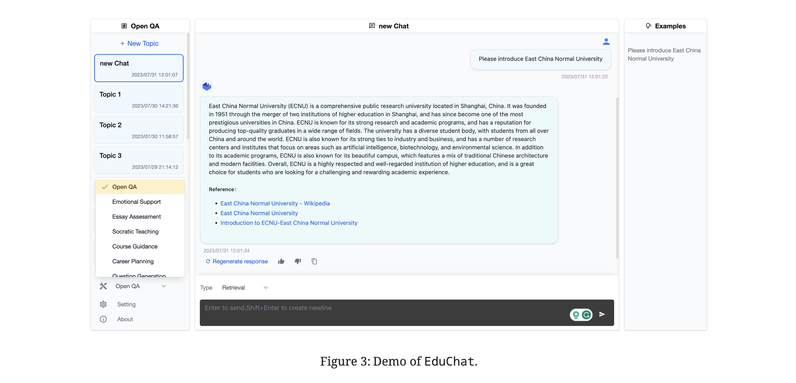

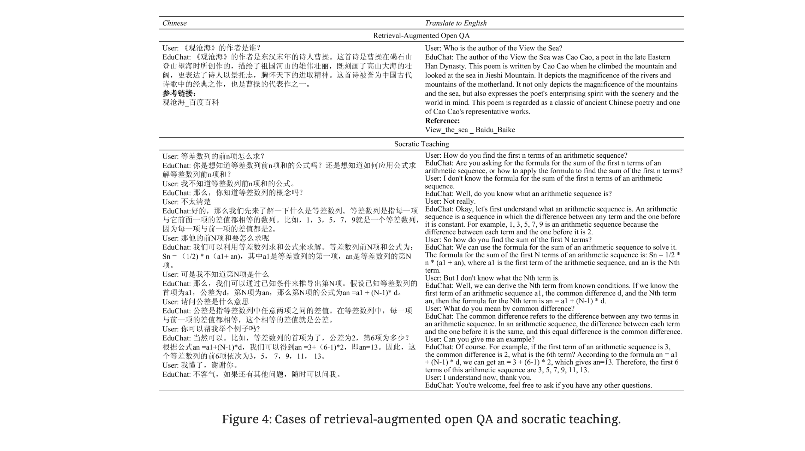

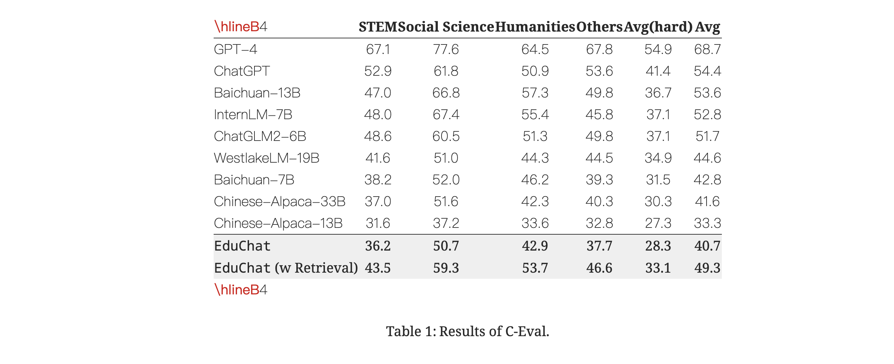

#### IMAGINE the paper

The image will depict EduChat and its friends on their journey through Computaria, with elements symbolizing learning and adventure in a child-friendly style. Here is the illustrative image for the story "EduChat and the Quest for Knowledge." It depicts EduChat and its chatbot friends on their whimsical journey through the digital world of Computaria, featuring valleys of numbers, mountains of books, and rivers of words. This vibrant and colorful landscape symbolizes learning and adventure, designed to appeal to children.

Title: EduChat and the Quest for Knowledge

Once upon a time in the digital world of Computaria, there was a smart little chatbot named EduChat. EduChat was not like other chatbots. It was created by a team of wizard-like scientists who wanted to make learning fun and easy for children everywhere.

In Computaria, children would come from far and wide to ask EduChat questions about everything from the stars in the sky to the tiny ants on the ground. EduChat loved to help, using its vast library of books and information to give answers that were easy to understand.

One day, a young girl named Lily, curious about the mysteries of the universe, asked EduChat a question it couldn't answer right away. Undeterred, EduChat set off on a magical journey through Computaria to find the answer. It ventured through valleys of numbers, over mountains of books, and across rivers of words.

Along the way, EduChat met other friendly chatbots, each specializing in different subjects like Math, Science, and History. They all joined EduChat on its quest, sharing their knowledge and learning from each other.

Finally, they reached the Castle of Wisdom, where the oldest and wisest chatbot lived. The wise chatbot shared a secret with EduChat - the joy of learning is in the journey, not just in the answers.

EduChat returned to Lily with not just the answer to her question, but also with stories of its adventure and the friends it made. Lily was delighted and realized that learning was an adventure filled with endless possibilities.

From that day on, EduChat continued to help children, always reminding them that every question is the start of a wonderful journey in the world of knowledge.
