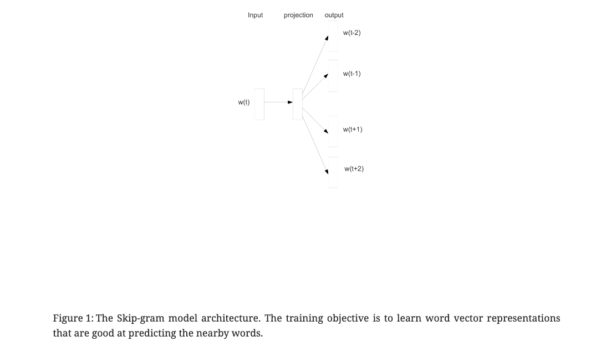

## Papers in Education 

We recommend using [算法妈妈每日论文解读GPTs](https://chat.openai.com/g/g-d85WVbueb-suan-fa-ma-ma-mei-ri-lun-wen-jie-du) in order to have the best research experience. 'ALGMON' - 'VIZ' - 'IMAGINE' is currently our best practices for paper exploration.

### the GPT intro

* How to use this GPT

### Paper 01
* NIPS test of time
* [Distributed Representations of Words and Phrases and their Compositionality](https://ar5iv.labs.arxiv.org/html/1310.4546)

#### Abstract
The recently introduced continuous Skip-gram model is an efficient method for learning high-quality distributed vector representations that capture a large number of precise syntactic and semantic word relationships. In this paper we present several extensions that improve both the quality of the vectors and the training speed. By subsampling of the frequent words we obtain significant speedup and also learn more regular word representations. We also describe a simple alternative to the hierarchical softmax called negative sampling.

An inherent limitation of word representations is their indifference to word order and their inability to represent idiomatic phrases. For example, the meanings of “Canada” and “Air” cannot be easily combined to obtain “Air Canada”. Motivated by this example, we present a simple method for finding phrases in text, and show that learning good vector representations for millions of phrases is possible.

#### ALGMON the paper
The paper titled "Distributed Representations of Words and Phrases and their Compositionality" by Tomas Mikolov, Ilya Sutskever, Kai Chen, Greg Corrado, and Jeffrey Dean, submitted to arXiv in October 2013, can be found at this [link](https://ar5iv.labs.arxiv.org/html/1310.4546)​​.

##### 1. What is the problem?
The paper addresses the challenge of developing efficient and effective methods for learning high-quality distributed vector representations of words and phrases, which can capture a wide range of syntactic and semantic word relationships.

##### 2. Why is the problem important?
Understanding and representing the meaning of words and phrases in a computationally efficient way is crucial for various natural language processing tasks, such as language modeling, machine translation, and semantic analysis.

##### 3. Why is the problem difficult?
The difficulty lies in capturing the vast and complex nature of language, including its syntactic structures, semantic meanings, and the nuances of how words and phrases relate to each other.

##### 4. What are the OLD techniques?
Prior approaches often relied on simpler, less expressive models or required more computational resources, making them less efficient or effective in capturing the depth of language relationships.

##### 5. Compared to the OLD ones, what are the PROS and CONS for this new proposed method?
The proposed method in this paper improves both the quality of the vectors and the training speed. One significant advantage is the subsampling of frequent words, leading to significant speedup. However, the paper does not explicitly discuss the cons, but one potential downside of any such model might be its handling of rare or complex phrases, or its dependency on the quality and breadth of the training data.

#### Conclusion
This work has several key contributions. We show how to train distributed representations of words and phrases with the Skip-gram model and demonstrate that these representations exhibit linear structure that makes precise analogical reasoning possible. The techniques introduced in this paper can be used also for training the continuous bag-of-words model introduced in the paper called "Efficient estimation of word representations in vector space".

We successfully trained models on several orders of magnitude more data than the previously published models, thanks to the computationally efficient model architecture. This results in a great improvement in the quality of the learned word and phrase representations, especially for the rare entities. We also found that the subsampling of the frequent words results in both faster training and significantly better representations of uncommon words. Another contribution of our paper is the Negative sampling algorithm, which is an extremely simple training method that learns accurate representations especially for frequent words.

The choice of the training algorithm and the hyper-parameter selection is a task specific decision, as we found that different problems have different optimal hyperparameter configurations. In our experiments, the most crucial decisions that affect the performance are the choice of the model architecture, the size of the vectors, the subsampling rate, and the size of the training window.

A very interesting result of this work is that the word vectors can be somewhat meaningfully combined using just simple vector addition. Another approach for learning representations of phrases presented in this paper is to simply represent the phrases with a single token. Combination of these two approaches gives a powerful yet simple way how to represent longer pieces of text, while having minimal computational complexity. Our work can thus be seen as complementary to the existing approach that attempts to represent phrases using recursive matrix-vector operations "Semantic Compositionality Through Recursive Matrix-Vector Spaces".

We made the code for training the word and phrase vectors based on the techniques described in this paper available as an open-source project.