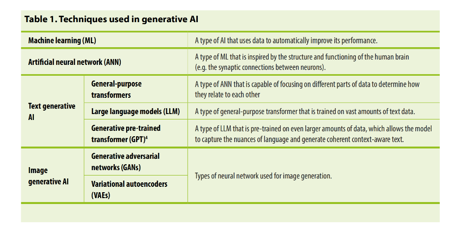
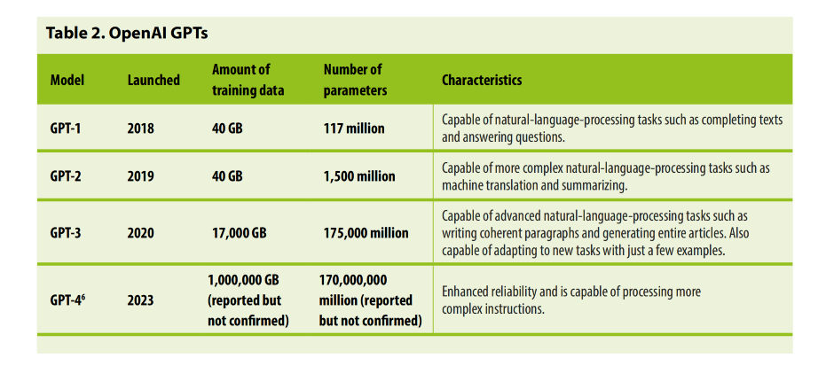
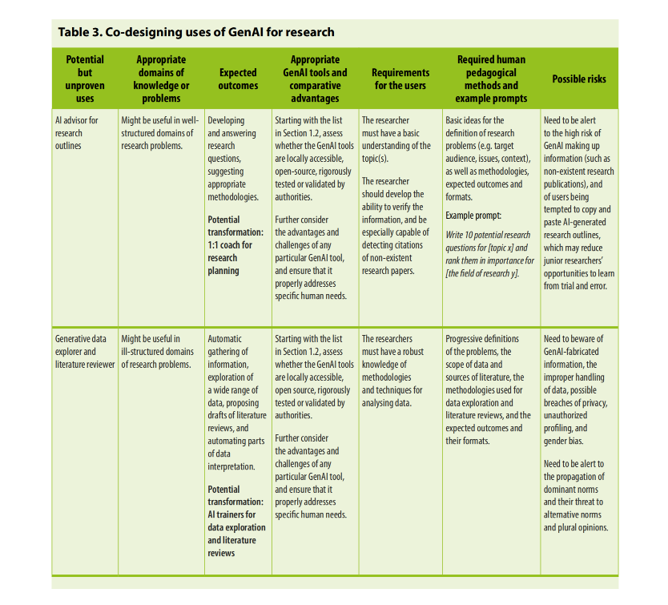
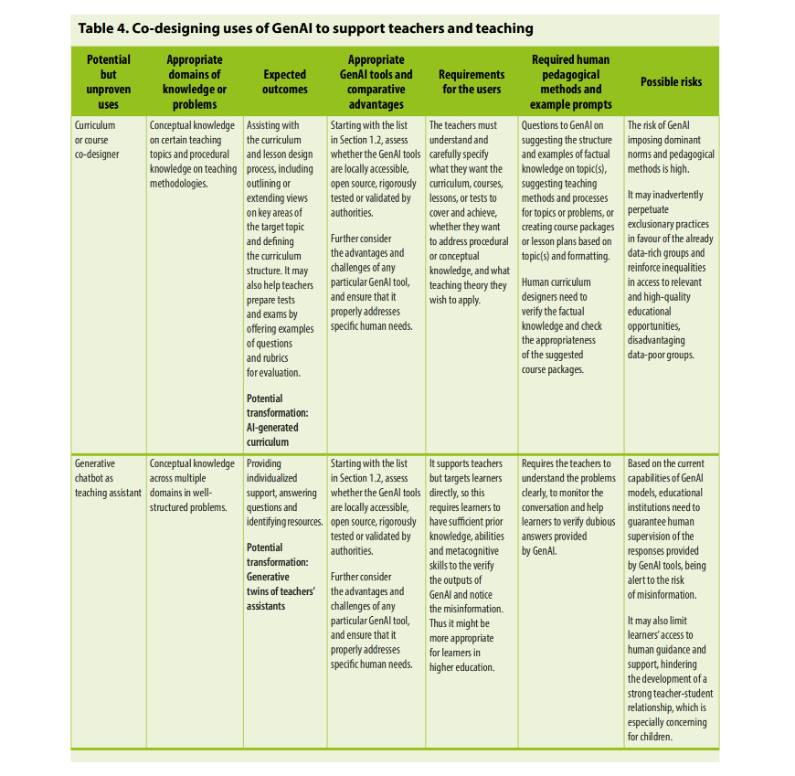
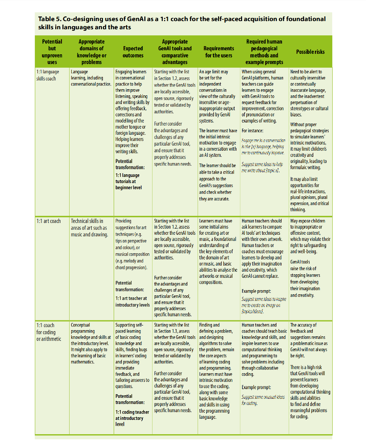
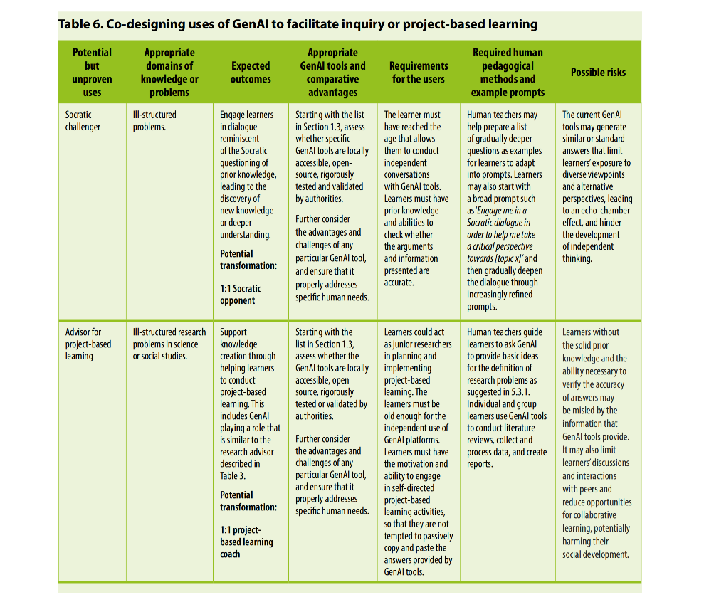
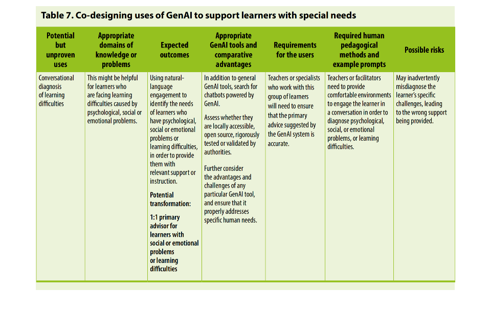
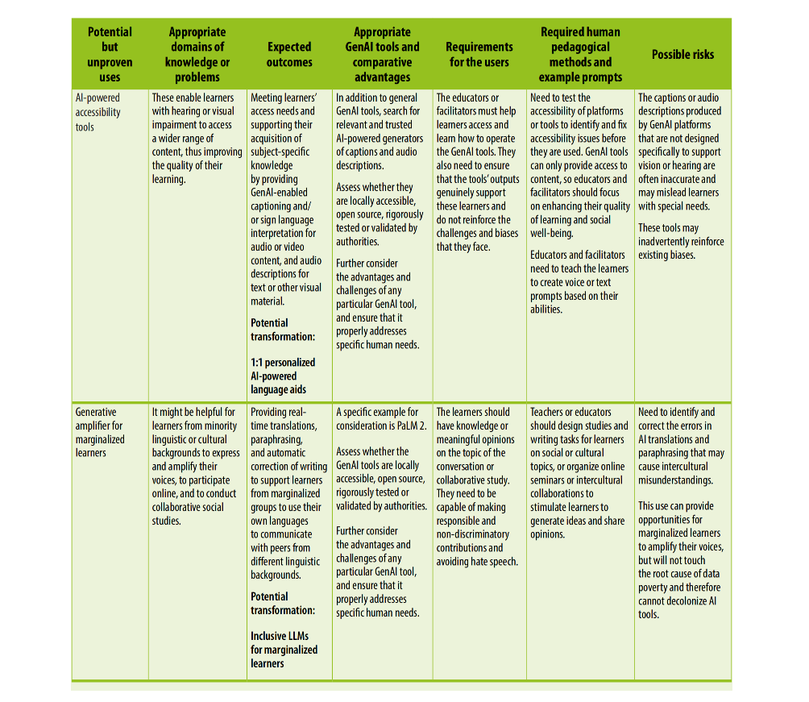

### Report Title
* Guidance for Generative AI in education and research
* from United Nations Educational, Scientific and Cultural Organization

### Summary
* While ChatGPT reached 100 million monthly active users in Jan, 2023, only one country had released regulations on generative AI as of July 2023.
* 在联合国教科文组织的框架下，拓展AI赋能教育的边界，这是一个精彩的世界。

### Table & Figures

