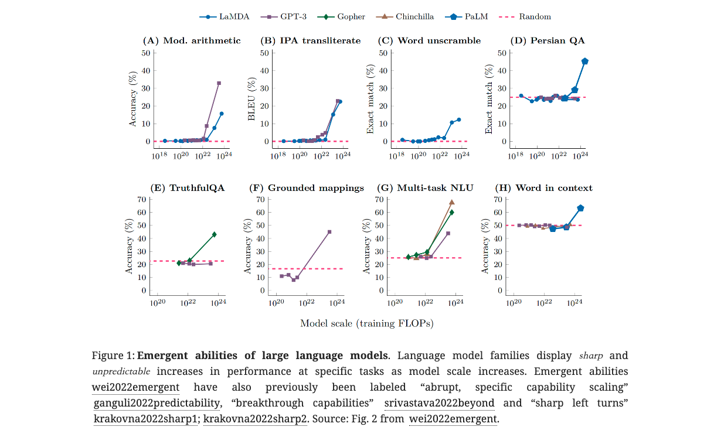

### Paper Title
* Are Emergent Abilities of Large Language Models a Mirage?
* NIPS 2023

### Abstract
Recent work claims that large language models display emergent abilities, abilities not present in smaller-scale models that are present in larger-scale models. What makes emergent abilities intriguing is two-fold: their sharpness, transitioning seemingly instantaneously from not present to present, and their unpredictability, appearing at seemingly unforeseeable model scales. Here, we present an alternative explanation for emergent abilities: that for a particular task and model family, when analyzing fixed model outputs, one can choose a metric which leads to the inference of an emergent ability or another metric which does not. Thus, our alternative suggests that existing claims of emergent abilities are creations of the researcher’s analyses, not fundamental changes in model behavior on specific tasks with scale. We present our explanation in a simple mathematical model, then test it in three complementary ways: we (1) make, test and confirm three predictions on the effect of metric choice using the InstructGPT/GPT-3 family on tasks with claimed emergent abilities, (2) make, test and confirm two predictions about metric choices in a meta-analysis of emergent abilities on BIG-Bench; and (3) show how similar metric decisions suggest apparent emergent abilities on vision tasks in diverse deep network architectures (convolutional, autoencoder, transformers). In all three analyses, we find **strong supporting evidence** that emergent abilities **may not** be a fundamental property of scaling AI models.

### ALGMON the paper
The paper can be downloaded [here](https://ar5iv.labs.arxiv.org/html/2304.15004).

The paper "Are Emergent Abilities of Large Language Models a Mirage?" discusses the concept of emergent abilities in large language models (LLMs). Emergent abilities are defined as abilities not present in smaller-scale models but appearing in larger-scale models. This phenomenon has garnered interest due to its unpredictability and the abruptness of these abilities' appearance at certain model scales. The paper, however, proposes an alternative explanation. It suggests that these perceived emergent abilities might be artifacts of the metrics used in analyzing the models. Through various tests and analyses, the paper argues that emergent abilities might not be fundamental properties of scaling AI models, but rather a result of specific metric choices that non-linearly or discontinuously scale a model's per-token error rate.

### What is the problem?
The problem addressed is the phenomenon of emergent abilities in large language models (LLMs). These are abilities that appear in larger-scale models but are not present in smaller ones. The key issue is whether these emergent abilities are genuine features of model scaling or artifacts of the metrics used in research.

### Why is the problem important?
Understanding the nature of emergent abilities is crucial for AI and machine learning research. It impacts how we perceive the scalability of LLMs and their capabilities. If emergent abilities are real, they signify a profound shift in model behavior as they scale. If not, it implies a need for caution in interpreting the results of LLM research and development.

### Why is the problem difficult?
Identifying emergent abilities is challenging because it involves discerning whether observed abilities at large scales are genuinely new or simply results of specific metrics used in evaluation. This requires careful analysis and testing across different scales and metrics, considering the non-linearity and discontinuity in error rates.

### What are the OLD techniques?
Previous approaches focused on observing and documenting emergent abilities as LLMs scale up, often using performance metrics like exact string match or multiple-choice grade. These studies typically highlighted the appearance of new capabilities in larger models without deeply analyzing the influence of evaluation metrics.

### Compared to the OLD ones, what are the Pros and Cons for this new proposed method?
The new approach proposed in the paper involves a critical examination of the metrics used to identify emergent abilities. It suggests that these abilities might be illusory, influenced by the choice of metric.
Pros: This approach fosters a more nuanced understanding of LLM scaling and urges caution against overestimating model capabilities based on specific metrics.

Cons: It might challenge the notion of genuine advancement in LLM capabilities at larger scales, potentially leading to skepticism about the real progress in the field. Additionally, it requires extensive analysis and may not provide a definitive answer on whether certain abilities are truly emergent or not.