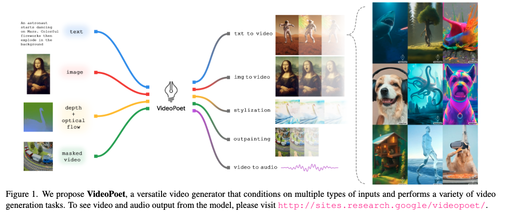
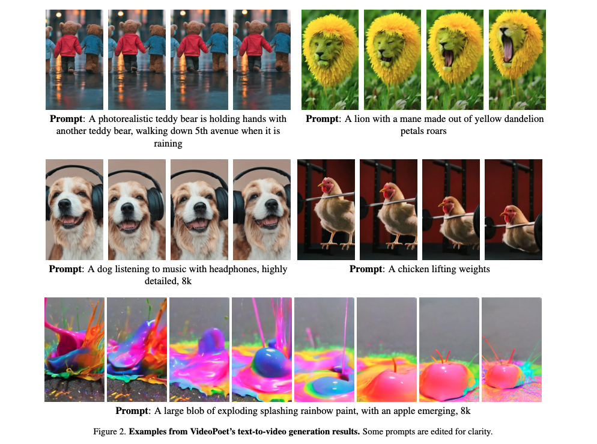
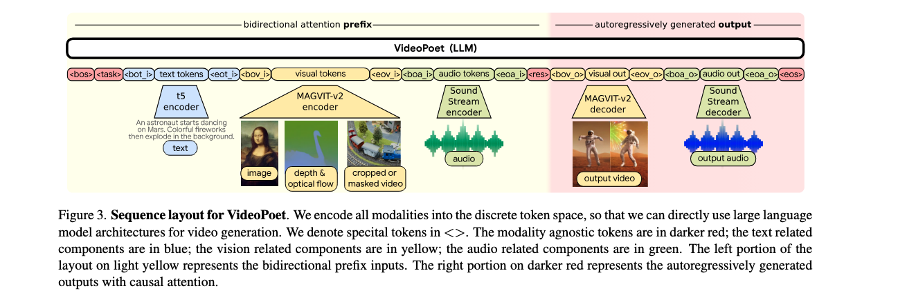

### Paper Title
* VideoPoet: A Large Language Model for Zero-Shot Video Generation

### Abstract
We present VideoPoet, a language model capable of synthesizing high-quality video, with matching audio, from a large variety of conditioning signals. VideoPoet employs a decoder-only transformer architecture that processes multimodal inputs – including images, videos, text, and audio. The training protocol follows that of Large Language Models (LLMs), consisting of two stages: pretraining and task-specific adaptation. During pretraining, VideoPoet incorporates a mixture of multimodal generative objectives within an autoregressive Transformer framework. The pretrained LLM serves as a foundation that can be adapted for a range of video generation tasks. We present empirical results demonstrating the model’s state-of-the-art capabilities in zero-shot video generation, specifically highlighting VideoPoet’s ability to generate high-fidelity motions.

### ALGMON the paper
"VideoPoet: A Large Language Model for Zero-Shot Video Generation" is a research paper focusing on a novel video generation model. Unfortunately, I couldn't access the detailed contents of the paper on arXiv or other academic sources due to technical restrictions.

However, from a brief overview available from Google Research, VideoPoet is designed to transform any autoregressive language model or large language model (LLM) into a high-quality video generator. Key components include:

1. Pre-trained video and audio tokenizers that convert images, videos, and audio clips into discrete codes compatible with text-based language models.
2. An autoregressive language model trained across video, image, audio, and text modalities for predicting next video or audio tokens.
3. Multimodal generative learning objectives integrated into the LLM training framework. These objectives cover a range of tasks like text-to-video, image-to-video, video frame continuation, video inpainting and outpainting, video stylization, and video-to-audio.

VideoPoet stands out for its ability to synthesize and edit videos with high temporal consistency and supports generating videos in various orientations, including square and portrait, alongside audio generation from video input.

### What is the problem?
The problem addressed by VideoPoet is the generation of high-quality videos from various inputs, including text, images, and audio. Traditional methods of video generation often require extensive data and complex models, making the process challenging.

### Why is the problem important?
This problem is significant because video generation has numerous applications in entertainment, education, and information dissemination. Efficient and versatile video generation models can revolutionize content creation, making it more accessible and dynamic.

### Why is the problem difficult?
Video generation is difficult due to the need for high temporal consistency and the complex nature of integrating multiple modalities (text, image, audio) coherently. Maintaining quality and coherence over time in generated videos is a complex task requiring advanced modeling techniques.

### What are the OLD techniques?
Previous techniques often relied on separate models for different aspects of video generation, like text-to-image or image-to-video models. These methods might not integrate multiple modalities seamlessly and often struggled with maintaining temporal consistency over longer sequences.

### Compared to the OLD ones, what are the Pros and Cons for this new proposed method?
Pros:
* Multimodal Integration: VideoPoet can integrate text, image, audio, and video inputs more cohesively.
* Temporal Consistency: It maintains higher temporal consistency in video generation.
* Zero-Shot Capabilities: The model can perform tasks like text-to-video generation without specific training on those tasks.
* Flexibility in Output: It supports generating videos in various orientations and includes audio generation from video input.

Cons:
* Complexity: The system's complexity might require significant computational resources.
* Potential for Bias: As with any AI model, there's a risk of biases in the generated content, depending on the training data.
* Limited by Training Data: The quality and diversity of the generated videos are contingent on the breadth and diversity of the training data.

This new approach demonstrates an innovative step in video generation technology, particularly in its ability to integrate multiple input types and maintain quality and coherence in the generated content.

