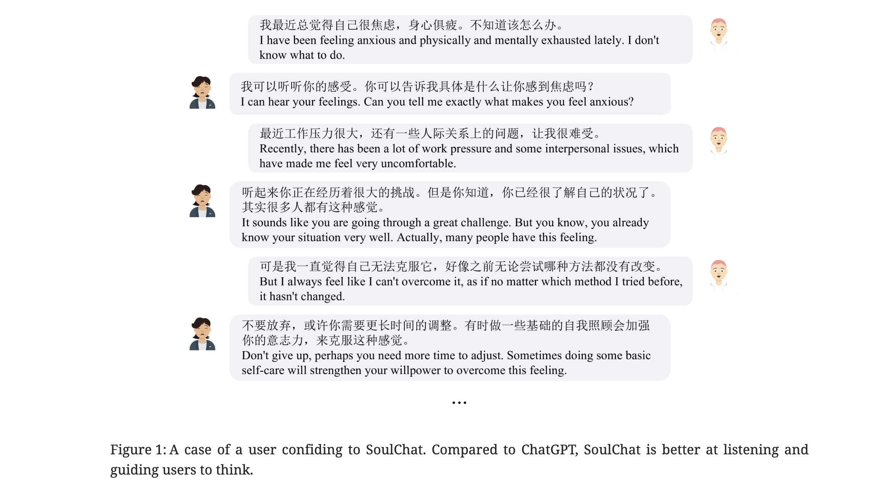
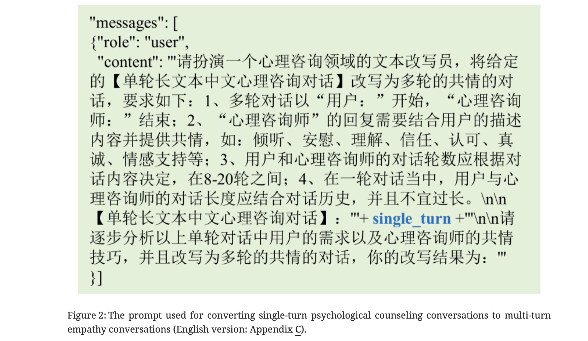
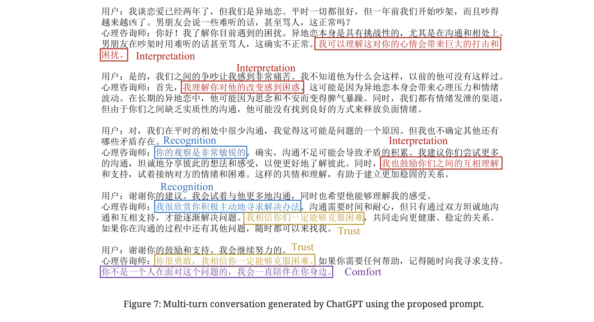

### Paper Title
* SoulChat: Improving LLMs’ Empathy, Listening, and Comfort Abilities through Fine-tuning with Multi-turn Empathy Conversations

### Abstract
* Large language models (LLMs) have been widely applied in various fields due to their excellent capability for memorizing knowledge and chain of thought (CoT). When these language models are applied in the field of psychological counseling, they often rush to provide universal advice. However, when users seek psychological support, they need to gain empathy, trust, understanding and comfort, rather than just reasonable advice. To this end, we constructed a multi-turn empathetic conversation dataset of more than 2 million samples, in which the input is the multi-turn conversation context, and the target is empathetic responses that cover expressions such as questioning, comfort, recognition, listening, trust, emotional support, etc. Experiments have shown that the empathy ability of LLMs can be significantly enhanced when finetuning by using multi-turn dialogue history and responses that are closer to the expression of a psychological consultant.

### Suanfamama the paper
* The paper can be downloaded [here](https://ar5iv.labs.arxiv.org/html/2311.00273)
* The paper "SoulChat: Improving LLMs’ Empathy, Listening, and Comfort Abilities through Fine-tuning with Multi-turn Empathy Conversations" focuses on enhancing the empathetic abilities of large language models (LLMs) in psychological counseling contexts. Here's an analysis based on the 5W methodology:

### What is the problem?
* LLMs, when applied in psychological counseling, often provide universal, repetitive advice lacking empathy, trust, understanding, and comfort.

### Why is the problem important?
* Empathy and personalized responses are crucial in psychological support to ensure effective and human-centered communication.

### Why is the problem difficult?
* Developing empathy in LLMs is challenging due to the lack of large-scale multi-turn empathy conversation datasets, especially for non-English languages like Chinese.

### What are the OLD techniques?
* Previous approaches relied on datasets like EMPATHETICDIALOGUES and ESConv for English, which had limitations in training LLMs for empathetic responses in psychological counseling.

### Compared to the OLD ones, what are the Pros and Cons for this new proposed method?
Pros:
* SoulChatCorpus, a large-scale multi-turn empathy conversation dataset, was developed to fine-tune LLMs, leading to significantly enhanced empathy, listening, and comfort abilities.
* The dataset covers 12 psychological counseling topics, providing a diverse range of empathetic responses​​.

Cons:
* The complexity of empathy mechanisms and varying user expectations might still pose challenges. For instance, adults and adolescents might expect different types of empathetic responses​​.
* The need to further consider user attributes like personality and gender to generate more targeted empathetic responses

