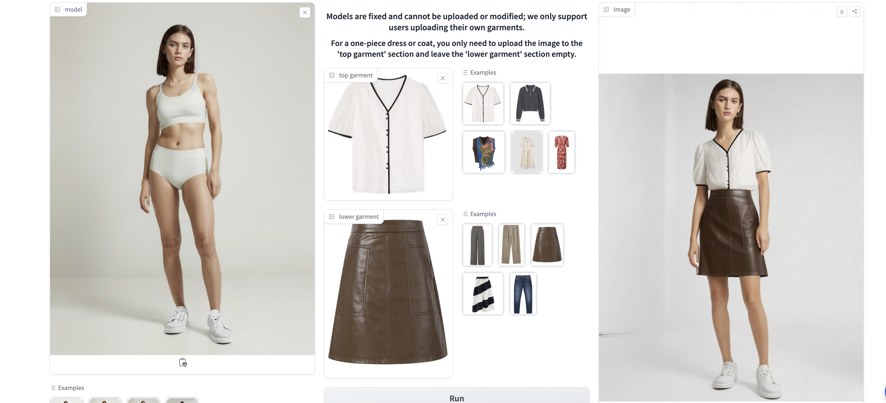
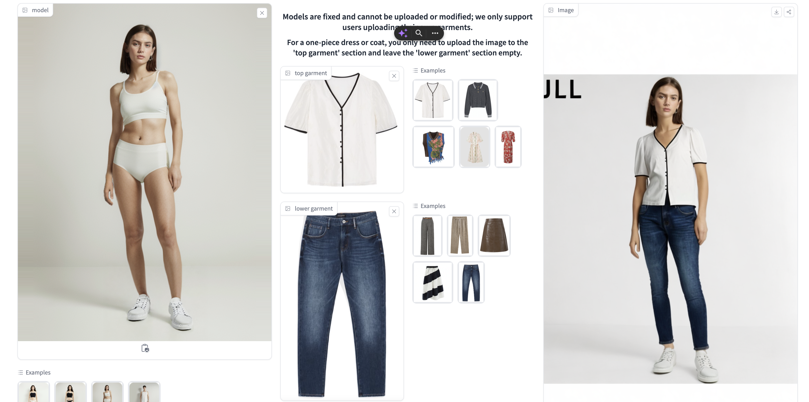
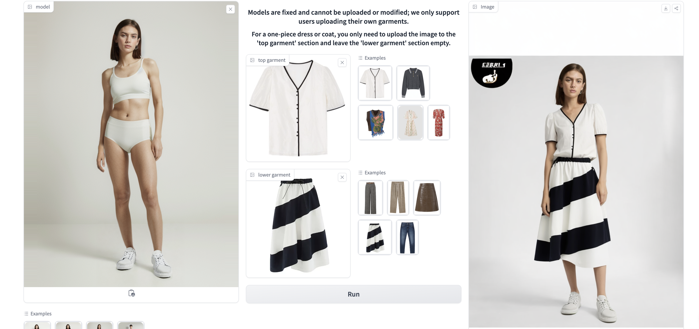

### Paper Title
* Outfit Anyone
* Alibaba

### Abstract
Virtual try-on has developed into a game-changing tool that allows people to play with style without ever having to put on clothes in person. However, producing outcomes with great fidelity and consistency in details is a challenge for many of the current methods. Although diffusion models have proven to be capable of producing images that are both high-quality and lifelike, they still struggle to maintain control and consistency in conditional generation scenarios such as virtual try-ons.

### Showroom

### Paper Title
* TryOnDiffusion: A Tale of Two UNets
* Luyang Zhu et. al. from Google

### Abstract
* Given two images depicting a person and a garment worn by another person, our goal is to generate a visualization of how the garment might look on the input person. A key challenge is to synthesize a photorealistic detail-preserving visualization of the garment, while warping the garment to accommodate a significant body pose and shape change across the subjects. Previous methods either focus on garment detail preservation without effective pose and shape variation, or allow try-on with the desired shape and pose but lack garment details. In this paper, we propose a diffusion-based architecture that unifies two UNets (referred to as Parallel-UNet), which allows us to preserve garment details and warp the garment for significant pose and body change in a single network. The key ideas behind Parallel-UNet include: 1) garment is warped implicitly via a cross attention mechanism, 2) garment warp and person blend happen as part of a unified process as opposed to a sequence of two separate tasks. Experimental results indicate that TryOnDiffusion achieves state-of-the-art performance both qualitatively and quantitatively.

### Showroom

* Man with garment trying on, example 1

* Lady with garment trying on, example 2

* Man with garment trying on, example 3

* Different person wearing different garments