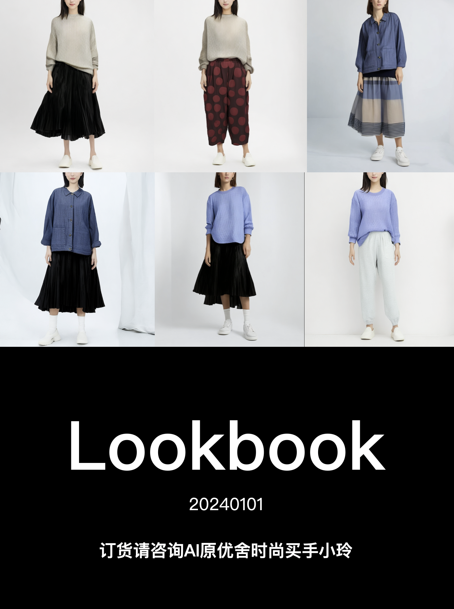
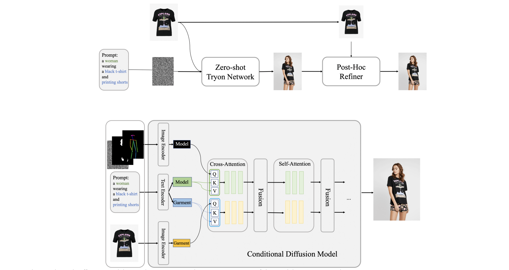
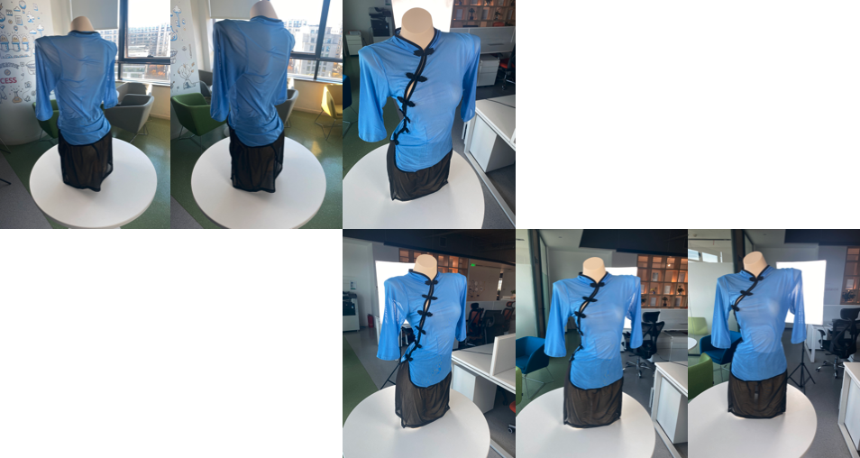
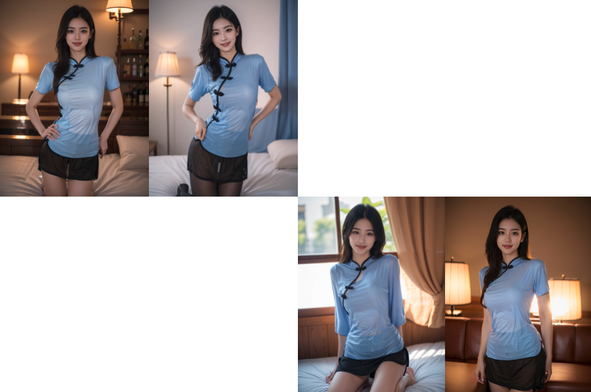
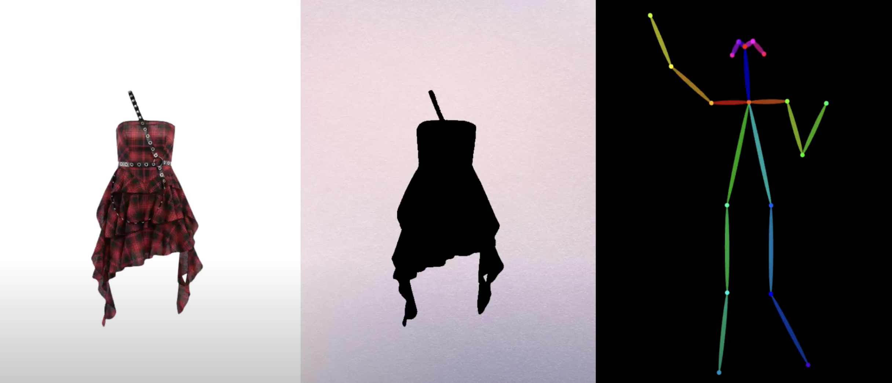
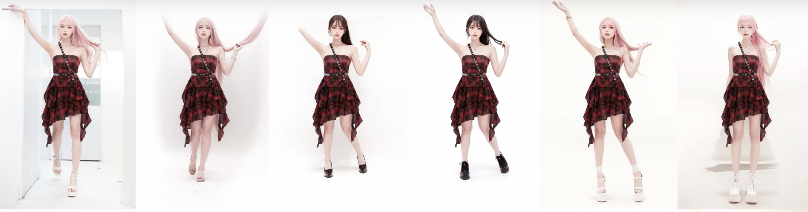

### 简介
算法妈妈旗下买手店品牌AI原优舍使用虚拟试衣技术为客户提供直观衣感，面料及纹理感觉的模特图。我们在此展示Lookbook样板，Lookbook的全自动生成是多个核心技术的综合运用。


### 核心技术 1
* [Outfit Anyone](https://humanaigc.github.io/outfit-anyone/)
* 技术提供商：Alibaba

#### Abstract
Virtual try-on has developed into a game-changing tool that allows people to play with style without ever having to put on clothes in person. However, producing outcomes with great fidelity and consistency in details is a challenge for many of the current methods. Although diffusion models have proven to be capable of producing images that are both high-quality and lifelike, they still struggle to maintain control and consistency in conditional generation scenarios such as virtual try-ons.

#### Showroom


#### Neural Network Architecture


* The conditional Diffusion Model central to our approach processes images of the model, garments, and accompanying text prompts, using garment images as the control factor. Internally, the network segregates into two streams for independent processing of model and garment data. These streams converge within a fusion network that facilitates the embedding of garment details onto the model's feature representation. On this foundation, we have established Outfit Anyone, comprising two key elements: the Zero-shot Try-on Network for initial try-on imagery, and the Post-hoc Refiner for detailed enhancement of clothing and skin texture in the output images.

### 核心技术 2
* [TryOnDiffusion: A Tale of Two UNets](https://tryondiffusion.github.io/)
* Luyang Zhu et. al.
* 技术提供商：Google

#### Abstract
* Given two images depicting a person and a garment worn by another person, our goal is to generate a visualization of how the garment might look on the input person. A key challenge is to synthesize a photorealistic detail-preserving visualization of the garment, while warping the garment to accommodate a significant body pose and shape change across the subjects. Previous methods either focus on garment detail preservation without effective pose and shape variation, or allow try-on with the desired shape and pose but lack garment details. In this paper, we propose a diffusion-based architecture that unifies two UNets (referred to as Parallel-UNet), which allows us to preserve garment details and warp the garment for significant pose and body change in a single network. The key ideas behind Parallel-UNet include: 1) garment is warped implicitly via a cross attention mechanism, 2) garment warp and person blend happen as part of a unified process as opposed to a sequence of two separate tasks. Experimental results indicate that TryOnDiffusion achieves state-of-the-art performance both qualitatively and quantitatively.

#### Showroom

* Man with garment trying on, example 1


* Different person wearing different garments

#### Neural Network Architecture

Overall Pipeline: During preprocessing step, the target person is segmented out of the person image creating “clothing agnostic RGB” image, the target garment is segmented out of the garment image, and pose is computed for both person and garment images. These inputs are taken into 128×128 Parallel-UNet (key contribution) to create the 128x128 try-on image which is further sent as input to the 256×256 Parallel-UNet together with the try-on conditional inputs. Output from 256×256 Parallel-UNet is sent to standard super resolution diffusion to create the 1024×1024 image


The architecture of 128×128 Parallel-UNet. The person-UNet (top) takes the clothing-agnostic RGB and the noisy image as input. Since both inputs are pixel-wise aligned, we directly concatenate them along the channel dimension at the beginning of UNet processing. The garment-UNet (bottom) takes the segmented garment image as input. The garment features are fused to the target image via cross attentions. To save model parameters, we early stop the garment-UNet after the 32×32 upsampling block, where the final cross attention module in person-UNet is done. The person and garment poses are first fed into the linear layers to compute pose embeddings separately. The pose embeddings are then fused to the person-UNet through the attention mechanism. Besides, they are used to modulate features for both UNets using FiLM across all scales.

### 核心技术 3
* 虚拟试衣（AI模特服装图）
* [即绘](https://aigc.trydiffusion.com/#/home)
* 技术提供商：心念绘见

#### 系统输入


#### 系统输出


#### Neural Network Architecture
*（未知）

### 核心技术 4
* 虚拟试衣（AI模特服装图）
* 技术提供商：算法妈妈

#### Abstract
* 我们使用Stable Diffusion WebUI作为核心图片处理工具，帮助生成模特图。

#### Neural Network Architecture
* diffusion models

#### 核心参数设置
* 推荐Stable Diffusion大模型
  * [chilloutmix](https://civitai.com/models/6424?modelVersionId=11745)
* 推荐Lora模型
  * [ShojoVibe少女感](https://civitai.com/models/13213?modelVersionId=16557)
  * [Fashion Girl](https://civitai.com/models/8217?modelVersionId=67935)
* 推荐插件
  * additional-networks
  * 3D Openpose Editor
  * controlnet
  * inpaint-anything
* 推荐系统输入，包括：
  * 纯底色服装图
  * 蒙版图
  * 姿态图


* 系统输出
  * AI模特照


* 推荐正向提示词
```md
belly button, ((thin thighs)), slim body, ((on street)), long hair, black hair, ockings, best quality, amazing, {Scenes with extreme detail {{{extremely deCF}}}}, {{beautiful detailed background}}
```

* 推荐反向提示词
```md
(easynegative),(signature:1.2),(artist name:1.2),(watermark:1.2),EasyNegative, nsfw, (worst quality, low quality:1.4), lowres, bad anatomy, (bad hands), mutated hand, text, error, missing fingers, extra digit, fewer digits, cropped, jpeg artifacts, jpeg artefacts, (patreon logo, signature, watermark, username, artist name:1.3), bad proportions, bad anatomy, malformed, mutated, anatomical nonsense, bad proportions, disfigured, ugly, gross proportions ,mutation, disfigured, deformed, (mutation), (poorly drawn), (abs, muscular, ribs:1.2), (hand error:1.3), (more than two hands:1.3),
(worst quality:2), (low quality:2), (normal quality:2), lowres, normal quality, ((monochrome)), ((grayscale)), skin spots, acnes, skin blemishes, age spot, backlight,(ugly:1.331), (duplicate:1.331), (morbid:1.21), (mutilated:1.21), (tranny:1.331), deformed eyes, deformed lips, mutated hands, (poorly drawn hands:1.331), blurry, (bad anatomy:1.21), (bad proportions:1.331), three arms, extra limbs, extra legs, extra arms, extra hands, (more than 2 nipples:1.331), (missing arms:1.331), (extra legs:1.331), (fused fingers:1.61051), (too many fingers:1.61051), (unclear eyes:1.331), bad hands, missing fingers, extra digit, (futa:1.1), bad body, pubic hair, glans, easynegative, three feet, four feet,
```