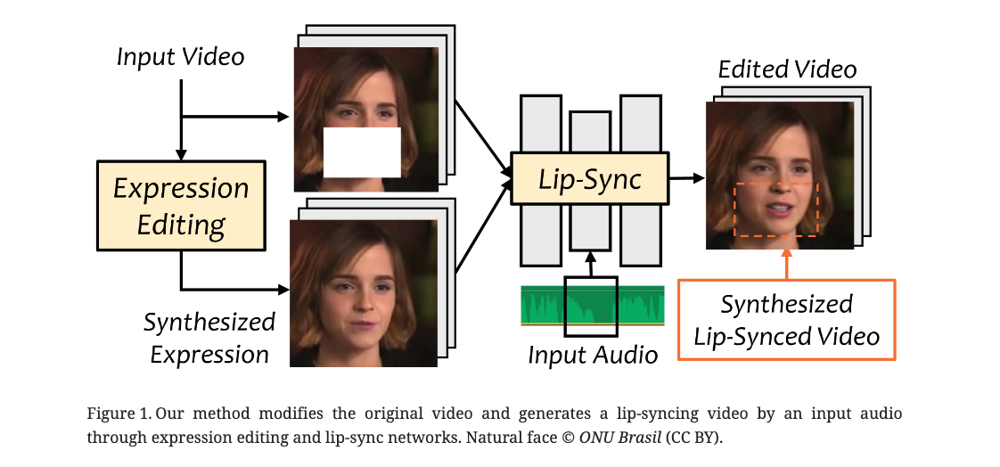

### Paper Title
* Toward General-Purpose Robots via Foundational Models: A Survey and Meta-Analysis
* Jonathan Francis et. al. from CMU

### Abstract
Building general-purpose robots that can operate seamlessly, in any environment, with any object, and utilizing various skills to complete diverse tasks has been a long-standing goal in Artificial Intelligence. Unfortunately, however, most existing robotic systems have been constrained—having been designed for specific tasks, trained on specific datasets, and deployed within specific environments. These systems usually require extensively-labeled data, rely on task-specific models, have numerous generalization issues when deployed in real-world scenarios, and struggle to remain robust to distribution shifts. Motivated by the impressive open-set performance and content generation capabilities of web-scale, large-capacity pre-trained models (i.e., foundation models) in research fields such as Natural Language Processing (NLP) and Computer Vision (CV), we devote this survey to exploring (i) how these existing foundation models from NLP and CV can be applied to the field of robotics, and also exploring (ii) what a robotics-specific foundation model would look like. We begin by providing an overview of what constitutes a conventional robotic system and the fundamental barriers to making it universally applicable. Next, we establish a taxonomy to discuss current work exploring ways to leverage existing foundation models for robotics and develop ones catered to robotics. Finally, we discuss key challenges and promising future directions in using foundation models for enabling general-purpose robotic systems. We encourage readers to view our living GitHub repository of resources, including papers reviewed in this survey as well as related projects and repositories for developing foundation models for robotics https://robotics-fm-survey.github.io/