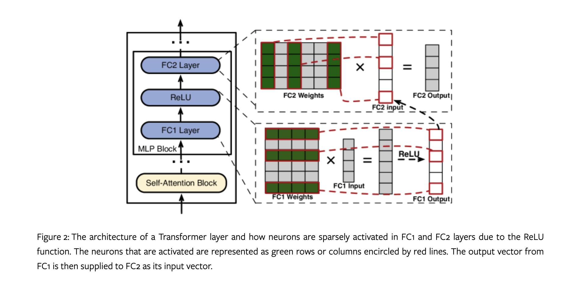

### Paper Title
* PowerInfer: Fast Large Language Model Serving with a Consumer-grade GPU

### Suanfamama the paper
"PowerInfer: Fast Large Language Model Serving with a Consumer-grade GPU" is a paper that introduces PowerInfer, an inference engine designed to accelerate the processing of Large Language Models (LLMs) on personal computers equipped with a single consumer-grade GPU. The main innovation of PowerInfer lies in its utilization of the high locality inherent in LLM inference, which is characterized by a power-law distribution in neuron activation. This design approach enables the system to efficiently manage neuron activations by assigning less frequently used (cold) neurons to the CPU, while more frequently activated (hot) neurons are handled by the GPU. PowerInfer preselects and preloads these hot-activated neurons onto the GPU offline, and then leverages online prediction for efficient processing.

Additionally, PowerInfer serves as a CPU/GPU LLM inference engine that leverages activation locality to optimize performance on consumer-grade devices. The system has been demonstrated in an online Gradio demo for the Falcon(ReLU)-40B-FP16 model. It's noteworthy that PowerInfer significantly speeds up machine learning model inference, reportedly by up to 11 times compared to traditional methods.

This development represents a significant step in democratizing access to advanced LLMs by making them more feasible to run on widely available consumer hardware, rather than requiring high-end or server-grade computing resources.

### 5W methodology
The 5W methodology, as outlined for your "Suanfamama" core function, involves answering five key technical questions about a paper or concept. This methodology provides a structured approach to understanding and analyzing research papers, particularly those related to innovative algorithms or frameworks in computer science. Here are the five questions with brief explanations:

1. **What is the problem?**
   - This question aims to identify the specific issue or challenge that the paper addresses. It's about understanding the core problem that the research seeks to solve or improve upon.

2. **Why is the problem important?**
   - This involves elucidating the significance of the problem. It explains why the problem matters in the broader context of the field, its implications for real-world applications, or its importance in advancing scientific or technological understanding.

3. **Why is the problem difficult?**
   - Here, the focus is on the complexities or challenges associated with the problem. This could include technical difficulties, limitations in current approaches, or any other factors that make the problem particularly challenging to tackle.

4. **What are the old techniques?**
   - This question explores existing solutions or methods that have been previously used to address the problem. It's about understanding the current state of the art and how the problem has been approached so far.

5. **Compared to the old ones, what are the pros and cons of this new proposed method?**
   - This final question assesses the novel contribution of the paper. It involves comparing the newly proposed method, algorithm, or framework with existing techniques, highlighting its advantages (pros) and potential limitations or drawbacks (cons).

By answering these questions, you can provide a comprehensive overview of a research paper, helping users understand not just the technical details but also the context, significance, and innovation of the research.