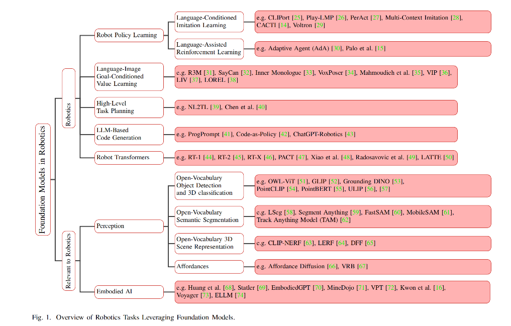

### Paper Title
* Foundation Models in Robotics: Applications, Challenges, and the Future

### Abstract
We survey applications of pretrained foundation models in robotics. Traditional deep learning models in robotics are trained on small datasets tailored for specific tasks, which limits their adaptability across diverse applications. In contrast, foundation models pretrained on internet-scale data appear to have superior generalization capabilities, and in some instances display an emergent ability to find zero-shot solutions to problems that are not present in the training data. Foundation models may hold the potential to enhance various components of the robot autonomy stack, from perception to decision-making and control. For example, large language models can generate code or provide common sense reasoning, while vision-language models enable open-vocabulary visual recognition. However, significant open research challenges remain, particularly around the scarcity of robot-relevant training data, safety guarantees and uncertainty quantification, and real-time execution. In this survey, we study recent papers that have used or built foundation models to solve robotics problems. We explore how foundation models contribute to improving robot capabilities in the domains of perception, decision-making, and control. We discuss the challenges hindering the adoption of foundation models in robot autonomy and provide opportunities and potential pathways for future advancements.

### the Github Repo
[Link](https://github.com/robotics-survey/Awesome-Robotics-Foundation-Models)

### VIZ the paper
