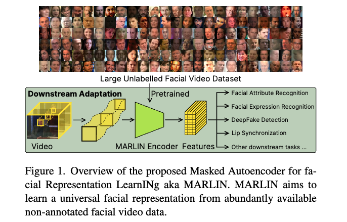
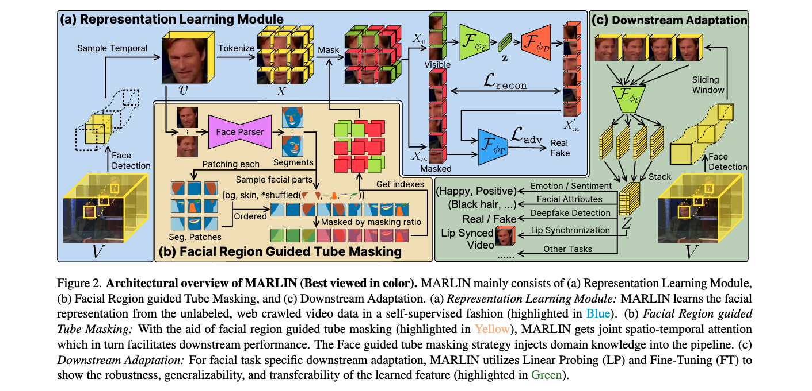
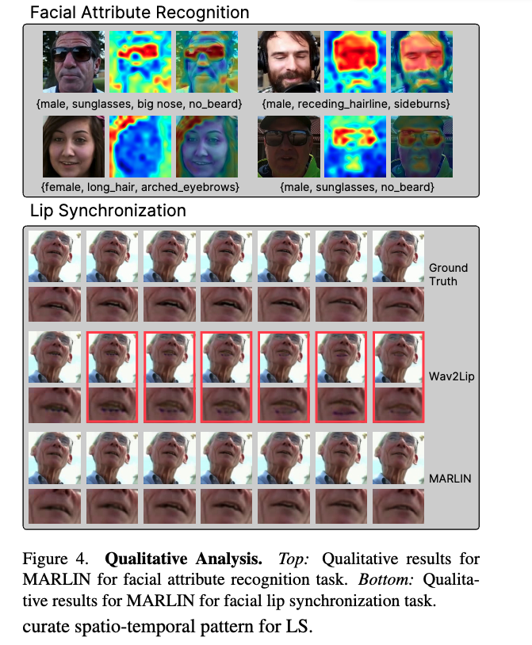

### Paper Title
* MARLIN: Masked Autoencoder for facial video Representation LearnINg
* Zhixi Cai et. al.
* CVPR 2023

### Abstract
* This paper proposes a self-supervised approach to learn universal facial representations from videos, that can transfer across a variety of facial analysis tasks such as Facial Attribute Recognition (FAR), Facial Expression Recognition (FER), DeepFake Detection (DFD), and Lip Synchronization (LS). Our proposed framework, named MARLIN, is a facial video masked autoencoder, that learns highly robust and generic facial embeddings from abundantly available non-annotated web crawled facial videos. As a challenging auxiliary task, MARLIN reconstructs the spatio-temporal details of the face from the densely masked facial regions which mainly include eyes, nose, mouth, lips, and skin to capture local and global aspects that in turn help in encoding generic and transferable features. Through a variety of experiments on diverse downstream tasks, we demonstrate MARLIN to be an excellent facial video encoder as well as feature extractor, that performs consistently well across a variety of downstream tasks including FAR (1.13% gain over supervised benchmark), FER (2.64% gain over unsupervised benchmark), DFD (1.86% gain over unsupervised benchmark), LS (29.36% gain for Frechet Inception Distance), and even in low data regime.

### the Github Repo
* [Link](https://github.com/ControlNet/MARLIN)

### ALGMON the paper
The paper "MARLIN: Masked Autoencoder for facial video Representation LearnINg" introduces a self-supervised approach for learning universal facial representations from videos, applicable to various facial analysis tasks like Facial Attribute Recognition (FAR), Facial Expression Recognition (FER), DeepFake Detection (DFD), and Lip Synchronization (LS). The key innovation in MARLIN is its ability to reconstruct the spatio-temporal details of a face from densely masked facial regions using non-annotated facial videos. This is achieved through a facial region-guided tube masking strategy, which aids in encoding generic and transferable features.

MARLIN's design focuses on learning robust and transferable facial representations from widely available, non-annotated web-crawled facial videos. The framework is task-agnostic, meaning it can adapt its learned facial representations to various downstream tasks. The effectiveness of MARLIN is demonstrated through quantitative and qualitative analysis, showing consistent performance across different tasks including FAR, FER, DFD, and LS.

### 5W methodology
The 5W methodology applied to the paper "MARLIN: Masked Autoencoder for facial video Representation LearnINg" would involve the following questions:

1. **What is the problem?**
   The problem addressed by MARLIN is learning universal and robust facial representations from videos for a variety of facial analysis tasks like FAR, FER, DFD, and LS, using a self-supervised method.

2. **Why is the problem important?**
   This problem is crucial for analyzing human non-verbal behavior, which is essential in areas like HCI and affective computing. Efficiently capturing these representations can advance various applications and technologies.

3. **Why is the problem difficult?**
   The challenge lies in learning from non-annotated, diverse web-crawled facial videos and creating a model that can transfer learned knowledge across different tasks.

4. **What are the old techniques?**
   Prior techniques often relied on large-scale annotated datasets, which are resource-intensive and not feasible for some tasks. They might not have effectively addressed the challenge of task transferability and universal representation.

5. **Compared to the old ones, what are the pros and cons of this new proposed method?**
   The new approach, MARLIN, offers the advantage of self-supervised learning from non-annotated videos, making it less resource-intensive and more scalable. It has shown gains in performance across various tasks compared to benchmarks. However, the potential limitations or cons of this method are not explicitly stated in the available information.

### VIZ the paper

* Overview of the proposed Masked Autoencoder for facial Representation LearnNg aka MARLIN

* Architectural overview of MARLIN

* Lip Synchronization