### Paper Title
* StreamDiffusion: A Pipeline-level Solution for Real-time Interactive Generation
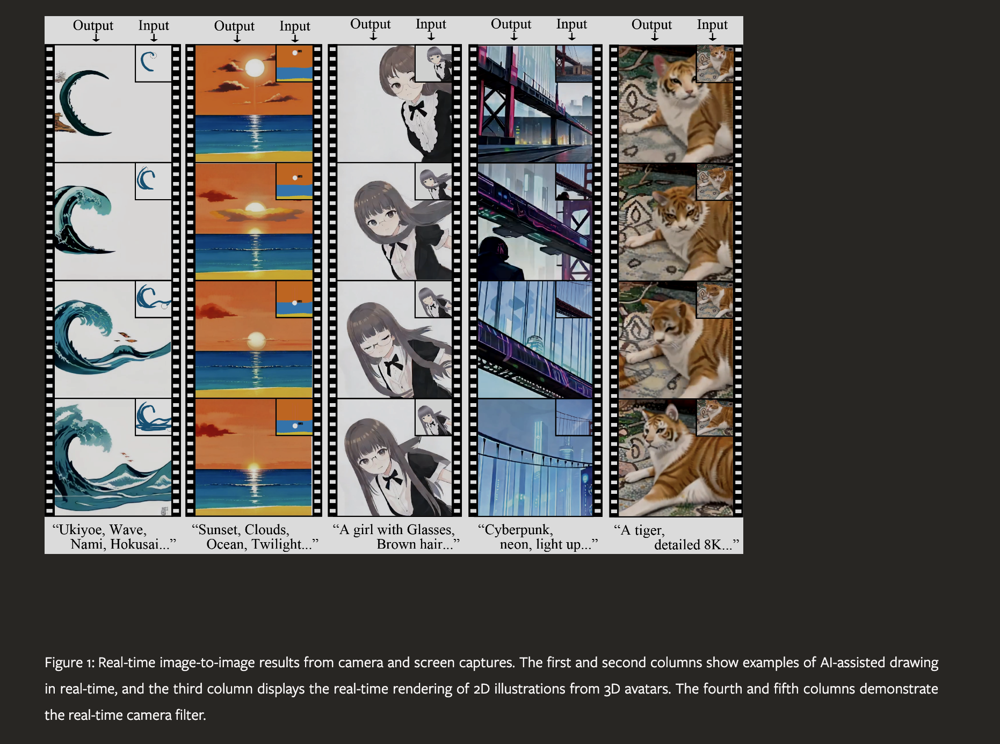

### Abstract
We introduce StreamDiffusion, a real-time diffusion pipeline designed for interactive image generation. Existing diffusion models are adept at creating images from text or image prompts, yet they often fall short in real-time interaction. This limitation becomes particularly evident in scenarios involving continuous input, such as Metaverse, video game graphics rendering, live video streaming, and broadcasting, where high throughput is imperative. To address this, we present a novel and simple approach that transforms the original sequential denoising into the batching denoising process. Stream Batch eliminates the conventional wait-and-interact approach and enables fluid and high throughput streams. To handle the disparity in frequencies between data input and model throughput, we design a novel input-output queue for parallelizing the streaming process. Moreover, the existing diffusion pipeline uses classifier-free guidance to enforce the generated results conditioned on the prompts. We point out that current implementations are inefficient due to the inherent redundancy of negative conditional denoising. To mitigate the redundant computations, we propose a novel residual classifier-free guidance (RCFG) algorithm that reduces the number of negative conditional denoising steps to only one or even zero. Besides, to optimize power consumption, we use a simple and effective stochastic similarity filtering strategy, which significantly reduces GPU activation frequency, thereby improving GPU utilization efficiency. Our batching denoising strategy achieves around 1.5x speedup compared to the sequential denoising method at different denoising levels. The proposed (RCFG) leads to up-to 2.05x speedups compared to the previous conventional classifier-free guidance. The combination of the proposed strategies and existing mature acceleration tools makes the image-to-image generation achieve up-to 91.07fps on one RTX 4090 GPU, improving the throughputs of AutoPipline developed by Diffusers over 59.56x. Beyond the pipeline efficiency, our proposed StreamDiffusion also significantly reduces the energy consumption by 2.39x on one RTX 3060 GPU and 1.99x on one RTX 4090 GPU for a static scene input, respectively. The code is available at https://github.com/cumulo-autumn/StreamDiffusion.

### Suanfamama the paper
StreamDiffusion is introduced as a real-time diffusion pipeline specifically designed for interactive image generation. It stands out in the field of diffusion models, which are typically adept at creating images from text or image prompts but often fall short in scenarios requiring real-time interaction. StreamDiffusion addresses this limitation, making it particularly relevant for applications involving continuous input, such as Metaverse environments, video game graphics rendering, and live video streaming.

The 5W methodology from Suanfamama for analyzing StreamDiffusion involves answering the following five technical questions:

1. **What is the problem?**
   StreamDiffusion addresses the challenge in diffusion models related to real-time, interactive image generation. Traditional diffusion models are effective for creating images from text or image prompts but are not optimized for scenarios that demand quick responses or continuous interaction.

2. **Why is the problem important?**
   The need for real-time, interactive image generation is significant in various rapidly growing fields such as virtual reality, augmented reality, video game graphics, and live video streaming. These applications require a dynamic and responsive visual experience that traditional models cannot adequately provide.

3. **Why is the problem difficult?**
   Real-time interaction poses a unique challenge because it requires the model to generate high-quality images quickly and continuously, adapting to changing inputs or prompts. This is in contrast to conventional diffusion models, which typically take longer to generate images and are not designed for ongoing, interactive input.

4. **What are the old techniques?**
   Previous techniques in image generation mainly relied on standard diffusion models, which excel in creating detailed and high-quality images from prompts. However, these models usually have longer processing times and are not tailored for real-time interactions, making them less suitable for dynamic environments.

5. **Compared to the old ones, what are the pros and cons of this new proposed method?**

   Pros:
   - StreamDiffusion is specifically designed for real-time interaction, making it highly suitable for applications requiring immediate visual feedback.
   - It can adapt continuously to changing inputs, which is essential for interactive environments like gaming or virtual reality.

   Cons:
   - There may be trade-offs in terms of the complexity or detail of the generated images compared to traditional models, as real-time processing imposes constraints on the depth of image processing.
   - The adaptation to real-time constraints might also limit the scope of scenarios where the model can be effectively applied, as compared to more versatile, non-real-time models.

### VIZ the paper

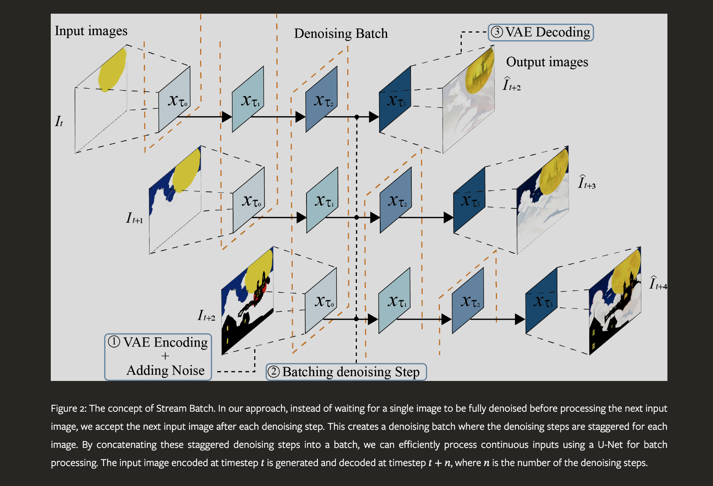

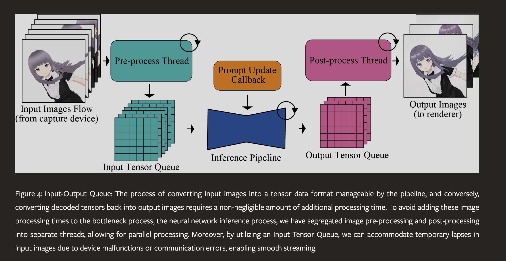

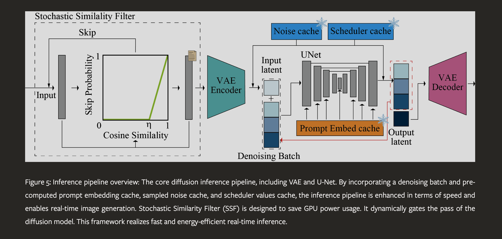

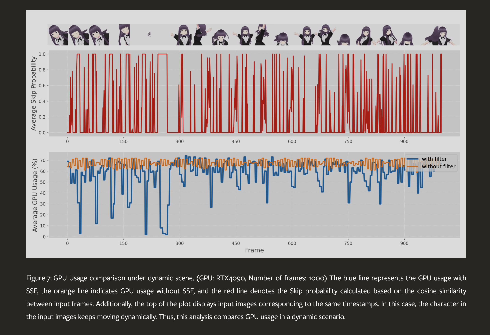

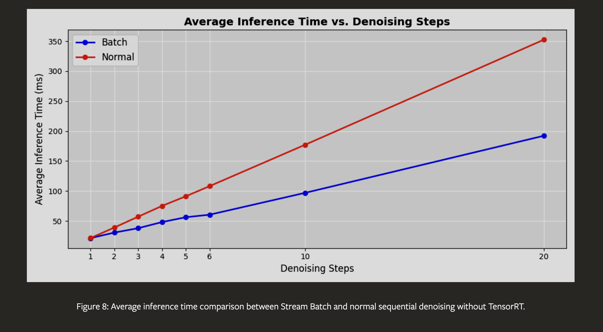

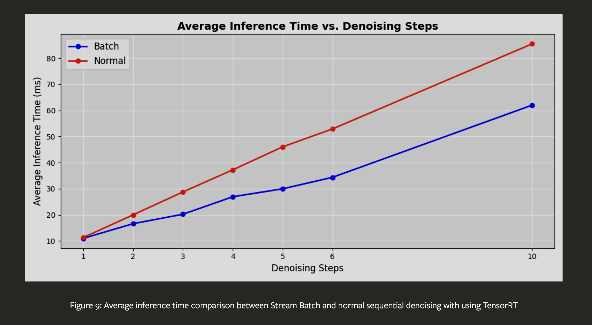

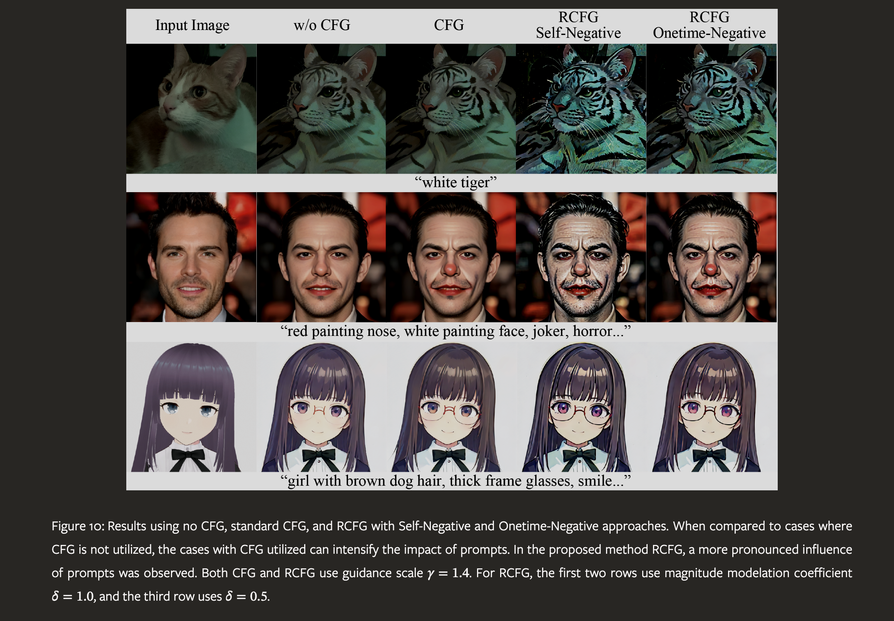

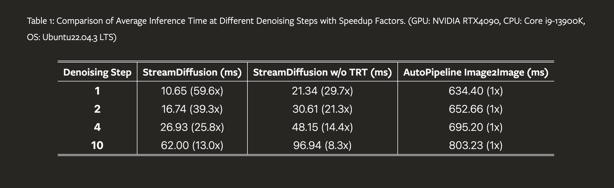

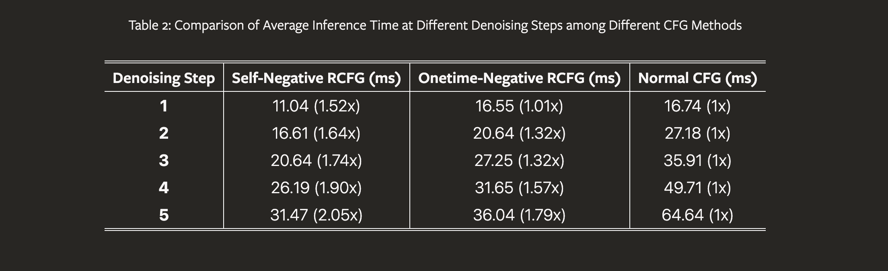

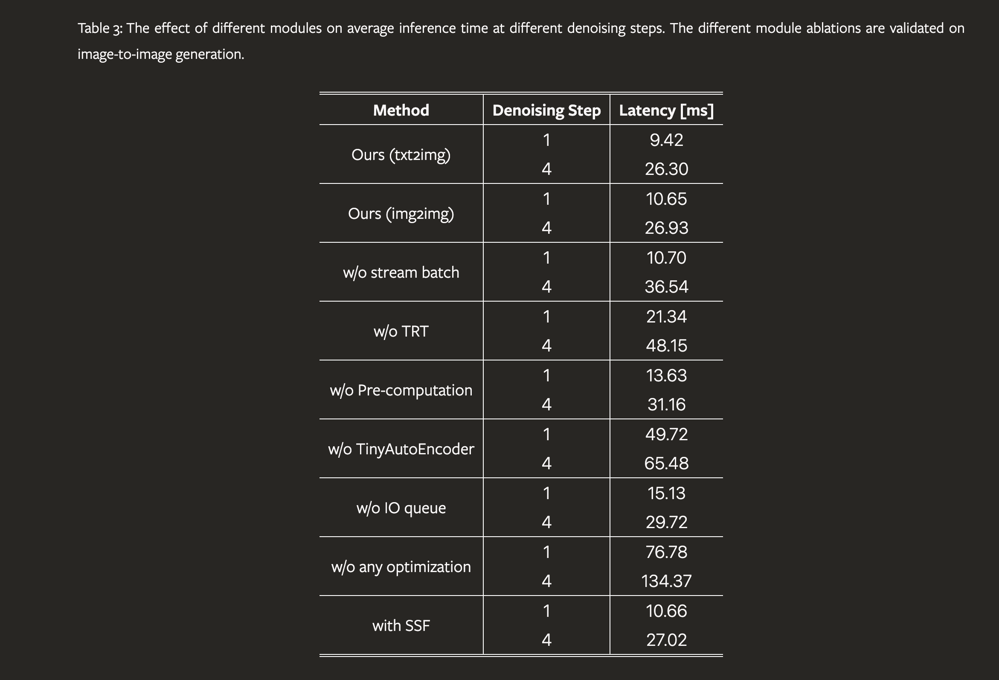