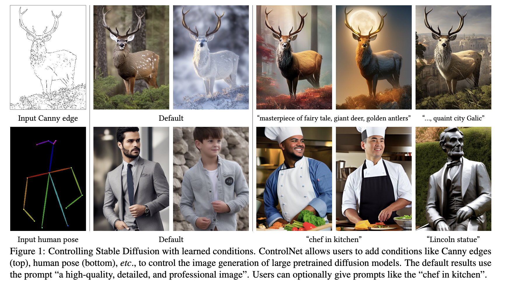
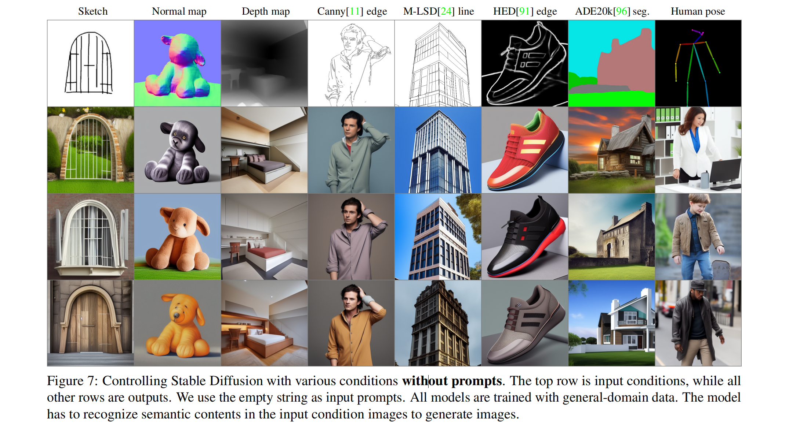

### Paper Title
* Adding Conditional Control to Text-to-Image Diffusion Models
* Lvmin Zhang et. al. from Standford U

#### Abstract
We present ControlNet, a neural network architecture to add spatial conditioning controls to large, pretrained text-to-image diffusion models. ControlNet locks the production-ready large diffusion models, and reuses their deep and robust encoding layers pretrained with billions of images as a strong backbone to learn a diverse set of conditional controls. The neural architecture is connected with “zero convolutions” (zero-initialized convolution layers) that progressively grow the parameters from zero and ensure that no harmful noise could affect the finetuning. We test various conditioning controls, e.g., edges, depth, segmentation, human pose, etc., with Stable Diffusion, using single or multiple conditions, with or without prompts. We show that the training of ControlNets is robust with small and large datasets. Extensive results show that ControlNet may facilitate wider applications to control image diffusion models.

#### ALGMON the paper
The paper "Adding Conditional Control to Text-to-Image Diffusion Models" introduces ControlNet, a neural network structure designed to augment large diffusion models with the ability to handle additional input conditions. This enhancement allows for greater control and flexibility in image generation tasks. Key aspects of the paper include:

1. **ControlNet's Design and Capability**: ControlNet is an end-to-end neural network architecture that enhances large image diffusion models, such as Stable Diffusion, by enabling them to learn task-specific input conditions. It achieves this by creating two copies of the model: a 'trainable copy' for learning the new conditions, and a 'locked copy' that retains the original model's capabilities. This design allows ControlNet to handle a variety of input conditions, including edge maps, segmentation maps, keypoints, and more.

2. **Adaptability to Different Data Scales and Computational Resources**: One of the significant advantages of ControlNet is its robustness in learning, even with smaller datasets (less than 50k samples). Additionally, its training process is comparable in speed to fine-tuning existing diffusion models. This flexibility means it can be trained on personal devices for smaller tasks or scaled up to utilize large computation clusters for handling bigger datasets, possibly ranging from millions to billions of data points.

3. **Unique Features of ControlNet**: The ControlNet architecture uses a special type of convolution layer called 'zero convolution'. This layer allows the convolution weights to gradually develop from zero to optimized parameters, facilitating efficient learning. The zero convolution layer ensures that no new noise is added to the deep features, making the training process as rapid as fine-tuning a diffusion model. This is a critical feature, especially when compared to training entirely new layers from scratch.

4. **Versatility in Applications**: ControlNet has been trained and tested with various datasets under different conditions, such as Canny edges, Hough lines, user scribbles, human key points, segmentation maps, shape normals, and depths. The experiments demonstrate that ControlNet can be effectively trained even on personal computing devices like an Nvidia RTX 3090TI, achieving competitive results compared to commercial models trained on more extensive and powerful computational setups.

Overall, the paper presents ControlNet as a significant advancement in the field of image generation, offering enhanced control and adaptability across different tasks and computational environments. This development could potentially enrich methods to control large diffusion models and facilitate a wide range of related applications.

#### Algmon 5W methodology
To analyze the paper "Adding Conditional Control to Text-to-Image Diffusion Models" using the 5W methodology, we will consider five key questions:

1. **What is the problem?**
   - The problem addressed by the paper is the lack of flexibility and control in existing large text-to-image diffusion models. These models, while powerful, do not readily support additional input conditions or specific user controls for diverse image processing tasks.

2. **Why is the problem important?**
   - This problem is significant because it limits the applicability of diffusion models to a broader range of image generation and processing tasks. There are many specific image processing challenges that could benefit from the advanced capabilities of these models if they could be more easily tailored to specific conditions and user inputs.

3. **Why is the problem difficult?**
   - The problem is challenging due to the complexity of diffusion models and the vast diversity of potential input conditions and user requirements. Additionally, modifying these models without losing their pre-trained capabilities and ensuring they can be trained effectively on datasets of varying sizes adds to the complexity.

4. **What are the old techniques?**
   - Traditional techniques in text-to-image generation primarily rely on pre-trained models that generate images based on text descriptions. However, these models are typically not designed to incorporate additional conditions like edge maps, keypoints, or user scribbles, nor are they easily adaptable to smaller, task-specific datasets.

5. **Compared to the old ones, what are the pros and cons of this new proposed method?**
   - Pros:
     - ControlNet introduces the ability to adapt large diffusion models to specific tasks and conditions, enhancing their flexibility and applicability.
     - It is robust in learning from both small and large datasets and does not require extensive computational resources.
     - The unique 'zero convolution' layer in ControlNet ensures efficient training and minimizes the introduction of new noise.
   - Cons:
     - While ControlNet is an advancement, it may still require a certain level of expertise to configure and use effectively for specific tasks.
     - The paper does not explicitly address potential limitations in handling extremely diverse or complex conditional inputs beyond those tested.

This 5W analysis helps in understanding the significance, challenges, and advancements presented by the "Adding Conditional Control to Text-to-Image Diffusion Models" paper in the context of image generation using diffusion models.

#### Conclusion
ControlNet is a neural network structure that learns conditional control for large pretrained text-to-image diffusion models. It reuses the large-scale pretrained layers of source models to build a deep and strong encoder to learn specific conditions. The original model and trainable copy are connected via “zero convolution” layers that eliminate harmful noise during training. Extensive experiments verify that ControlNet can effectively control Stable Diffusion with single or multiple conditions, with or without prompts. Results on diverse conditioning datasets show that the ControlNet structure is likely to be applicable to a wider range of conditions, and facilitate relevant applications.