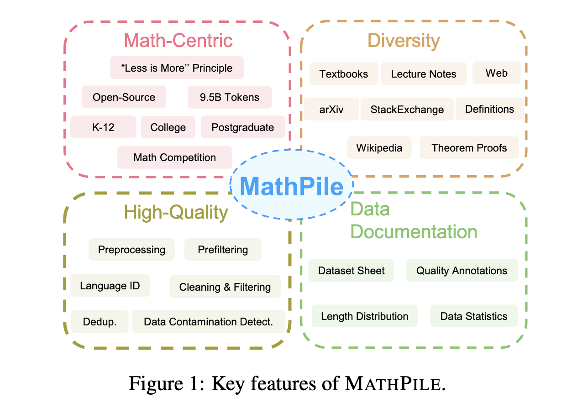
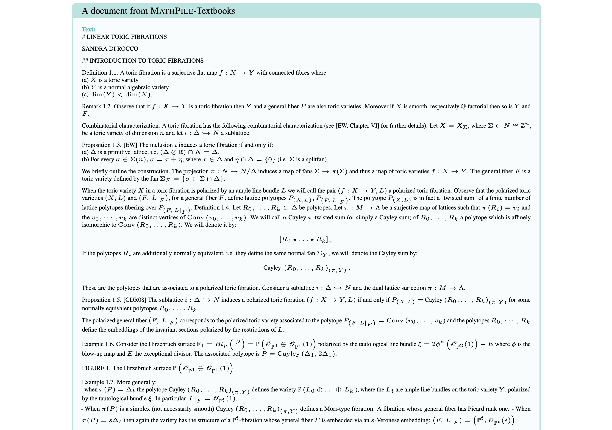
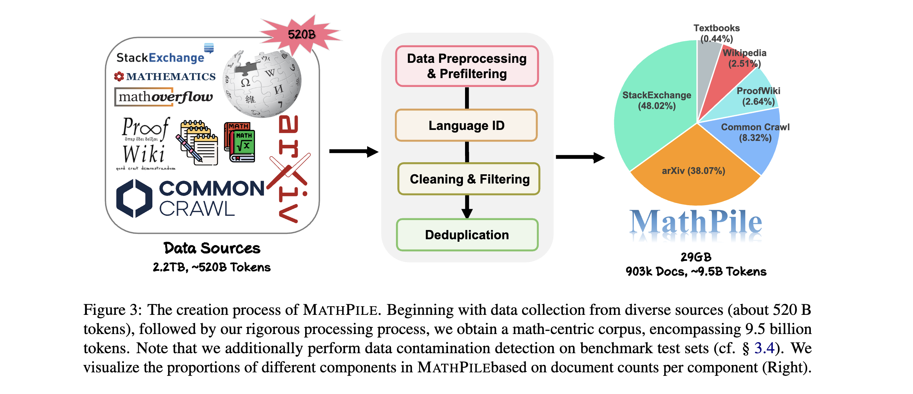

### Paper Title
* Generative AI for Math: Part I -- MathPile: A Billion-Token-Scale Pretraining Corpus for Math

#### Abstract
* 以数学为中心的语料库MathPile，该语料库包含约95亿个token。我们为确保数据集是高质量的，我们预处理，预过滤，语言识别，清理，过滤和去重。
* High-quality, large-scale corpora are the cornerstone of building foundation models. In this work, we introduce MathPile, a diverse and high-quality math-centric corpus comprising about 9.5 billion tokens. Throughout its creation, we adhered to the principle of less is more, firmly believing in the supremacy of data quality over quantity, even in the pre-training phase. Our meticulous data collection and processing efforts included a complex suite of preprocessing, prefiltering, language identification, cleaning, filtering, and deduplication, ensuring the high quality of our corpus. Furthermore, we performed data contamination detection on downstream benchmark test sets to eliminate duplicates. We hope our MathPile can help to enhance the mathematical reasoning abilities of language models. We plan to open-source different versions of mathpile with the scripts used for processing, to facilitate future developments in this field.

