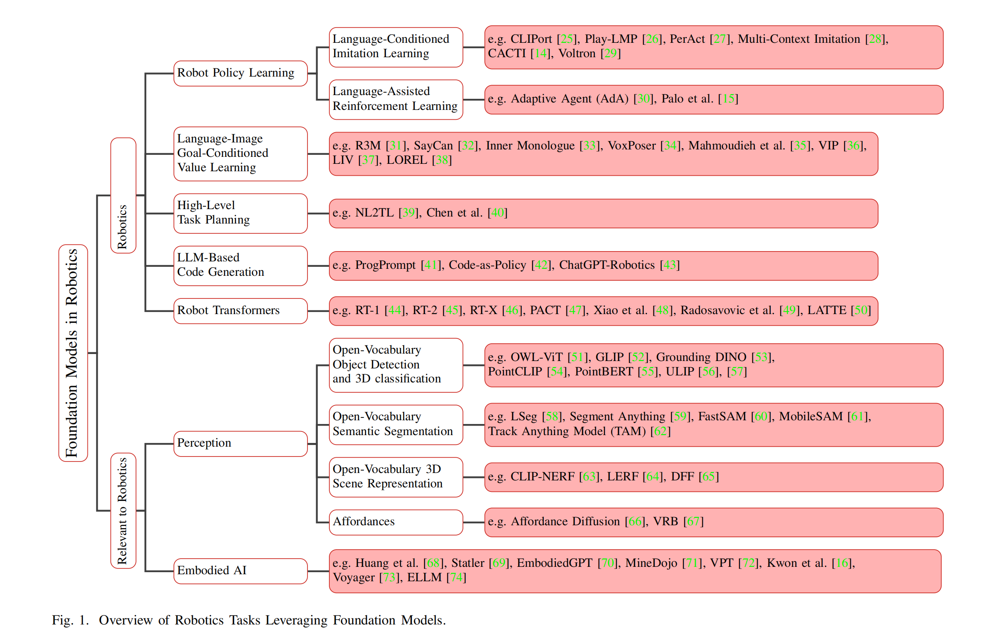
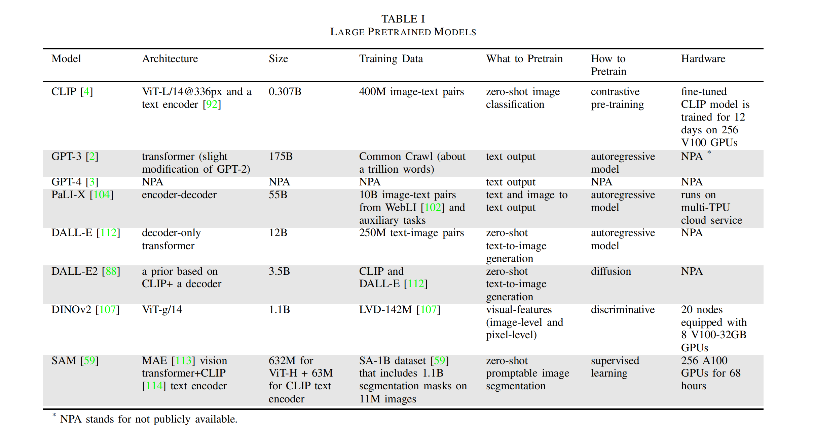
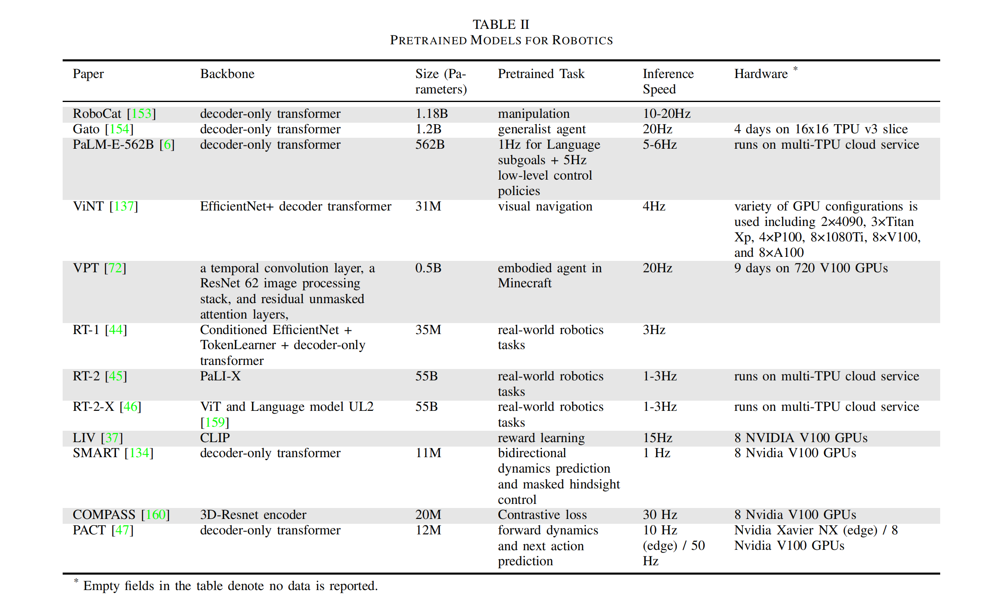

### Paper Title
* Foundation Models in Robotics: Applications, Challenges, and the Future

#### Abstract
We survey applications of pretrained foundation models in robotics. Traditional deep learning models in robotics are trained on small datasets tailored for specific tasks, which limits their adaptability across diverse applications. In contrast, foundation models pretrained on internet-scale data appear to have superior generalization capabilities, and in some instances display an emergent ability to find zero-shot solutions to problems that are not present in the training data. Foundation models may hold the potential to enhance various components of the robot autonomy stack, from perception to decision-making and control. For example, large language models can generate code or provide common sense reasoning, while vision-language models enable open-vocabulary visual recognition. However, significant open research challenges remain, particularly around the scarcity of robot-relevant training data, safety guarantees and uncertainty quantification, and real-time execution. In this survey, we study recent papers that have used or built foundation models to solve robotics problems. We explore how foundation models contribute to improving robot capabilities in the domains of perception, decision-making, and control. We discuss the challenges hindering the adoption of foundation models in robot autonomy and provide opportunities and potential pathways for future advancements. The GitHub project corresponding to this paper (Preliminary release. We are committed to further enhancing and updating this work to ensure its quality and relevance) can be found [here](https://github.com/robotics-survey/Awesome-Robotics-Foundation-Models)

#### Suanfamama
The paper "Foundation Models in Robotics: Applications, Challenges, and the Future" explores the use of pretrained foundation models in the field of robotics. Traditional deep learning models in robotics have been trained on small, task-specific datasets, which limits their adaptability to a wide range of applications. In contrast, foundation models, which are pretrained on large-scale internet data, demonstrate superior generalization capabilities. These models can sometimes find zero-shot solutions to problems not present in their training data.

Foundation models have the potential to enhance various components of robot autonomy, including perception, decision-making, and control. For instance, large language models can be used for generating code or providing common sense reasoning, and vision-language models facilitate open-vocabulary visual recognition. However, the paper also identifies significant challenges that need to be addressed, such as the scarcity of robot-relevant training data, ensuring safety and uncertainty quantification, and achieving real-time execution. This survey reviews recent papers that have employed or developed foundation models to address problems in robotics, examining how these models contribute to improving robot capabilities in key domains and discussing the challenges and future directions in this area​​.

The "5W methodology" in the context of understanding and analyzing academic papers, especially in the field of robotics and AI, typically involves answering five key questions:

1. What is the problem?
* The issue addressed is the limitations of traditional deep learning models in robotics, which are trained on small, task-specific datasets and lack adaptability to diverse applications.

2. Why is the problem important?
* This problem is significant as it restricts the broader applicability and efficiency of robotics in varying scenarios and tasks.

3. Why is the problem difficult?
* The challenge arises from the need for models that can generalize across varied tasks and environments, a complex endeavor given the dynamic and unpredictable nature of real-world scenarios.

4. What are the old techniques?
* Previously, robotics relied on deep learning models trained on narrow datasets specific to certain tasks.

5. Compared to the old ones, what are the pros and cons of this new proposed method?
* Foundation models, pretrained on extensive internet-scale data, exhibit better generalization and sometimes zero-shot problem-solving capabilities. However, they face challenges like scarcity of robot-relevant data, safety and uncertainty issues, and the need for real-time execution​​.

#### VIZ the paper

