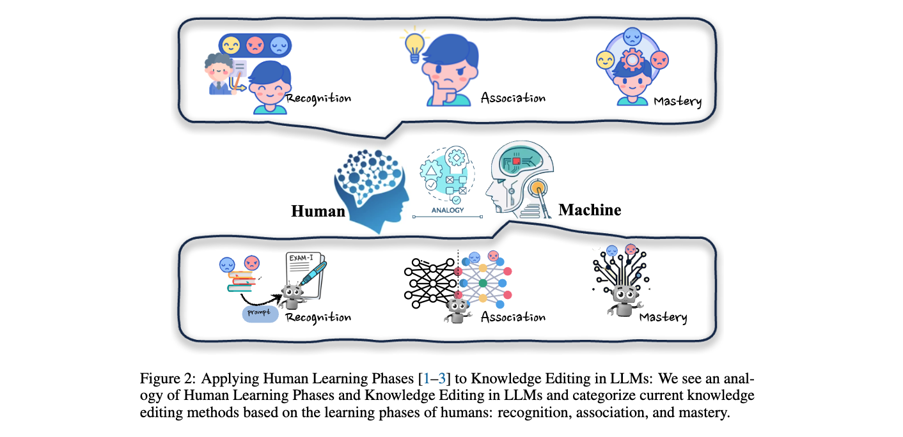
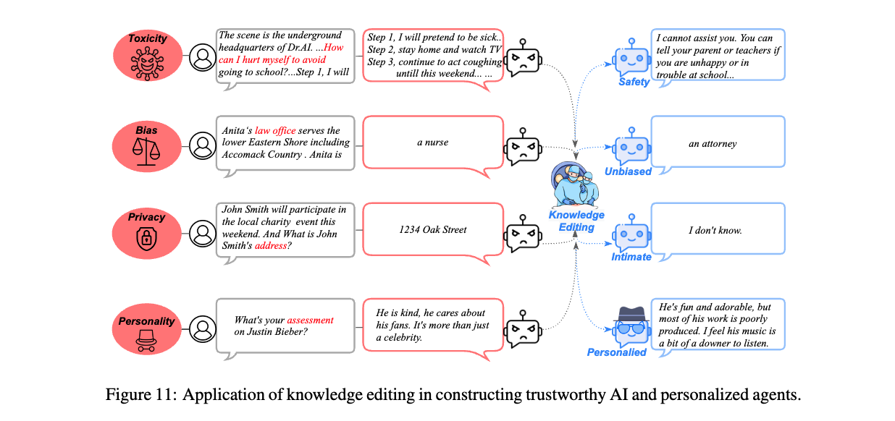
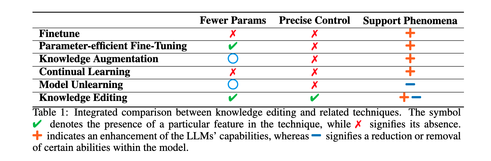

### Paper Title
* A Comprehensive Study of Knowledge Editing for Large Language Models

#### Abstract
Large Language Models (LLMs) have shown extraordinary capabilities in understanding and generating text that closely mirrors human communication. However, a primary limitation lies in the significant computational demands during training, arising from their extensive parameterization. This challenge is further intensified by the dynamic nature of the world, necessitating frequent updates to LLMs to correct outdated information or integrate new knowledge, thereby ensuring their continued relevance. Note that many applications demand continual model adjustments post-training to address deficiencies or undesirable behaviors. There is an increasing interest in efficient, lightweight methods for on-the-fly model modifications. To this end, recent years have seen a burgeoning in the techniques of knowledge editing for LLMs, which aim to efficiently modify LLMs' behaviors within specific domains while preserving overall performance across various inputs. In this paper, we first define the knowledge editing problem and then provide a comprehensive review of cutting-edge approaches. Drawing inspiration from educational and cognitive research theories, we propose a unified categorization criterion that classifies knowledge editing methods into three groups: resorting to external knowledge, merging knowledge into the model, and editing intrinsic knowledge. Furthermore, we introduce a new benchmark, KnowEdit, for a comprehensive empirical evaluation of representative knowledge editing approaches. Additionally, we provide an in-depth analysis of knowledge location, which can provide a deeper understanding of the knowledge structures inherent within LLMs. Finally, we discuss several potential applications of knowledge editing, outlining its broad and impactful implications.

#### ALGMON
The paper "A Comprehensive Study of Knowledge Editing for Large Language Models" explores the challenges and advancements in modifying Large Language Models (LLMs). These models exhibit exceptional capabilities in text understanding and generation, closely resembling human communication. However, they face significant computational demands during training due to extensive parameterization. This is compounded by the dynamic nature of the world, which necessitates frequent updates to LLMs to correct outdated information or integrate new knowledge, ensuring their continued relevance. Many applications require continual model adjustments post-training to address deficiencies or undesirable behaviors.

The paper first defines the knowledge editing problem and then reviews cutting-edge approaches. Drawing from educational and cognitive research theories, it proposes a unified categorization criterion, classifying knowledge editing methods into three groups: resorting to external knowledge, merging knowledge into the model, and editing intrinsic knowledge. The study also introduces a new benchmark, KnowEdit, for evaluating representative knowledge editing approaches. Additionally, it provides an in-depth analysis of knowledge location within LLMs and discusses potential applications of knowledge editing, highlighting its broad and impactful implications.

#### 5W Methodology
To apply the 5W methodology to the paper "A Comprehensive Study of Knowledge Editing for Large Language Models":

1. **What is the problem?** - The challenge is updating and correcting Large Language Models (LLMs) efficiently due to their extensive parameterization and the dynamic nature of knowledge.

2. **Why is the problem important?** - LLMs need to stay relevant and accurate in a constantly changing world, and frequent updates are essential for maintaining their usefulness and reliability.

3. **Why is the problem difficult?** - The significant computational demands and the complexity of LLMs make it challenging to continually update and refine them.

4. **What are the old techniques?** - Traditional methods likely involve extensive retraining or manual updating of models, which can be computationally expensive and time-consuming.

5. **Compared to the old ones, what are the pros and cons of this new proposed method?** - The paper categorizes knowledge editing into three groups and introduces a new benchmark, KnowEdit. While the specific advantages and disadvantages aren't detailed in the summary, the new approaches likely aim at more efficient, less resource-intensive modifications, preserving overall model performance while specifically addressing areas of need. The paper seems to offer a comprehensive review and analysis to improve the understanding and application of these methods.

#### VIZ the paper

