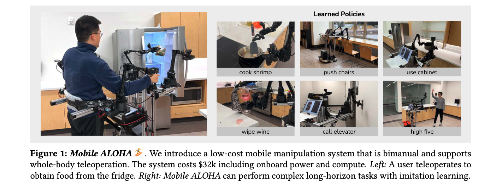
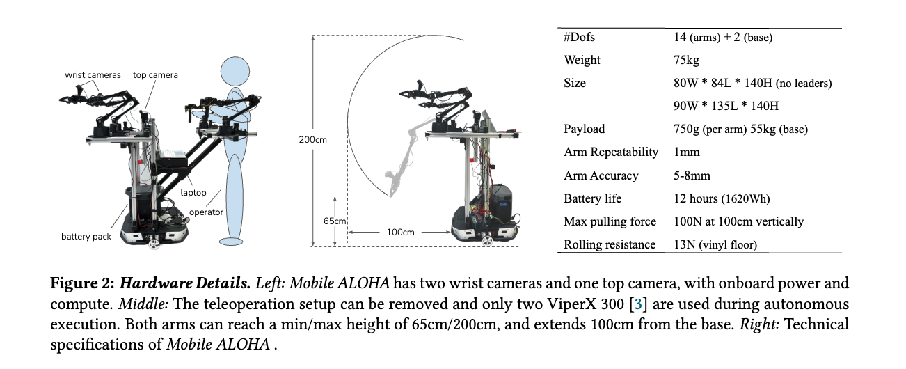
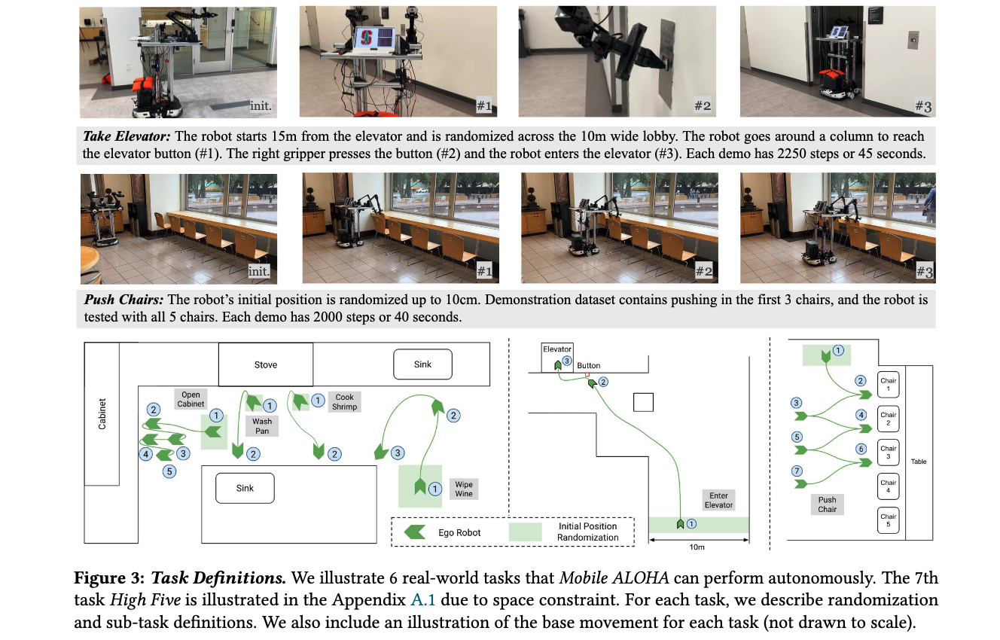

### Paper Title
* Mobile ALOHA: Learning Bimanual Mobile Manipulation with Low-Cost Whole-Body Teleoperation
* Zipeng Fu from Stanford U

#### Abstract
Imitation learning from human demonstrations has shown impressive performance in robotics. However, most results focus on table-top manipulation, lacking the mobility and dexterity necessary for generally useful tasks. In this work, we develop a system for imitating mobile manipulation tasks that are bimanual and require whole-body control. We first present Mobile ALOHA, a low-cost and whole-body teleoperation system for data collection. It augments the ALOHA system with a mobile base, and a whole-body teleoperation interface. Using data collected with Mobile ALOHA, we then perform supervised behavior cloning and find that co-training with existing static ALOHA datasets boosts performance on mobile manipulation tasks. With 50 demonstrations for each task, co-training can increase success rates by up to 90%, allowing Mobile ALOHA to autonomously complete complex mobile manipulation tasks such as sauteing and serving a piece of shrimp, opening a two-door wall cabinet to store heavy cooking pots, calling and entering an elevator, and lightly rinsing a used pan using a kitchen faucet. Project website: [this https URL](https://mobile-aloha.github.io/)

#### VIZ the paper

