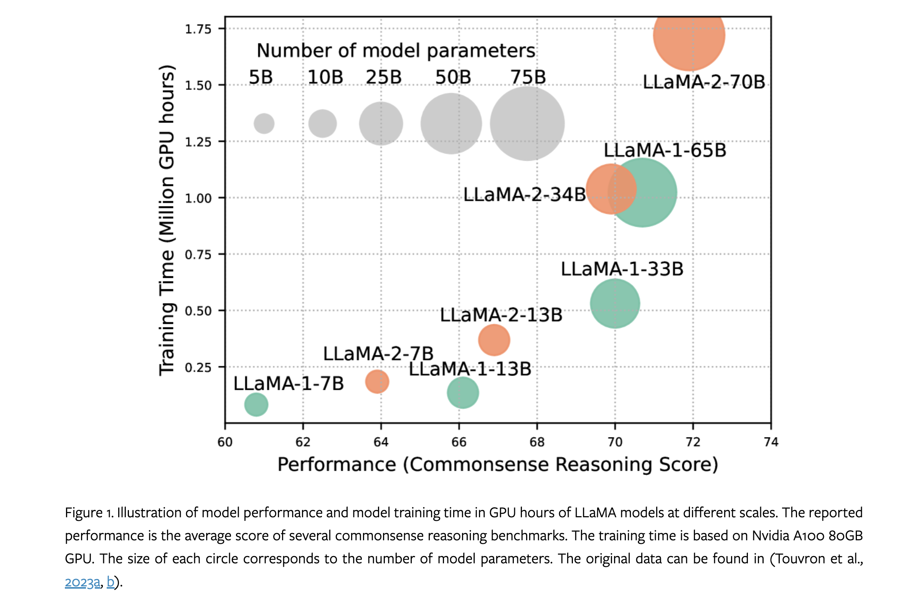
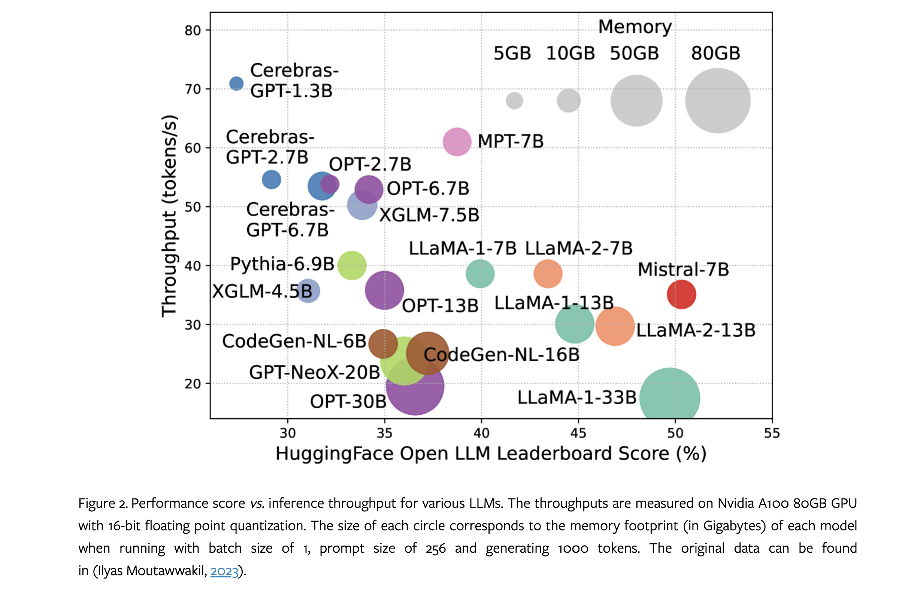
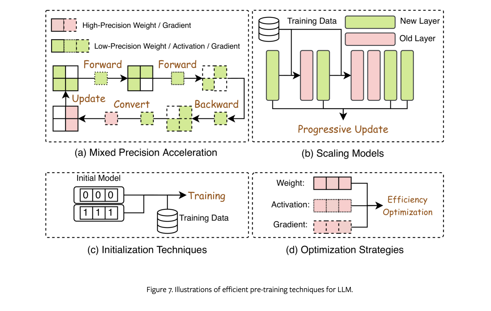
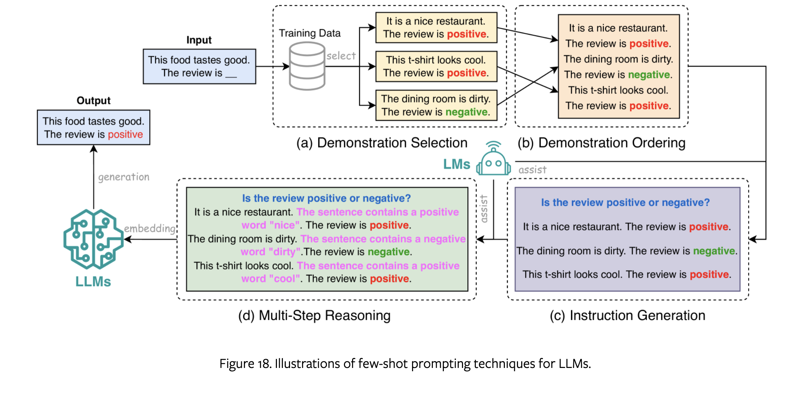

### Paper Title
* Efficient Large Language Models: A Survey

#### Abstract
Large Language Models (LLMs) have demonstrated remarkable capabilities in important tasks such as natural language understanding, language generation, and complex reasoning and have the potential to make a substantial impact on our society. Such capabilities, however, come with the considerable resources they demand, highlighting the strong need to develop effective techniques for addressing their efficiency challenges. In this survey, we provide a systematic and comprehensive review of efficient LLMs research. We organize the literature in a taxonomy consisting of three main categories, covering distinct yet interconnected efficient LLMs topics from model-centric, data-centric, and framework-centric perspective, respectively. We have also created a GitHub repository where we compile the papers featured in this survey at https://github.com/AIoT-MLSys-Lab/Efficient-LLMs-Survey, and will actively maintain this repository and incorporate new research as it emerges. We hope our survey can serve as a valuable resource to help researchers and practitioners gain a systematic understanding of the research developments in efficient LLMs and inspire them to contribute to this important and exciting field.

#### VIZ the paper

