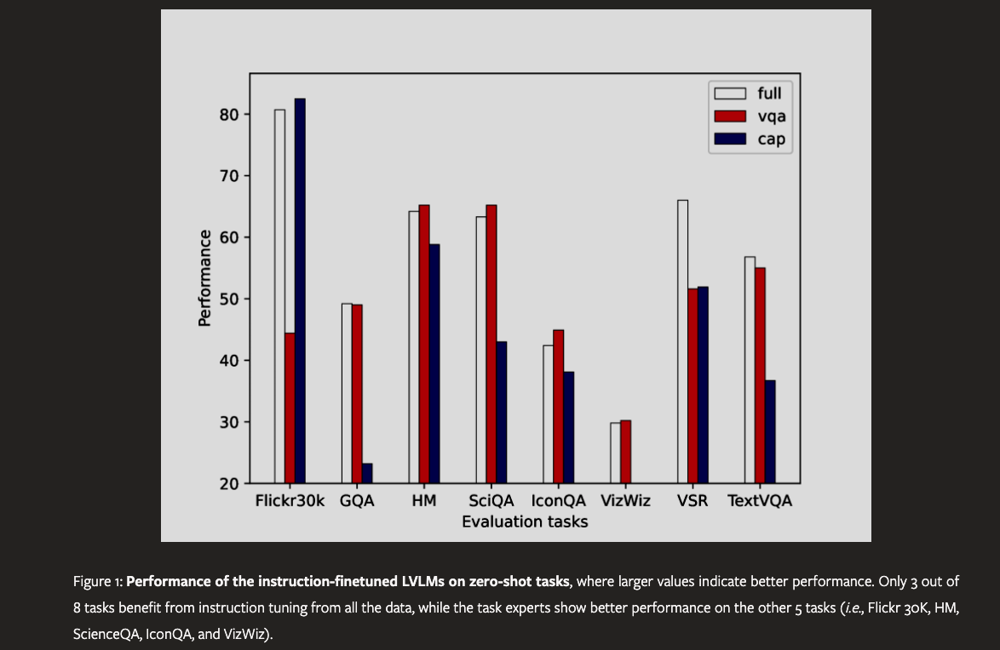
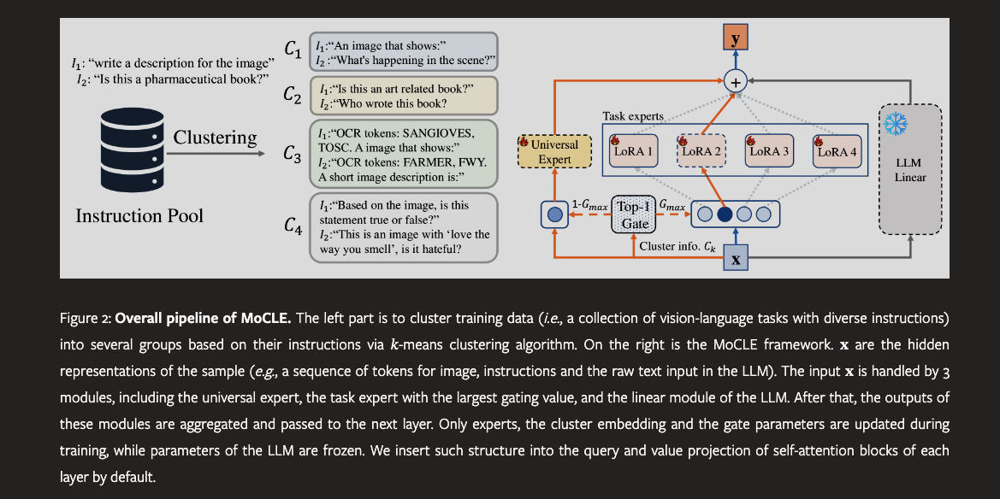

### Paper Title
* Mixture of Cluster-conditional LoRA Experts for Vision-language Instruction Tuning

#### Abstract
* Instruction tuning of the Large Vision-language Models (LVLMs) has revolutionized the development of versatile models with zero-shot generalization across a wide range of downstream vision-language tasks. However, diversity of training tasks of different sources and formats would lead to inevitable task conflicts, where different tasks conflicts for the same set of model parameters, resulting in sub-optimal instruction-following abilities. To address that, we propose the Mixture of Cluster-conditional LoRA Experts (MoCLE), a novel Mixture of Experts (MoE) architecture designed to activate the task-customized model parameters based on the instruction clusters. A separate universal expert is further incorporated to improve the generalization capabilities of MoCLE for novel instructions. Extensive experiments on 10 zero-shot tasks demonstrate the effectiveness of MoCLE.

#### What is the LoRA technique?
LoRA, which stands for Low-Rank Adaptation, is a technique used in machine learning, particularly in fine-tuning large-scale pre-trained models such as language models. It offers a more efficient and parameter-efficient way to adapt these models to specific tasks. Instead of updating all parameters of the model, which can be computationally expensive, LoRA focuses on updating only a small set of additional parameters. These parameters are introduced into the model as low-rank matrices, which interact with the original weights of the model. This approach allows for effective adaptation of the model with a much smaller increase in the number of parameters, thus reducing the computational burden and making the fine-tuning process more efficient.

#### popular LoRAs on Civitai

#### VIZ the paper

#### Suanfamama the paper
The paper "Mixture of Cluster-conditional LoRA Experts for Vision-language Instruction Tuning" proposes a novel architecture called MoCLE (Mixture of Cluster-conditional LoRA Experts) to address the challenges in instruction tuning of Large Vision-language Models (LVLMs). Instruction tuning has been pivotal in empowering Large Language Models (LLMs) and LVLMs to follow human instructions, demonstrating strong generalization across various tasks. However, the diversity in training tasks and formats can lead to task conflicts, affecting the model's performance on instruction-following tasks.

MoCLE aims to resolve this by clustering instructions of training data into several centroids using a pretrained model, grouping similar tasks that can positively influence each other. It employs a router at each model layer that dispatches input data to one of the specialized task experts or a universal expert shared across all data. These outputs are then combined and passed to the next layer, striking a balance between specialization and generalization. This approach mitigates task conflicts and improves the model's ability to generalize across tasks.

The effectiveness of MoCLE has been validated on various tasks using the state-of-the-art InstructBLIP model. It shows remarkable improvement on held-out tasks such as image captioning, text-based visual question answering, knowledge-based visual question answering, and novel visual reasoning tasks.

#### 5W methodology
1. **What is the problem?** – The main challenge is the task conflicts arising during the instruction tuning of Large Vision-language Models (LVLMs) due to diverse training tasks from different sources and formats.

2. **Why is the problem important?** – Addressing this issue is crucial for improving the instruction-following abilities of LVLMs, which is key for their performance across a wide range of downstream vision-language tasks.

3. **Who is affected by the problem?** – Researchers and practitioners working on LVLMs and related applications, as well as end-users relying on these models for various vision-language tasks.

4. **Where is the problem occurring?** – The problem occurs in the domain of machine learning, specifically in the training and fine-tuning of large-scale vision-language models.

5. **When does the problem occur?** – This problem arises during the fine-tuning process of LVLMs, when the model is trained on a mixture of instruction-following tasks from various sources【19†source】.

#### Conclusion
* In this paper, we first show that the task conflicts exists in vision language instruction tuning through extensive experiments. To address this, we propose the Mixture of Cluster-conditional LoRA Experts (MoCLE), a novel MoE architecture designed to activate the task-customized model parameters based on the instruction clusters. In addition, we achieve task specialization and generalization in MoCLE simultaneously via a separate universal expert. Comprehensive evaluations of MoCLE on 11 unseen tasks show the effectiveness of the proposed MoCLE method.