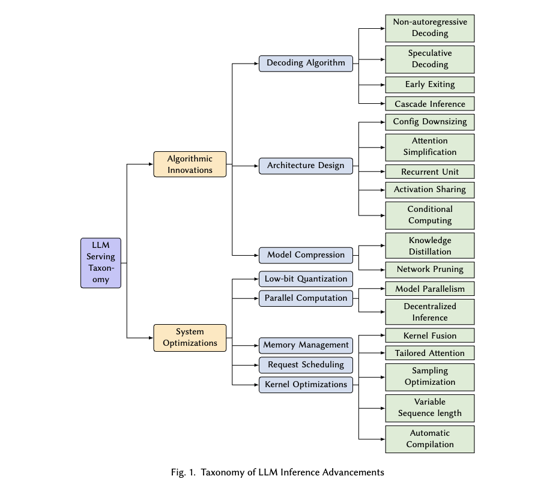
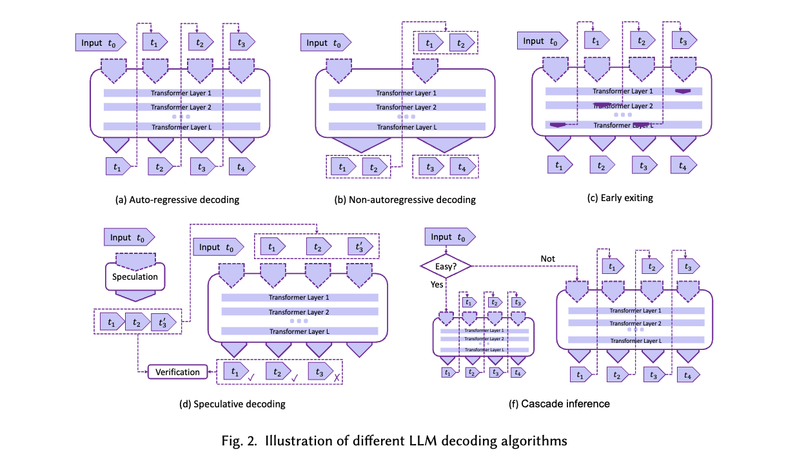
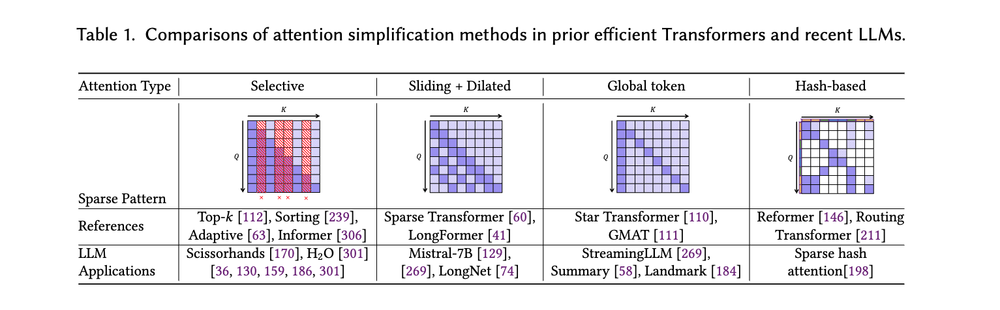
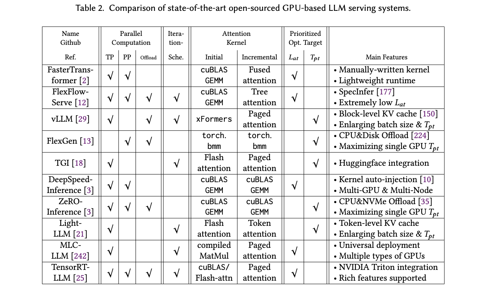

### Paper Title
* [Towards Efficient Generative Large Language Model Serving: A survey from Algorithms to Systems](https://arxiv.org/abs/2312.15234)

#### Abstract
In the rapidly evolving landscape of artificial intelligence (AI), generative large language models (LLMs) stand at the forefront, revolutionizing how we interact with our data. However, the computational intensity and memory consumption of deploying these models present substantial challenges in terms of serving efficiency, particularly in scenarios demanding low latency and high throughput. This survey addresses the imperative need for efficient LLM serving methodologies from a machine learning system (MLSys) research perspective, standing at the crux of advanced AI innovations and practical system optimizations. We provide in-depth analysis, covering a spectrum of solutions, ranging from cutting-edge algorithmic modifications to groundbreaking changes in system designs. The survey aims to provide a comprehensive understanding of the current state and future directions in efficient LLM serving, offering valuable insights for researchers and practitioners in overcoming the barriers of effective LLM deployment, thereby reshaping the future of AI.

#### Conclusion
* Efficient LLM serving is a fundamental step towards democratizing access to advanced AI technologies. This survey aims to provide researchers, practitioners, and developers with a comprehensive understanding of the existing methodologies, enabling them to make informed decisions when deploying LLMs in real-world environments. By consolidating the latest research findings on algorithms and systems, this survey paper hopes to accelerate progress and foster innovation in the pursuit of highly efficient LLM serving solutions.