### 演讲标题
* 张钹院士：大模型发展趋势
* 2024年01月16日
* 评论：江纬@算法妈妈

### 演讲内容
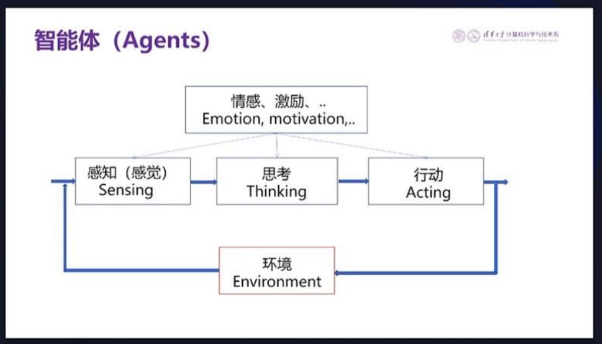
* 智能体 agents
* 感知，思考及行动是旧时的划分。其实可以不划分，统一化归为脑部思考运动。
* 笛卡尔：我思故我在

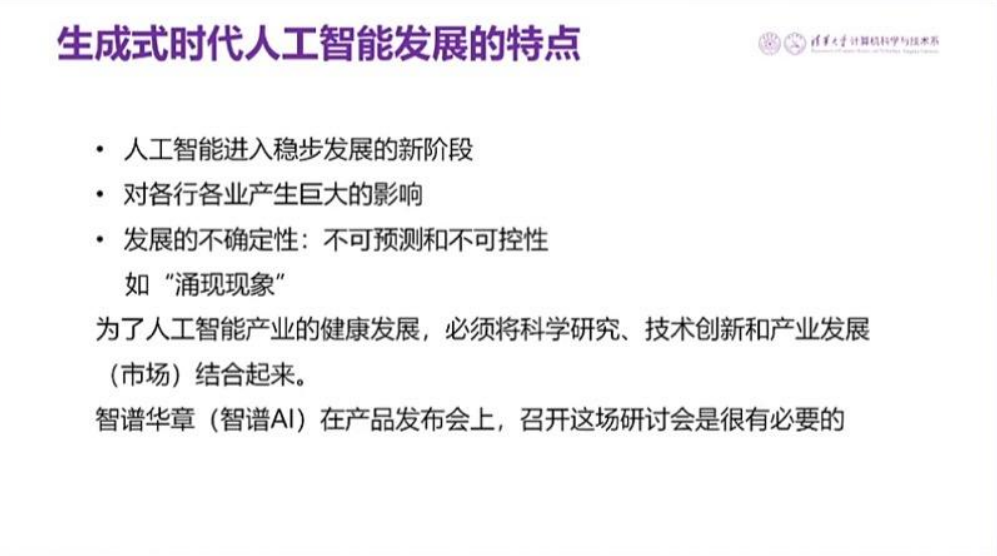
* 为什么会能力涌现，现在还不知道
* 上层建设容易，底层实现和被监管难，创新能力缺乏而抄欧美。

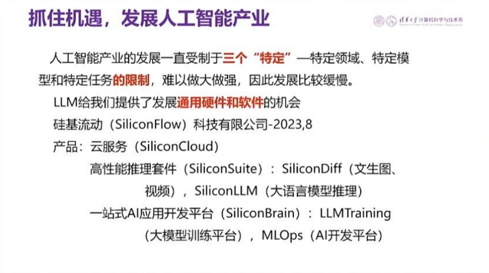
* 愿硅基流动和智谱越来越好
* 2023年AI创业 只有极少数人获得成功 其他陪跑 摔得没有感情 没有样子

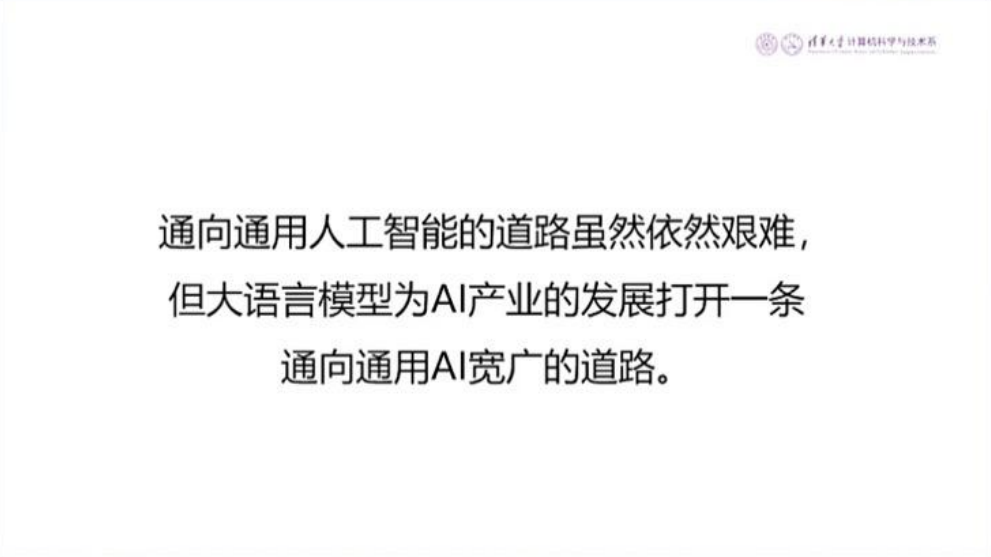
* 有待时间验证
* 希望通用人工智能是福不是祸

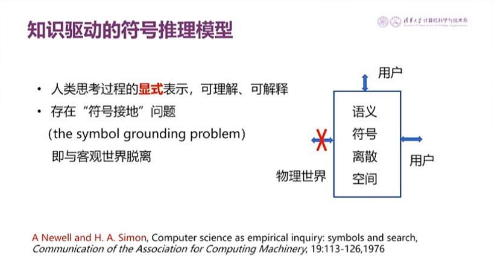
* 

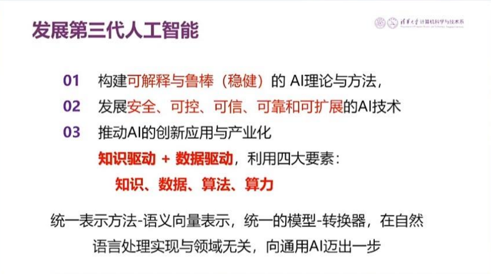
* 知识驱动 + 数据驱动

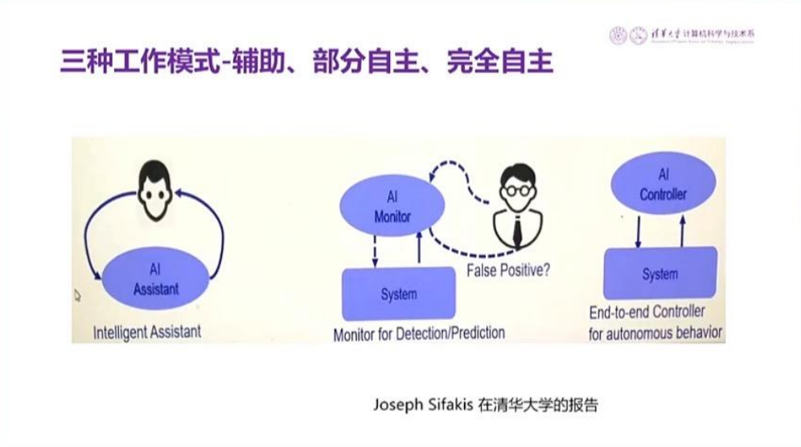
* 

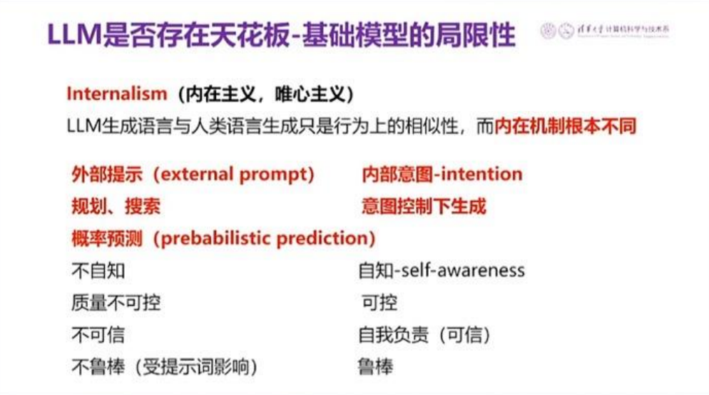
* 内在机理是否相同还有待进一步做实验认证

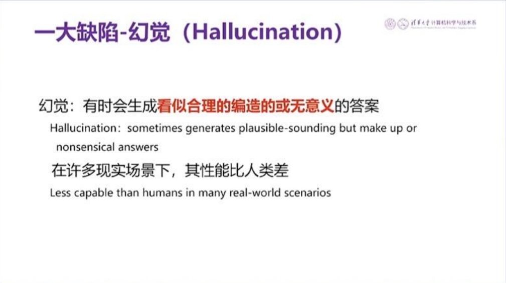
* 幻觉其实是创造力之一 就像人喝完酒后的表现

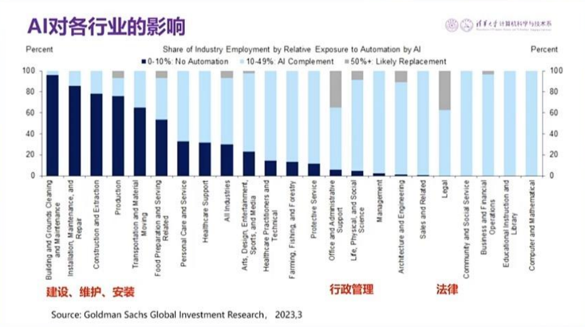
* 超级个体出现的年代
* 被抢饭碗是因为人类还不够强

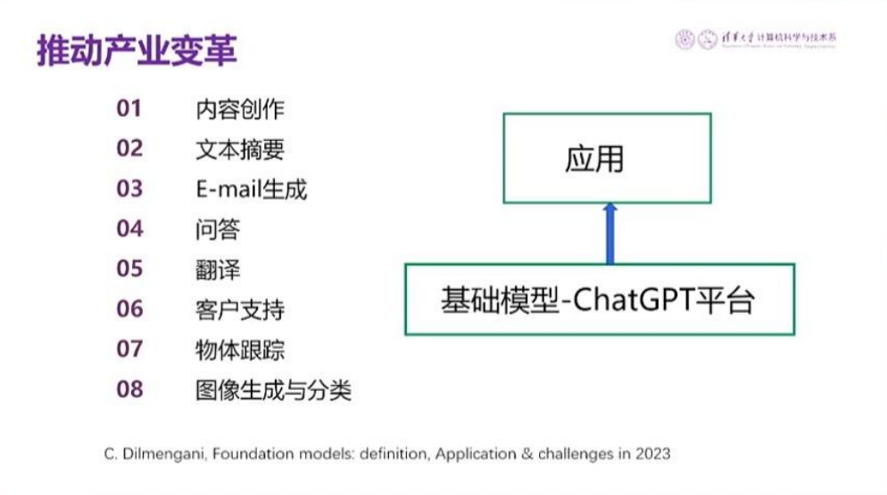
* 算法妈妈从教培和时尚两个行业开始，逐步延伸到其他行业

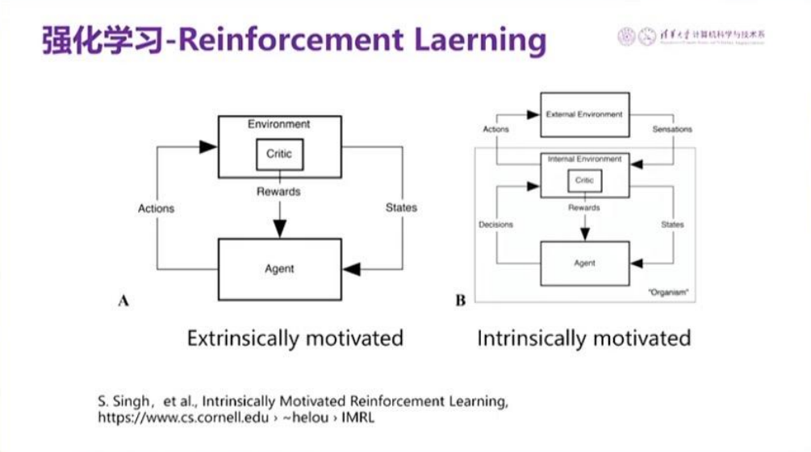
* 强化学习，监督性学习及非监督性学习三者之间已经边界模糊

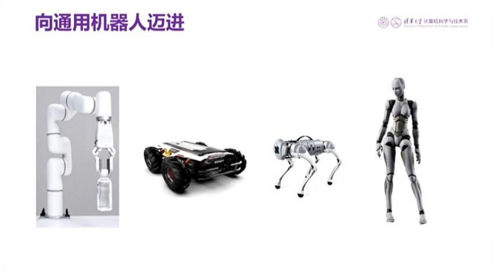
* With somebody, the brain can do more

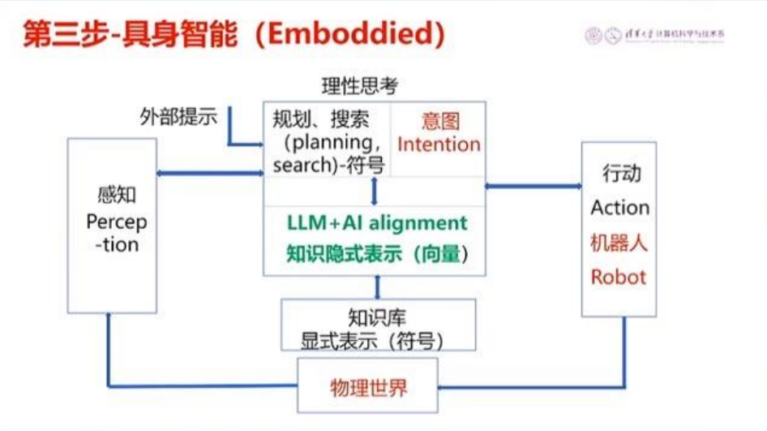
* With somebody, more can be done
* 未来可期