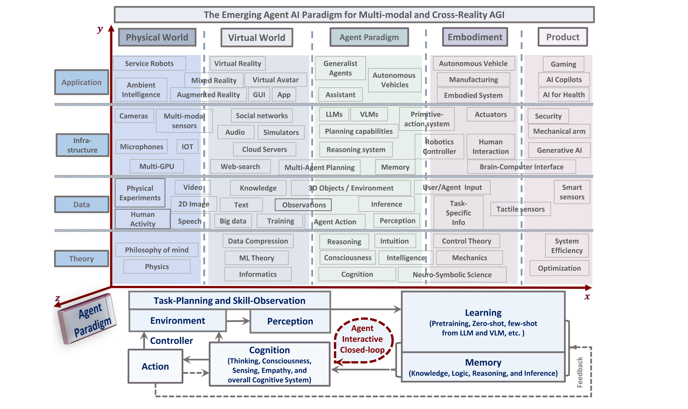
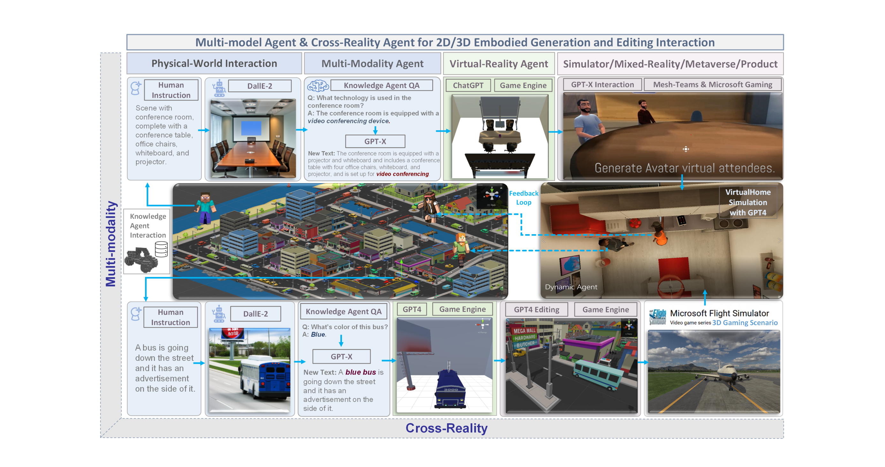
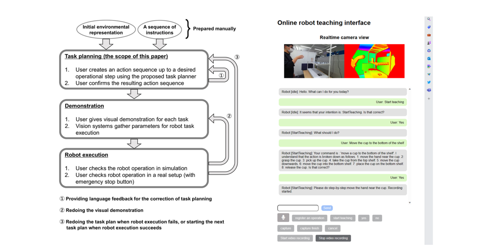
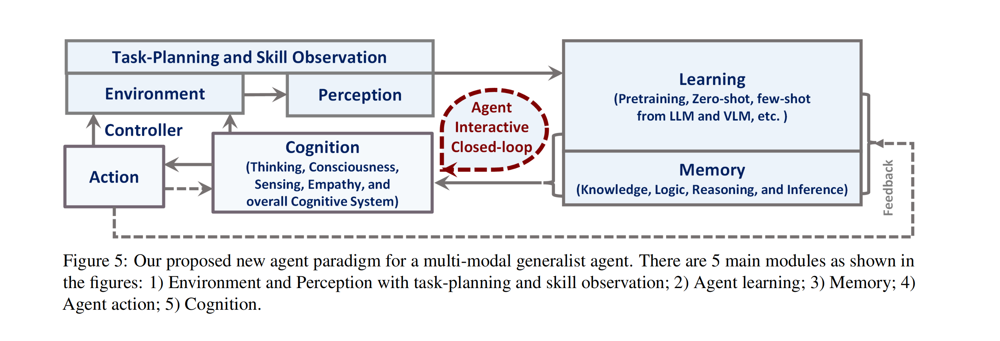

### 论文标题
* Agent AI: SURVEYING THE HORIZONS OF MULTIMODAL INTERACTION

### Authors
* Zane Durante et. al.

### Abstract
* Multi-modal AI systems will likely become a ubiquitous presence in our everyday lives. A promising approach to making these systems more interactive is to embody them as agents within physical and virtual environments. At present, systems leverage existing foundation models as the basic building blocks for the creation of embodied agents. Embedding agents within such environments facilitates the ability of models to process and interpret visual and contextual data, which is critical for the creation of more sophisticated and context-aware AI systems. For example, a system that can perceive user actions, human behavior, environmental objects, audio expressions, and the collective sentiment of a scene can be used to inform and direct agent responses within the given environment. To accelerate research on agent-based multimodal intelligence, we define "Agent AI" as a class of interactive systems that can perceive visual stimuli, language inputs, and other environmentally-grounded data, and can produce meaningful embodied action with infinite agent. In particular, we explore systems that aim to improve agents based on next-embodied action prediction by incorporating external knowledge, multi-sensory inputs, and human feedback. We argue that by developing agentic AI systems in grounded environments, one can also mitigate the hallucinations of large foundation models and their tendency to generate environmentally incorrect outputs. The emerging field of Agent AI subsumes the broader embodied and agentic aspects of multimodal interactions. Beyond agents acting and interacting in the physical world, we envision a future where people can easily create any virtual reality or simulated scene and interact with agents embodied within the virtual environment.

### Figures & Tables

* Figure 1: Overview of an Agent AI system that can perceive and act in different domains and applications. Agent AI is emerging as a promising avenue toward Artificial General Intelligence (AGI). Agent AI training has demonstrated the capacity for multi-modal understanding in the physical world. It provides a framework for reality-agnostic training by leveraging generative AI alongside multiple independent data sources. Large foundation models trained for agent and action-related tasks can be applied to physical and virtual worlds when trained on cross-reality data. We present the general overview of an Agent AI system that can perceive and act in many different domains and applications, possibly serving as a route towards AGI using an agent paradigm.

* Figure 2: The multi-model agent AI for 2D/3D embodied generation and editing interaction in cross-reality.

* Figure 4: A robot teaching system developed in (Wake et al., 2023c). (Left) The system workflow. The process involves three steps: Task planning, where ChatGPT plans robotic tasks from instructions and environmental information; Demonstration, where the user visually demonstrates the action sequence. All the steps are reviewed by the user, and if any step fails or shows deficiencies, the previous steps can be revisited as necessary. (Right) A web application that enables uploading of demonstration data and the interaction between the user and ChatGPT.

